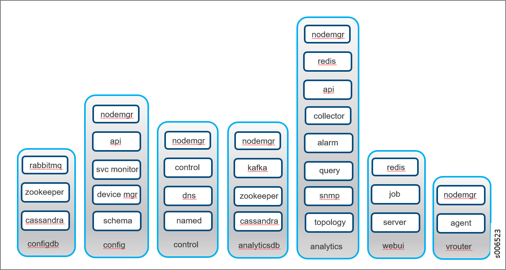

.. This work is licensed under the Creative Commons Attribution 4.0 International License.
   To view a copy of this license, visit http://creativecommons.org/licenses/by/4.0/ or send a letter to Creative Commons, PO Box 1866, Mountain View, CA 94042, USA.

===================================================
Introduction to Contrail Microservices Architecture
===================================================

With Contrail 4.0, Contrail started moving to an architecture of containers for major system components. Each container encapsulates the services needed for that container. The first phase of Contrail containers were characterized as fat containers, where multiple processes run within the container.

Starting with Contrail 5.0, more components are being containerized, and the fat containers are being decomposed into thin containers with microservices. The microservices are still encapsulated in their respective containers, however, only the essential functions relative to each container’s functions are present as microservices. This enables a more agile system, avoiding monolithic containers.

-  `What is Contrail Microservices Architecture?`_ 

-  `Installing Contrail with Microservices Architecture`_ 

What is Contrail Microservices Architecture?
--------------------------------------------

Nothing is changing with regard to Contrail functionality, however, employing microservices provides a number of benefits, including the ability to deploy patches without updating the entire Contrail deployment, offering better ways to manage the lifecycles of containers, and improving user experiences with Contrail provisioning and upgrading. The microservices architecture enables provisioning with minimum information provided, and enables every feature to be configurable, Utilizing microservices also simplifies application complexity by implementing small, independent processes.

The containers and their processes are grouped as services and microservices, and are similar to pods in the Kubernetes open-source software used to manage containers on a server cluster.

`Figure 2`_ shows how the Contrail containers and microservices are grouped into a pod structure upon installation.

.. _Figure 2: 

*Figure 2* : Contrail Containers, Pods, and Microservices

Installing Contrail with Microservices Architecture
---------------------------------------------------

Procedures have been developed to simplify the installation and management of Contrail with microservices architecture. Refer to the following topics for installation for the operating system appropriate for your system:

-  `Overview of contrail-ansible-deployer for Installing Contrail with Microservices Architecture`_ 

-  `Installing and Managing Contrail 5.0 Microservices Architecture Using Helm Charts`_ 

.. _Overview of contrail-ansible-deployer for Installing Contrail with Microservices Architecture: install-contrail-overview-ansible-50.html

.. _Installing and Managing Contrail 5.0 Microservices Architecture Using Helm Charts: install-microsvcs-helm-chart-50.html

