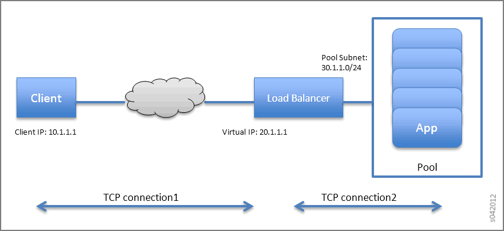

.. This work is licensed under the Creative Commons Attribution 4.0 International License.
   To view a copy of this license, visit http://creativecommons.org/licenses/by/4.0/ or send a letter to Creative Commons, PO Box 1866, Mountain View, CA 94042, USA.

===================================================
Configuring Load Balancing as a Service in Contrail
===================================================

-  `Overview: Load Balancing as a Service`_ 

-  `Contrail LBaaS Implementation`_ 

-  `Configuring LBaaS Using CLI`_ 

-  `Configuring LBaaS using the Contrail Web UI`_ 

Overview: Load Balancing as a Service
=====================================

Load Balancing as a Service (LBaaS) is a feature available through OpenStack Neutron. Contrail Release 1.20 and greater allows the use of the Neutron API for LBaaS to apply open source load balancing technologies to provision a load balancer in the Contrail system.

The LBaaS load balancer enables the creation of a pool of virtual machines serving applications, all front-ended by a virtual-ip. The LBaaS implementation has the following features:

- Load balancing of traffic from clients to a pool of backend servers. The load balancer proxies all connections to its virtual IP.

- Provides load balancing for HTTP, TCP, and HTTPS.

- Provides health monitoring capabilities for applications, including HTTP, TCP, and ping.

- Enables floating IP association to ``virtual-ip`` for public access to the backend pool.

In the following figure, the load balancer is launched with the virtual IP address 20.1.1.1. The backend pool of virtual machine applications (App Pool) is on the subnet 30.1.1.0/24. Each of the application virtual machines gets an IP address (virtual-ip) from the pool subnet. When a client connects to the ``virtual-ip`` for accessing the application, the load balancer proxies the TCP connection on its ``virtual-ip`` , then creates a new TCP connection to one of the virtual machines in the pool.

The pool member is selected using one of following methods:

- weighted round robin (WRR), based on the weight assignment

- least connection, selects the member with the fewest connections

- source IP selects based on the ``source-ip`` of the packet

Additionally, the load balancer monitors the health of each pool member using the following methods:

- Monitors TCP by creating a TCP connection at intervals.

- Monitors HTTP by creating a TCP connection and issuing an HTTP request at intervals.

- Monitors ping by checking if a member can be reached by pinging.

Contrail LBaaS Implementation
=============================

Contrail supports the OpenStack LBaaS Neutron APIs and creates relevant objects for LBaaS, including ``virtual-ip`` , ``loadbalancer-pool, loadbalancer-member,`` and ``loadbalancer-healthmonitor`` . Contrail creates a service instance when a ``loadbalancer-pool`` is associated with a ``virtual-ip`` object. The service scheduler then launches a namespace on a randomly selected virtual router and spawns HAProxy into that namespace. The configuration for HAProxy is picked up from the load balancer objects. Contrail supports high availability of namespaces and HAProxy by spawning active and standby on two different vrouters.

A Note on Installation
----------------------

To use the LBaaS feature, HAProxy, version 1.5 or greater and ``iproute2`` , version 3.10.0 or greater must both be installed on the Contrail compute nodes.
If you are using fab commands for installation, the haproxy and iproute2 packages will be installed automatically with LBaaS if you set the following:

::

 env.enable_lbaas=True

Use the following to check the version of the ``iproute2`` package on your system:

::

 root@nodeh5:/var/log# ip -V
 ip utility, iproute2-ss130716
 root@nodeh5:/var/log#

Limitations
-----------

LBaaS currently has these limitations:

- A pool should not be deleted before deleting the VIP.

- Multiple VIPs cannot be associated with the same pool. If pool needs to be reused, create another pool with the same members and bind it to the second VIP.

- Members cannot be moved from one pool to another. If needed, first delete the members from one pool, then add to a different pool.

- In case of active-standby failover, namespaces might not get cleaned up when the agent restarts.

- The floating-ip association needs to select the VIP port and not the service ports. ​

Configuring LBaaS Using CLI
===========================

The LBaaS feature is enabled on Contrail through Neutron API calls. The following procedure shows how to create a pool network and a VIP network using CLI. The VIP network is created in the public network and members are added in the pool network.

Creating a Load Balancer
------------------------

Use the following steps to create a load balancer in Contrail.

#. Create a VIP network.
    ``neutron net-create vipnet`` 
    ``neutron subnet-create –-name vipsubnet vipnet 20.1.1.0/24`` 

#. Create a pool network.
    ``neutron net-create poolnet`` 
    ``neutron subnet-create --name poolsubnet poolnet 10.1.1.0/24`` 

#. Create a pool for HTTP.
    ``neutron lb-pool-create --lb-method ROUND_ROBIN --name mypool --protocol HTTP --subnet-id poolsubnet``  

#. Add members to the pool.
    ``neutron lb-member-create --address 10.1.1.2 --protocol-port 80 mypool`` 
    ``neutron lb-member-create --address 10.1.1.3 --protocol-port 80 mypool`` 

#. Create a VIP for HTTP and associate it to the pool.
    ``neutron lb-vip-create --name myvip --protocol-port 80 --protocol HTTP--subnet-id vipsubnet mypool`` 

Deleting a Load Balancer
------------------------

Use the following steps to delete a load balancer in Contrail.

#. Delete the VIP.
    ``neutron lb-vip-delete<vip-uuid>`` 

#. Delete members from the pool.
    ``neutron lb-member-delete<member-uuid>`` 

#. Delete the pool.
    ``neutron lb-pool-delete<pool-uuid>``  

Managing Healthmonitor for Load Balancer
----------------------------------------

Use the following commands to create a healthmonitor, associate a healthmonitor to a pool, disassociate a healthmonitor, and delete a healthmonitor.

#. Create a healthmonitor.
    ``neutron lb-healthmonitor-create --delay 20 --timeout 10 --max-retries 3 --type HTTP`` 

#. Associate a healthmonitor to a pool.
    ``neutron lb-healthmonitor-associate<healthmonitor-uuid>mypool`` 

#. Disassociate a healthmonitor from a pool.
    ``neutron lb-healthmonitor-disassociate<healthmonitor-uuid>mypool``  

Configuring an SSL VIP with an HTTP Backend Pool
------------------------------------------------

Use the following steps to configure an SSL VIP with an HTTP backend pool.

#. Copy an SSL certificate to all compute nodes.
    ``scp ssl_certificate.pem<compute-node-ip> <certificate-path>`` 

#. Update the information in ``/etc/contrail/contrail-vrouter-agent.conf`` .
    ``# SSL certificate path haproxy`` 
    ``haproxy_ssl_cert_path=<certificate-path>`` 

#. Restart ``contrail-vrouter-agent.`` 
    ``service contrail-vrouter-agent restart``  

#. Create a VIP for port 443 (SSL)​.
    ``neutron lb-vip-create --name myvip --protocol-port 443 --protocol HTTP --subnet-id vipsubnet mypool​`` 

Configuring LBaaS using the Contrail Web UI
===========================================

Create, edit, or delete load balancers using the Contrail Web UI. Use the following guidelines when creating load balancers:
- Each load balancer consists of one or more listeners, pools, pool members, and health monitors.

 - Listener: Port that listens for traffic from a particular load balancer. Multiple listeners can be associated with a single load balancer.

 - Pool: Group of hosts that serves traffic from the load balancer.

 - Pool Member: Server that is specified by the IP address and port for which it uses to serve the traffic it receives from the load balancer.

 - Health Monitor: Health monitors are associated with pools and help divert traffic away from pool members that are temporarily offline.

- Each load balancer can have multiple pools with one or more listeners for each pool.

   - The native load balancer has a single pool that is shared among multiple listeners.

Creating a Load Balancer
------------------------

Use the following steps to create a load balancer with the load balancer wizard.

#. Go to **Configure > Networking > Load Balancing** . A summary screen of the Load Balancers is displayed; see `Figure 117`_ .

   .. _Figure 117: 

   *Figure 117* : Summary Screen of Load Balancers

   .. figure:: s007007.png

#. To create a load balancer, click the |s042494.png| icon on the Load Balancers summary screen. The first window of the Create Load Balancer wizard is displayed.

   .. _Figure 118: 

   *Figure 118* : Load Balancer Information

   .. figure:: s007008.png

   Add the load balancer information:
   -  **Name** : Name of the load balancer.

   -  **Description** : (Optional) Description of the load balancer.

   -  **Subnet** : Dropdown menu displays all subnets from list of all available networks. The subnet is the network on which to allocate the IP address of the load balancer.

   -  **Fixed IPs** : (Optional) IPv4 or IPv6 address.

   -  **Loadbalancer Provider** : Dropdown menu includes available options. Default is opencontrail.

   -  **Floating IP** : (Optional) IPv4 or IPv6 address.

   -  **Admin State** : Check the checkbox for UP or uncheck the checkbox for DOWN. Default is UP.

#. Click **Next** . The Listener fields are displayed.

   .. _Figure 119: 

   *Figure 119* : Listener Information

   .. figure:: s007009.png

   Add the listener information:
   -  **Name** : Name of the listener.

   -  **Description** : (Optional) Description of the listener.

   -  **Protocol** : Dropdown menu includes HTTP, TCP, and TERMINATED_HTTPS protocols. TERMINATED_HTTPS is available only if the key-manager service is enabled and you have access to the lists of SSL certificates.

   -  **Port** : Must be an integer in the range of 1 to 65535.

   -  **Connection Limit** : (Optional) Default value is -1, indicating an infinite limit.

   -  **Admin State** : Check the checkbox for UP or uncheck the checkbox for DOWN. Default is UP.

#. Click **Next** . The Pool fields are displayed.

   .. _Figure 120: 

   *Figure 120* : Pool Information

   .. figure:: s007010.png

   Add the pool information:
   -  **Name** : Name of the pool.

   -  **Description** : (Optional) Description of the pool.

   -  **Method** : Load balancing method used to distribute incoming requests. Dropdown menu includes LEAST_CONNECTIONS, ROUND_ROBIN, and SOURCE_IP.

   -  **Protocol** : The protocol used by the pool and its members for the load balancer traffic. Dropdown menu includes TCP, HTTP, and HTTPS.

   -  **Session Persistence** : (Optional) Default value is an empty dictionary.

   -  **Admin State** : Check the checkbox for UP or uncheck the checkbox for DOWN. Default is UP.

#. Click **Next** . The list of available pool member instances are displayed. To add an external member, click the |s042494.png| icon. Each pool member must have a unique IP address and port combination.

   .. _Figure 121: 

   *Figure 121* : Pool Member Information

   .. figure:: s007011.png

   The pool member information includes:
   -  **Name** : Name of the pool member.

   -  **Subnet** : The subnet in which to access the member.

   -  **IP Address** : The IP address of the member that is used to receive traffic from the load balancer.

   -  **Port** : The port to which the member listens to receive traffic from the load balancer.

   -  **Weight** : The default value is 1.

   -  **Admin State** : Check the checkbox for UP or uncheck the checkbox for DOWN. Default is UP.

#. Click **Next** . The Monitor fields are displayed.

   .. _Figure 122: 

   *Figure 122* : Health Monitor Information

   .. figure:: s007012.png

   Add the health monitor information:
   -  **Monitor Type** : Dropdown menu includes HTTP, HTTPS, PING, and TCP.

   -  **Health check interval (sec)** : The time interval, in seconds, between each health check.

   -  **Retry count before markdown** : The maximum number of failed health checks before the state of a member is changed to OFFLINE.

   -  **Timeout (sec)** : The maximum number of seconds allowed for any given health check to complete. The timeout value should always be less than the health check interval.

   -  **HTTP Method** : Required if monitor type is HTTP. Dropdown menu includes GET and HEAD. The default value is GET.

   -  **Expected HTTP Status Code** : Required if monitor type is HTTP. The default value is 200.

   -  **URL Path** : Required if monitor type is HTTP. The default value is “/.”

   -  **Admin State** : Check the checkbox for UP or uncheck the checkbox for DOWN. Default is UP.

Viewing or Editing Load Balancers
---------------------------------

Use the following steps to view or edit existing load balancers.

#. Go to **Configure > Networking > Load Balancing** . A summary screen of the Load Balancers is displayed.

   .. _Figure 123: 

   *Figure 123* : Summary Screen of Load Balancers

   .. figure:: s007015.png

#. To view or edit a load balancer, click the name of a load balancer listed in the summary screen. The Load Balancer Info window is displayed.

   .. _Figure 124: 

   *Figure 124* : Load Balancer Info Window

   .. figure:: s007016.png

#. To view the list of listeners associated with the load balancer, click on the Listener tab. A summary screen of the listeners is displayed.

   .. _Figure 125: 

   *Figure 125* : Summary Screen of Listeners

   .. figure:: s007017.png

#. To view or edit a listener, click the name of a listener listed in the summary screen. The Listener Info window is displayed.

   .. _Figure 126: 

   *Figure 126* : Listener Info Window

   .. figure:: s007018.png

#. To view a list of pools associated with the listener, click on the Pool tab. A summary screen of the pools is displayed.

   .. _Figure 127: 

   *Figure 127* : Summary Screen of Pools

   .. figure:: s007019.png

#. To view or edit a pool, click the name of a pool listed in the summary screen. The Pool Info window is displayed.

   .. _Figure 128: 

   *Figure 128* : Pool Info Window

   .. figure:: s007020.png

#. To view a list of members associated with the pool, click on the Pool Members tab. A summary screen of the pool members is displayed.

   .. _Figure 129: 

   *Figure 129* : Pool Members Summary Screen

   .. figure:: s007021.png

#. To view the health monitor details associated with the pool, click on the Monitor tab. The health monitor details are displayed.

   .. _Figure 130: 

   *Figure 130* : Pool Members Summary Screen

   .. figure:: s007022.png

Deleting a Load Balancer
------------------------

Use the following steps to delete a load balancer.

#. Delete the members of the pools. Select the pool members you want to delete, then click the trashcan icon; see `Figure 129`_ .

#. Delete the pools. Select the pools you want to delete, then click the trashcan icon; see `Figure 127`_ .

#. Delete the listeners. Select the listeners you want to delete, then click the trashcan icon; see `Figure 125`_ .

#. Delete the load balancer. Select the load balancer you want to delete, then click the trashcan icon; see `Figure 123`_ .

**Related Documentation**

-  `Using Load Balancers in Contrail`_ 

-  `Support for OpenStack LBaaS Version 2.0 APIs`_ 

.. _Using Load Balancers in Contrail: lbaas-contrail3-F5.html

.. _Support for OpenStack LBaaS Version 2.0 APIs: lbaas-v2-vnc.html

.. |s042494.png| image:: s042494.png

.. |s042494.png| image:: s042494.png
