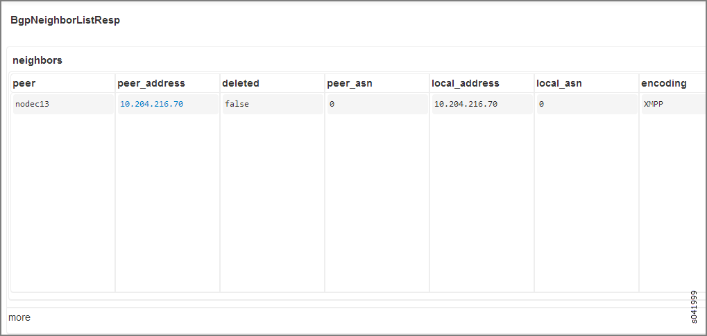

.. This work is licensed under the Creative Commons Attribution 4.0 International License.
   To view a copy of this license, visit http://creativecommons.org/licenses/by/4.0/ or send a letter to Creative Commons, PO Box 1866, Mountain View, CA 94042, USA.

======================
Route Target Filtering
======================

-  `Introduction`_ 

-  `Debugging and Troubleshooting Route Target Filtering`_ 

-  `RTF Limitations in Contrail 1.10`_ 

Introduction
============

BGP route target filtering (RTF) is a method for limiting the distribution of VPN routes to only those systems in the network for which the routes are necessary. If RTF is not active, the Contrail control node advertises all VPN routes to all of its VPN peers, which are either other control nodes or gateway routers such as an MX Series router. On the receiving side, the control node stores all VPN routes it receives from peers in the VPN table (for example, ``bgp.l3vpn.0`` ). Any routes that do not include a route target extended community that is referenced by the local ``vrf-import`` policies are discarded by Junos.

The control node must send all route updates to its peers, even for unnecessary routes that are discarded. ​Continuous route updates are both CPU- and memory-intensive. The only routes that are necessary to advertise to gateway routers are those that belong to the virtual networks that are configured for public access. It is not necessary to advertise VM routes belonging to other virtual networks to gateway routers.

If a datacenter has more than two control nodes, the ``vrouter-agent`` only subscribes to two of the control nodes, indicated by the discovery service. When a VM is initially launched in a virtual network, it sends an XMPP subscribe request for the virtual network VRF and publishes the VM route to the connected control node. It is not necessary to advertise routes belonging to this type of VRF to control nodes that don’t have the ``vrouter-agent`` subscribed in that VRF.

RTF is used to optimize the route distribution among control nodes and to the gateway routers to avoid unwanted route updates. If the BGP peer has not advertised or configured with RTF address family, then all routes belonging to the VPN table will be advetised.

RTF implementation in the control node does not support advertising and receiving of default route targets.

Constrained route distribution using route target reachability information is defined in RFC 4684, *“Constrained Route Distribution for Border Gateway Protocol/MultiProtocol Label Switching (BGP/MPLS) Internet Protocol (IP) Virtual Private Networks (VPNs)“.* 

Debugging and Troubleshooting Route Target Filtering
====================================================

Use the tips in this section to troubleshoot issues with RTF. ​ Use various http introspect commands to reveal details about BGP neighbors for RTF. The following is a sample portion of an http introspect page.​

When you access an introspect page, only the first panel of detail columns appears. Use a scroll bar or arrow keys to reveal more columns to the right, and vice versa.

- Use the following http introspect URL to display the details of each peer:

``http://(your_node_name):8083/Snh_BgpNeighborReq``  

For BGP peers, verify the configured and negotiated capability and the BGP table registration.

For XMPP peers, look at the ``routing_instances`` column to get details about the VRF to which the displayed ``vrouter-agent`` has subscribed and to see the import ``rtargets`` of the VRFs.

- Use the following http introspect URL to dump the ``bgp.rtarget.0`` table to display the ``RTargetRoutes`` :

``http://(your_node_name):8083/Snh_ShowRouteReq?x=bgp.rtarget.0``   

- Use the following http introspect URL to dump the details for each of the route targets configured on the control node:

``http://(your_node_name):8083/Snh_ShowRtGroupReq?`` 

For any given route target, this introspect displays the BGP table that imports and exports the route, the BGP peers that have shown interest in this route, and all dependent routes (when this route target has the extended community BGP attribute).

RTF Limitations in Contrail 1.10
================================

The following are RTF limitations in Contrail 1.10.

- The control node does not support advertising a default route target, which is an ``rtarget`` route with ``target:0:0`` or ``0/0`` as the prefix. This type of ``rtarget`` route enables a BGP peer to receive all VPN routes without ``rtarget`` filtering.

- The control node does not support receiving a default route target. If ``rtarget`` routes with a default ``rtarget`` prefix ​are received, they are silently ignored.

- A ``keep all`` configuration, typical for BGP peering for a control node on an MX Series router, does not have impact, because all VPN routes with an extended community route target, for which the MX has advertised the ``rtarget`` route, are sent to the MX. An example of this type of typical configuration is the following:

::

 set protocols bgp group contrail-control-nodes type internal  
 set protocols bgp group contrail-control-nodes local-address 10.204.216.253  
 set protocols bgp group contrail-control-nodes keep all  
 set protocols bgp group contrail-control-nodes family inet-vpn unicast  
 set protocols bgp group contrail-control-nodes family route-target  
 set protocols bgp group contrail-control-nodes neighbor 10.204.216.16

