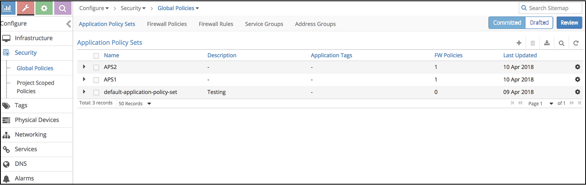
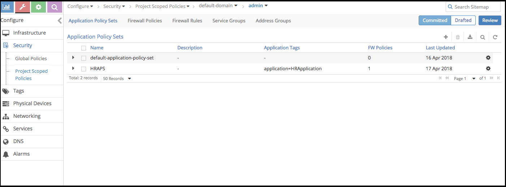
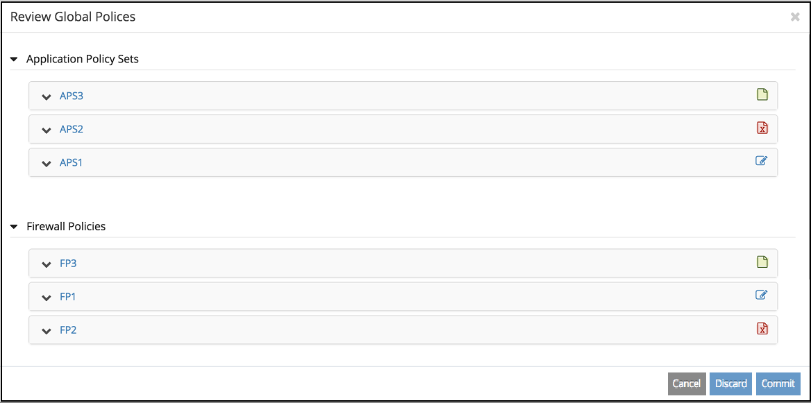

.. This work is licensed under the Creative Commons Attribution 4.0 International License.
   To view a copy of this license, visit http://creativecommons.org/licenses/by/4.0/ or send a letter to Creative Commons, PO Box 1866, Mountain View, CA 94042, USA.

=====================================
Managing Security Policies Draft Mode
=====================================

You can perform the following actions to enable and manage security policies in the draft mode.

-  `Enabling Security Policies Draft Mode`_ 

-  `Creating Security Policies in the Draft Mode`_ 

-  `Editing Security Policies in the Draft Mode`_ 

-  `Deleting a Security Policy in the Draft Mode`_ 

-  `Reviewing Security Policies in the Draft Mode`_ 

Enabling Security Policies Draft Mode
=====================================

Security policies draft mode is disabled by default. To enable the draft mode:

#. Click **Configure > Infrastructure** .

#. For enabling security policies draft mode for policies in the global scope, click **Global Config** .

   For enabling security policies draft mode for policies in the project scope, click **Project Settings** .

#. Select the **Security > Security Policy** tabs.

#. Click the Edit icon.

#. Select the **Security Policy Draft** check box on the **Edit Security Policy Options** page.

#. Click **Save** .

   Security policy draft mode is enabled for global or project scopes.

#. To verify that the draft mode is enabled, for policies in the global scope, select **Configure > Security > Global Policies** . The Global Policies page displays three buttons corresponding to the following three views on the top right:

   -  **Committed** —Click **Committed** to view the policies that have already been enforced.

   -  **Drafted** —Click **Drafted** to view, create, and edit policies in the draft mode.

   -  **Review** —Click **Review** to review policies the drafted policies and commit or discard the drafts.

`Figure 46`_ displays the security policies draft mode in the global scope.

.. _Figure 46: 

*Figure 46* : Global Security Policies Draft Mode

Similarly, to verify that the draft mode is enabled, for policies in the project scope, select **Configure > Security > Project Scoped Policies** . `Figure 47`_ displays that the security policies draft mode is enabled in the project scope.

.. _Figure 47: 

*Figure 47* : Project Scoped Security Policies Draft Mode

Creating Security Policies in the Draft Mode
============================================

When the security policy draft mode is enabled in global or project scopes, all new policies are created in the draft mode. To create a policy in the draft mode:

#. For policies in the global scope, select **Configure > Security > Global Policies** .

   For policies in the project scope, select **Configure > Security > Project Scoped Policies** .

#. Select the **Drafted** view or the **Committed** view and click the add icon ( **+** ).

#. Enter the configuration parameters as needed.

#. Click **Finish** to save the policy. The policy appears in the **Drafted** view.

   To review and enforce the policy, see `Reviewing Security Policies in the Draft Mode`_ .

Editing Security Policies in the Draft Mode
===========================================

When you edit an existing policy, a clone of the selected policy is visible in the **Drafted** view. To edit a policy in the draft mode:

#. For policies in the global scope, select **Configure > Security > Global Policies** .

   For policies in the project scope, select **Configure > Security > Project Scoped Policies** .

#. To edit policies that are already enforced, click the **Committed** view.

   To edit policies that are not enforced, click the **Drafted** view.

#. Select the check box for the policy that you want to edit select **Edit** under the settings icon to the far right of the selected policy. See `Figure 48`_ .

    .. _Figure 48: 

    *Figure 48* : Editing Policies

    .. figure:: s007001.png

#. Update the configuration parameters as needed.

#. Click **Finish** to save the updated policy configuration. The updated policy clone appears in the **Drafted** view. The original policy is also visible in the **Committed** view.

   To review and enforce the policy, see `Reviewing Security Policies in the Draft Mode`_ .

Deleting a Security Policy in the Draft Mode
============================================

You can delete a security policy if it is no longer needed. To delete a security policy:

#. For policies in the global scope, select **Configure > Security > Global Policies** .

   For policies in the project scope, select **Configure > Security > Project Scoped Policies** .

#. To delete policies that are already enforced, click the **Committed** view.

   To delete policies that are not enforced, click the **Drafted** view.

#. Select the check box for the policy that you want to delete and select **Delete** under the settings icon to the far right of the selected policy. You can also select multiple policies and click the delete icon on the top right of the page.

   A page requesting confirmation of the deletion appears.

#. Click **Confirm** to confirm that you want to delete the security policy.

   The policy is tagged as  draft_mode_state==deleted. The policy is deleted when a system administrator reviews the policy and deletes it permanently. For reviewing and permanently deleting a policy, see `Reviewing Security Policies in the Draft Mode`_ .

Reviewing Security Policies in the Draft Mode
=============================================

You can review all the policies that have been created, edited, or flagged for deletion in the **Review** view. You can choose to commit or discard the changes. To commit or discard changes, you need system administrator privileges.

To review your changes and commit or discard them:

- For policies in the global scope, select **Configure > Security > Global Policies > Review** .

For policies in the project scope, select **Configure > Security > Project Scoped Policies > Review** .

The **Review** view appears. The **Review** view contains all the policies in the draft mode. The list of policies includes newly created policies, existing enforced policies that have been edited, and also those policies that have been flagged for deletion.

- Click **Commit** to commit all your changes and enforce the policies. Newly created and edited policies are enforced and are visible in the **Committed** view. Policies that are flagged for deletion are deleted from the enforced policies.

- Click **Discard** to abandon your edits. Newly created policies are deleted. Edited policies abandon their changes.review-policies

`Figure 49`_ displays the **Review** view with new, deleted, and edited policies.

.. _Figure 49: 

*Figure 49* : Review Draft Security Policies

.. note:: The procedures described in this topic are valid for all five security policy resources.

**Related Documentation**

-  `Security Policies Draft Mode Overview`_ 

.. _Security Policies Draft Mode Overview: security-policy-draft-mode.html

