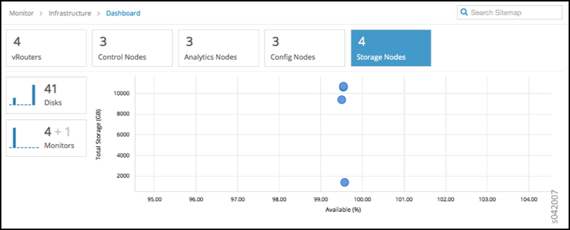
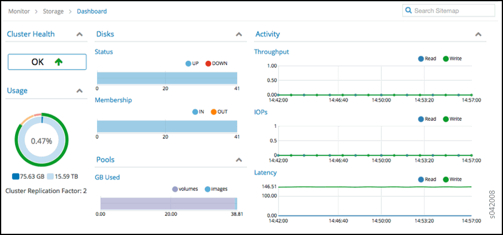

.. This work is licensed under the Creative Commons Attribution 4.0 International License.
   To view a copy of this license, visit http://creativecommons.org/licenses/by/4.0/ or send a letter to Creative Commons, PO Box 1866, Mountain View, CA 94042, USA.

=====================================
Installing and Using Contrail Storage
=====================================

-  `Overview of the Contrail Storage Solution`_ 

-  `Basic Storage Functionality with Contrail`_ 

-  `Ceph Block and Object Storage Functionality`_ 

-  `Using the Contrail Storage User Interface`_ 

-  `Hardware Specifications`_ 

-  `Contrail Storage Provisioning`_ 

Overview of the Contrail Storage Solution
=========================================

Contrail provides a storage support solution using OpenStack Cinder configured to work with Ceph. Ceph is a unified, distributed storage system whose infrastructure provides storage services to Contrail.

The Contrail storage solution has the following features:

- Provides storage class features to Contrail clusters, including replication, reliability, and robustness.

- Uses open source components.

- Uses Ceph block and object storage functionality.

- Integrates with OpenStack Cinder functionality.

- Does not require virtual machines (VMs) to configure mirrors for replication.

- Allows nodes to provide both compute and storage services.

- Provides easy installation of basic storage functionality based on Contrail roles.

- Provides a Contrail-integrated user interface from which the user can monitor Ceph components and drill down for more information about components.

- Provides native live-migration support if the VM is booted with Ceph storage as its root volume.

- Provides object storage support through Swift and S3 APIs.

Basic Storage Functionality with Contrail
=========================================

The following are basic interaction points between Contrail and the storage solution.

- Cinder volumes must be manually configured prior to installing the Contrail storage solution. The Cinder volumes can be attached to virtual machines (VMs) to provide additional storage.

- The storage solution stores virtual machine boot images and snapshots in Glance, using Ceph object storage functionality.

- All storage nodes can be monitored through a graphical user interface (GUI).

- It is possible to migrate virtual machines that have ephemeral storage in Ceph.

Ceph Block and Object Storage Functionality
===========================================

In Contrail Release 4.0, installing the Contrail storage solution creates the following Ceph configurations.

- Each disk is configured as a standalone storage device, enhancing optimal performance and creating proper failure boundaries. Ceph allocates and assigns a process called object storage daemon (OSD) to each disk.

- A replication factor of 2 is configured, consisting of one original instance plus one replica copy. Ceph ensures that each replica is on a different storage node.

- A Ceph monitor process (mon) is configured is configured on the contrail-ceph-controller node.

- The correct number of placement groups are automatically configured, based on the number of disk drives in the cluster.

- Properly identified SSD drives are set up for use as Ceph OSD journals to reduce write latencies.

- Multi-pool configuration is set up to segregate the OSD disks into logical pools improving performance and efficiency.

- If multiple storage nodes are in a single chassis, the ``chassis`` option helps in defining replication of data and also disabling replication of data within the nodes of the same chassis. Replication helps in avoiding data loss during a power failure to the chassis.

Using the Contrail Storage User Interface
=========================================

The Contrail storage solution provides a user interface integrated into the Contrail user interface. The storage solution user interface displays the following:

- Customer usable space, which is different from Ceph total space. The displayed usable space does not display the space used by replication and other Ceph functions.

- Monitor OSDs (disks), monitoring processes (mon), and state changes, enabling quick identification of resource failures within storage components.

- Total cluster I/O statistics and individual drive statistics.

- Ceph-specific information about each OSD (disk).

- Ceph logs, Ceph nodes, and Ceph alerts.

Select **Monitor > Infrastructure > Dashboard** to display an at-a-glance view of the system infrastructure components, including the numbers of virtual routers, control nodes, analytics nodes, config nodes, and storage nodes currently operational, and a bubble chart of storage nodes showing the Available (%) and Total Storage (GB). See the following figure.

Bubble charts use the following color-coding scheme for storage nodes:

- Blue—working as configured.

- Red—error, node is down.

- Yellow—​one of the node disks is down.

Select **Monitor > Storage > Dashboard** to see a summary of cluster health, usage, pools, and disk status, and to gain insight into activity statistics for all nodes. See the following figure.

Hardware Specifications
=======================

The following are additional hardware specifications needed for the Contrail storage solution.

Additional minimum specifications:

- Two​ 500 GB, 7200 RPM drives in the server 4 and server 5 cluster positions (those with the compute storage role) in the Contrail installation. This configuration provides 1 TB of clustered, replicated storage.

Recommended compute storage configuration:

- For every 4-5 HDD devices on one compute storage node, use one SSD device to provide the OSD journals for that set of HDD devices.

Contrail Storage Provisioning
=============================

The  contrail-ceph-controllerand  contrail-ceph-computeare two roles required to enable Ceph storage. The  contrail-ceph-controllerrole is added to the Ceph monitor servers. The number of mons is limited to three for small clusters and five for large clusters with more than 1000 disks. The  contrail-ceph-computerole is added to the servers that have the physical disks required for Ceph storage and also to the OpenStack Nova compute nodes that require Ceph storage services.
The following example displays sample ``cluster.json`` to provide Ceph storage configurations.

::

  "parameters": {
                  "provision": {
                      "contrail_4": {
                          "storage_ceph_config": {
                              "replica_size": 2,
  "ceph_object_storage": "True",
  "object_store_pool": "volumes"
                          }
                      }
                  }
              }

The replica_size is added to change the default replica size of 2. The  ceph_object_storageoption enables the Ceph-based object storage to support Swift and S3 APIs and the  object_storage_pooloption specifies the Ceph pool used for the Ceph object storage functionality.
The following example displays sample ``server.json`` to enable Ceph storage.

::

  Server.json :
        "parameters": {  
                  "provision": {   
                      "contrail_4":{
                          "storage":{
                              "storage_osd_disks":[
                                  "/dev/sdb:/dev/sdd:Pool_1",
                                  "/dev/sdc:/dev/sdd:Pool_2"
                              ],
                              "storage_osd_ssd_disks":[
                                  "/dev/sde:Pool_1",
                                  "/dev/sdf:Pool_2"
                              ],
  				“chassis_id”: “chassis_1”
                          }
                      }
                  }
              "roles": [
  "contrail-ceph-controller", "contrail-ceph-compute"
                     [p0-            ]

The  storage_osd_disksor  storage_osd_ssd_diskis needed to provision the disks for Ceph. The first disk iss OSD disk and the second optional disk is used as a Journal disk. If a multi-pool configuration is required, the pool name can be added along the OSD disk as shown in the ``server.json`` to enable Ceph storage. The  chassis_idoption can also be included per server. Pools and the  chassisoption cannot co-exist.

.. note:: The disks added to Ceph are not included in the OS disk. The  partitionparameter in the server JSON lists only the required OS disks.
          ::

            "parameters": {  
            "partition": "/dev/sda"
            }
          The disks added to Ceph cannot be part of LVM.

