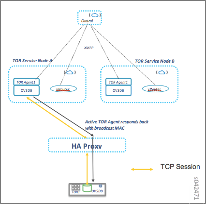
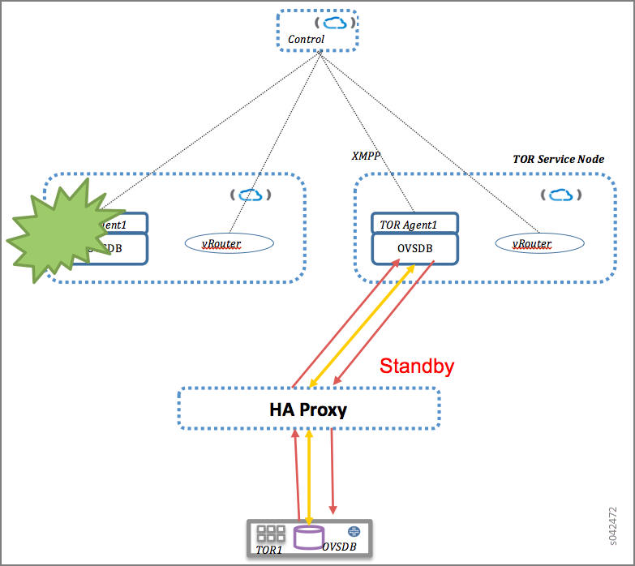
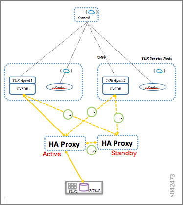
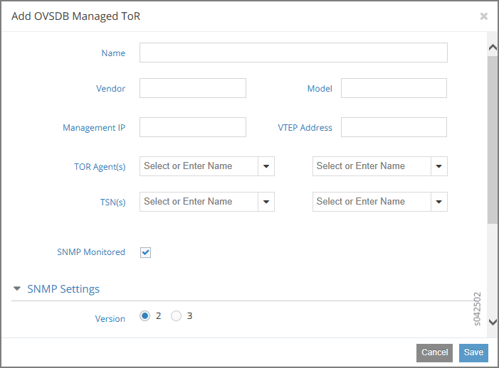

==============================================================
Configuring High Availability for the Contrail OVSDB ToR Agent
==============================================================

This topic describes how high availability can be configured for the Contrail ToR agent.

   -  `Overview: High Availability for a ToR Switch`_ 

   -  `High Availability Solution for Contrail ToR Agent`_ 

   -  `Failover Methodology Description`_ 

   -  `Failure Scenarios`_ 

   -  `Redundancy for HAProxy`_ 

   -  `Configuration for ToR Agent High Availability`_ 

Overview: High Availability for a ToR Switch
--------------------------------------------

In Contrail Release 2.20 and later, high availability can be configured for the Contrail ToR agent.

When a top-of-rack (ToR) switch is managed through the Open vSwitch Database (OVSDB) protocol by using a ToR agent on Contrail, a high availability configuration is necessary to maintain ToR agent redundancy. With ToR agent redundancy, if the ToR agent responsible for a ToR switch is unable to act as the vRouter agent for the ToR switch, due to any failure condition in the network or the node, then another ToR agent takes over and manages the ToR switch.

ToR agent redundancy (high availability) is achieved using HAProxy. HAProxy is an open source, reliable solution that offers high availability and proxy service for TCP applications. The solution uses HAProxy to initiate an SSL connection from the ToR switch to the ToR agent. This configuration ensures that the ToR switch is connected to exactly one active ToR agent at any given point in time.

High Availability Solution for Contrail ToR Agent
-------------------------------------------------

The following figure illustrates the method for achieving high availability for the ToR agent in Contrail.

.. _Figure 75: 

*Figure 75* : High Availability Solution for Contrail ToR Agent

The following describes the events shown in the figure:

   - ToR agent redundancy is achieved using HAProxy.

   - Two ToR agents are provisioned on different TSN nodes, to manage the same ToR switch.

   - Both ToR agents created in the cluster are active and get the same information from the control node.

   - HAProxy monitors these ToR agents.

   - An SSL connection is established from the ToR switch to the ToR agent, via HAProxy.

   - HAProxy selects one ToR agent to establish the SSL connection (e.g., ToR Agent 1 running on TSN A).

   - Upon connection establishment, this ToR Agent adds the ff:ff:ff:ff:ff:ff broadcast MAC address in the OVSDB with its own TSN IP address.

   - The ToR Agent sends the MAC addresses of the bare metal servers learned by the ToR switch to the control node using XMPP.

   - The control node reflects the addresses to other ToR agents and vRouter agents.

Failover Methodology Description
--------------------------------

The ToR switch connects to the HAProxy that is configured to use one of the ToR agents on the two ToR services nodes (TSNs). An SSL connection is established from the ToR switch to the ToR agent, making that agent the active ToR agent. The active ToR agent is responsible for managing the OVSDB on the ToR switch. It configures the OVSDB tables based on the configuration. It advertises the MAC routes learned on the ToR switch as Ethernet VPN (EVPN) routes to the Contrail controller. It also programs any routes learned by means of EVPN over XMPP, southbound into OVSDB on the ToR switch.

The active ToR agent also advertises the multicast route (ff:ff:ff:ff:ff:ff) to the ToR switch, ensuring that there is only one multicast route in OVSDB pointing to the active TSN.

Both the ToR agents, active and standby, receive the same configuration from the control node, and all routes are synchronized by means of BGP.

After the SSL connection is established, keepalive messages are exchanged between the ToR switch and the ToR agent. The messages can be sent from either end and are responded to from the other end. When any message exchange is seen on the connection, the keepalive message is skipped for that interval. When the ToR switch sees that keepalive has failed, it closes the current SSL session and attempts to reconnect. When the ToR agent side sees that keepalive has failed, it closes the SSL session and retracts the routes it exported to the control node.

Failure Scenarios
-----------------

Whenever the HAProxy cannot communicate with the ToR agent, a new SSL connection from the ToR switch is established to the other ToR agent.

HAProxy communication failures can occur under several scenarios, including:

   - The node on which the ToR agent is running goes down or fails.

   - The ToR agent crashes.

   - A network or other issue prevents or interrupts HAProxy communication with the ToR agent.

.. _Figure 76: 

*Figure 76* : Failure Scenarios

When a connection is established to the other ToR agent, the new ToR agent does the following:

   - Updates the multicast route in OVSDB to point to the new TSN.

   - Gets all of the OVSDB entries.

   - Audits the data with the configurations available.

   - Updates the database.

   - Exports entries from the OVSDB local table to the control node.

Because the configuration and routes from the control node are already synchronized to the new ToR Services Node (TSN), the new TSN can immediately act on the broadcast traffic from the ToR switch. Any impact to the service is only for the time needed for the SSL connection to be set up and for programming the multicast and unicast routes in the OVSDB.

When the SSL connection goes down, the ToR agent retracts the routes exported. Also, if the Extensible Messaging and Presence Protocol (XMPP) connection between the ToR agent and the control node goes down, the control node removes the routes exported by the ToR agent. In these scenarios, the entries from the OVSDB local table are retracted and then added back from the new ToR agent.

Redundancy for HAProxy
----------------------

In a high availability configuration, multiple HAProxy nodes are configured, with Virtual Router Redundancy Protocol (VRRP) running between them. The ToR agents are configured to use the virtual IP address of the HAProxy nodes to make the SSL connection to the controller. The active TCP connections go to the virtual IP master node, which proxies them to the chosen ToR agent. A ToR agent is chosen based on the number of connections from the HA Proxy to that node (the node with lower number of connections gets the new connection) and can be controlled through configuration of the HAProxy.

.. _Figure 77: 

*Figure 77* : Redundancy for HAProxy

If the HAProxy node fails, a standby node becomes the virtual IP master and sets up the connections to the ToR agents. The SSL connections are reestablished, following the same methods discussed earlier.

Configuration for ToR Agent High Availability
---------------------------------------------

To get the required configuration downloaded from the control node to the TSN agent and to the ToR agent, the physical router node must be linked to the virtual router nodes that represent the two ToR agents and the two TSNs.

In the Contrail Web user interface select **Configure > Physical Devices > Physical Routers** . In the **Physical Routers** window, click the **+** icon. The **Add OVSDB Managed ToR** window is displayed. See `Figure 78`_ .

.. _Figure 78: 

*Figure 78* : Add OVSDB Managed ToR Window

Enter a name to create an entry for the ToR switch, enter the ToR switch management IP address, and enter the virtual tunnel endpoint (VTEP) address. The router name should match the hostname of the ToR switch. Both ToR agents and their respective TSN nodes can be configured here.

**Related Documentation**

-  `Using ToR Switches and OVSDB to Extend the Contrail Cluster to Other Instances`_ 

.. _Using ToR Switches and OVSDB to Extend the Contrail Cluster to Other Instances: topic-97450.html
