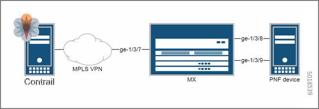

=====================================================================
Example: Adding a Physical Network Function Device to a Service Chain
=====================================================================

Beginning with Contrail 3.0, it is possible to add a physical network function (PNF) device to a service chain. This section provides an example of creating a service chain that includes a PNF.

-  `Prerequisites for Adding a PNF to a Service Chain`_ 

Prerequisites for Adding a PNF to a Service Chain
-------------------------------------------------

Prerequisites
-------------

The following are the minimum requirements needed before you can add a PNF to a service chain using the procedure shown in the example included in this topic:
- at least one MX Series device

- at least one PNF to connect to the MX device

- Juniper Networks Junos version that includes the feature ``accept-local-nexthop`` 

.. note:: The Junos feature ``accept-local-nexthop`` is available starting with Junos Release 14.1X55. The Contrail service chain with PNF has been tested on Junos 14.1X55. Contact your Juniper Networks customer service representative for more information.

The prerequisite minimum topology is shown in the following figure.

The following must be preconfigured on the MX Series device.
::

   interfaces {
    ge-1/3/7 {
        unit 0 {
            family inet {
                address 10.227.5.115/24;
            }
            family mpls;
        }
    }
    ge-1/3/9 {
        vlan-tagging;
    }
    ge-1/3/8 {
        vlan-tagging;
    }
  }
 protocols {
     bgp {
         family inet-vpn {
             unicast {
                 accept-local-nexthop;
             }
         }
     }
 }

If the MX is a service control gateway (SCG), the following configuration must also be present to support the service subscriptions:

::

    firewall {
     family inet {
         filter skip_tdf_service {
             term term1 {
                 then {
                     skip-services;
                     accept;
                 }
             }
         }
     }
 }
 routing-instances {
     <*-sc-entry-point> {
         forwarding-options {
             family inet {
                 filter {
                     input skip_tdf_service;
                 }
             }
         }
     }
 }

Procedure: Adding a PNF to a Service Chain
~~~~~~~~~~~~~~~~~~~~~~~~~~~~~~~~~~~~~~~~~~

#. At the Contrail UI, **Configure > Infrastructure > BGP Routers** , create a BGP router, with the Contrail controller as a peer, the address family you need, and a minimum configuration of the ``route-target`` , ``inet`` , and the ``inet-vpn`` . The following figure provides an example.

   .. figure:: S018540.png

#. Create two virtual networks. Select **Configure > Networking > Networks** and create a network named **IN** and a network named **OUT** . The following figure provides an example.

   .. figure:: S018541.png

#. Create a physical router associated with the BGP router. Select **Configure > Physical Devices> Physical Routers** and create a physical router. The VTEP address of the physical router should be same as the BGP router’s IP address. Associate the physical router with the BGP router created previously, and select for Virtual Networks the networks created for this example ( **IN** and **OUT** ). The following figure provides an example.

   .. figure:: S018542.png

#. While still on the **Add Physical Router** window, use the slider to scroll down to the **Netconf Settings** section and add the appropriate NETCONF information for your system. The following figure provides an example.

   .. figure:: S018543.png

#. Add the physical interfaces that connect to the PNF device. Go to **Configure > Physical Devices> Interfaces** and select the PNF to get to the **Add Interfaces** window, where you enter the name and type for each interface. The following figure provides an example.

   .. figure:: S018544.png

#. Add a service appliance set. Go to **Configure > Infrastructure> Service Appliance Sets** to get to the **Create Service Appliance Set** window, where you enter the name of the service appliance set. The following figure provides an example.

   .. figure:: S018545.png

#. Configure a service template, **Configure > Services > Service Templates** and click the **Create** button on **Service Templates** to get to **Add Service Template** . Ensure that the **Virtualization Type** is set to **Physical Device** , and that the template is associated to the service appliance set previously created. The following figure provides an example.

   .. figure:: s018748.png

#. Add a physical router that represents the PNF device. Go to **Configure > Physical Devices > Physical Routers** to get to the **Add Physical Router** window, where you enter a name for the physical router. The following figure provides an example.

   .. figure:: S018546.png

#. Create two interfaces for the PNF. The interfaces should connect to the interfaces already created in this example, and should connect in the manner illustrated in the topology diagram. The interfaces for the other PR should be available from the selection field. The following figure provides an example.

   .. figure:: s018739.png

#. Add a service appliance in the service appliance set. Go to **Configure > Infrastructure> Service Appliances** to get to the **Create Service Appliance** window, where you enter the name of the service appliance set and the IP address. Also add the left and right interfaces previously created. The following figure provides an example.

   .. figure:: S018547.png

   The remaining steps are the same as the steps to create a Contrail service chain, and are summarized in the following steps.

   For more details about service chains, see:

   -  `Service Chaining`_ 

   -  `Example\:\ Creating a Transparent Service Chain`_ 

#. Create a PNF service instance, go to **Configure > Services > Service Instances** , and click **Create** , then select the template to use and select the corresponding left, right, or management networks. When using a transparent service chain, the VN for the interfaces can be automatic.

#. Add a network policy to connect the virtual networks created for this example, go to **Configure > Networking > Policies** .

#. Associate the policy to both the left VN and the right VN ( **IN** and **OUT** in this example). Navigate to **Configure > Networking > Network** .

**Related Documentation**

-  `Service Chaining`_ 

-  `Example\:\ Creating a Transparent Service Chain`_ 

-  `Using Physical Network Functions in Contrail Service Chains`_ 

.. _Service Chaining: topic-79680.html

.. _Example\:\ Creating a Transparent Service Chain: topic-83385.html

.. _Service Chaining: topic-79680.html

.. _Example\:\ Creating a Transparent Service Chain: topic-83385.html

.. _Using Physical Network Functions in Contrail Service Chains: topic-103925.html
