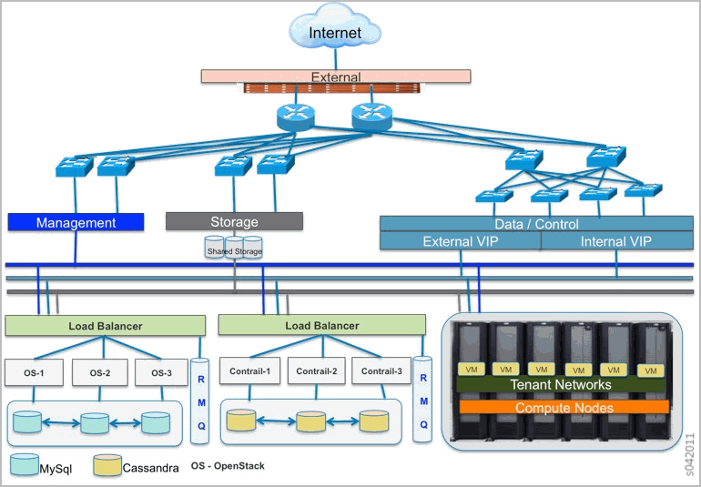
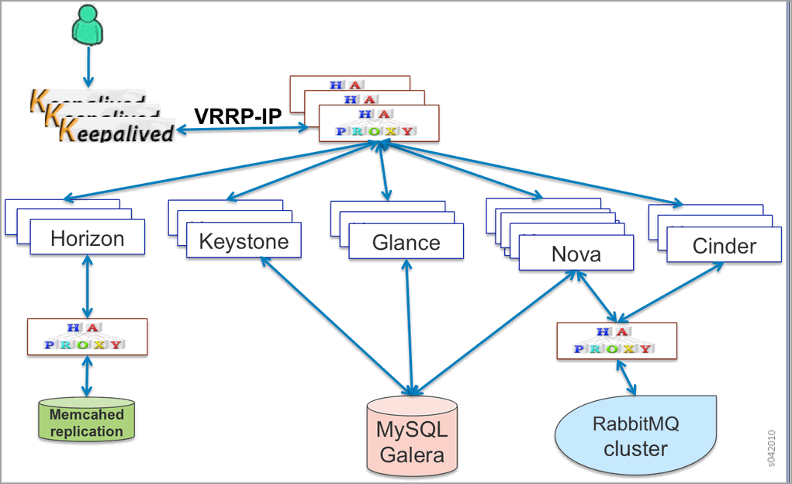
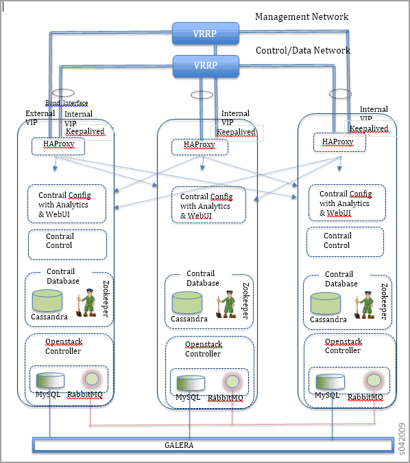

====================================
Juniper OpenStack High Availability
====================================

   -  `Introduction`_ 

   -  `Contrail High Availability`_ 

   -  `OpenStack High Availability`_ 

   -  `Supported Platforms`_ 

   -  `Juniper OpenStack High Availability Architecture`_ 

   -  `Juniper OpenStack Objectives`_ 

   -  `Limitations`_ 

   -  `Solution Components`_ 

   -  `Virtual IP with Load Balancing`_ 

   -  `Failure Handling`_ 

   -  `Deployment`_ 

   -  `Minimum Hardware Requirement`_ 

   -  `Compute`_ 

   -  `Network`_ 

   -  `Installation`_ 

   -  `Sample Server Manager-JSON`_ 

Introduction
============

The Juniper Networks software-defined network (SDN) controller has two major components: OpenStack and Contrail. High availability (HA) of the controller requires that both OpenStack and Contrail are resistant to failures. Failures can range from a service instance failure, node failure, link failure, to all nodes down due to a power outage. The basic expectation from a highly available SDN controller is that when failures occur, already provisioned workloads continue to work as expected without any traffic drop, and the controller is available to perform operations on the cluster. Juniper Networks OpenStack is a distribution from Juniper Networks that combines OpenStack and Contrail into one product.

Contrail High Availability
===========================

Contrail has high availability already built into various components, including support for the Active-Active model of high availability, which works by deploying the Contrail node component with an appropriate required level of redundancy.

The Contrail control node runs BGP and maintains adjacency with the vRouter module in the compute nodes. Additionally, every vRouter maintains a connection with all available control nodes.

Contrail uses Cassandra as the database. Cassandra inherently supports fault tolerance and replicates data across the nodes participating in the cluster.

A highly available deployment of Contrail, at minimum, requires at least:

-  two control nodes

-  three config nodes (including analytics and webui)

-  three database nodes

OpenStack High Availability
===========================

High availability of OpenStack is supported by deploying the OpenStack controller nodes in a redundant manner on multiple nodes. Previous releases of Contrail supported only a single instance of the OpenStack controller, and multiple instances of OpenStack posed new problems that needed to solved, including:

- State synchronization of stateful services (e.g. MySQL) across multiple instances.

- Load-balancing of requests across the multiple instances of services.

Supported Platforms
===================

Juniper OpenStack Controller has tested high availability on the following platforms:

- Linux — Ubuntu 12.04 with kernel version 3.13.0-34

- Ubuntu Server 16.04 LTS (Xenial Xerus)

For a list of all operating system versions and the corresponding Linux or Ubuntu kernel versions supported by Contrail Release 4.0 on OpenStack Kilo, Liberty, Mitaka, Newton and Ocata releases, see– EXTERNAL LINK. PLEASE RE-INSERT. –.

Juniper OpenStack High Availability Architecture
================================================

A typical cloud infrastructure deployment consists of a pool of resources of compute, storage, and networking infrastructure, all managed by a cluster of controller nodes.

The following figure illustrates a high-level reference architecture of a high availability deployment using Juniper OpenStack deployed as a cluster of controller nodes.

Juniper OpenStack Objectives
============================

The main objectives and requirements for Juniper OpenStack high availability are:

- 99.999% availability for tenant traffic.

- Anytime availability for cloud operations.

- Provide VIP-based access to the API and UI services.

- Load balance network operations across the cluster.

- Management and orchestration elasticity.

- Failure detection and recovery.

Limitations
===========

The following are limitations of Juniper OpenStack high availability:

- Only one failure is supported.

- During failover, a REST API call may fail. The application or user must reattempt the call.

- Although zero packet drop is the objective, in a distributed system such as Contrail, a few packets may drop during ungraceful failures.

- Juniper OpenStack high availability is not tested with any third party load balancing solution other than HAProxy.

Solution Components
====================

Juniper Openstack's high availability active-active model provides scale out of the infrastructure and orchestration services. The model makes it very easy to introduce new services in the controller and in the orchestration layer.

Virtual IP with Load Balancing
==============================

HAProxy is run on all nodes to load balance the connections across multiple instances of the services. To provide a Virtual IP (VIP), Keepalived (open source health check framework and hot standby protocol) runs and elects a master based on VRRP protocol. The VRRP master owns the VIP. If the master node fails, the VIP moves to a new master elected by VRRP.

The following figure shows OpenStack services provisioned to work with HAProxy and Keepalived, with HAProxy at the front of OpenStack services in a multiple operating system node deployment. The OpenStack database is deployed in clustered mode and uses Galera for replicating data across the cluster. RabbitMQ has clustering enabled as part of a multinode Contrail deployment. The RabbitMQ configuration is further tuned to support high availability.

Failure Handling
=================

This section describes how various types of failures are handled, including:

- Service failures

- Node failures

- Networking failures

*Service Failures* 

When an instance of a service fails, HAProxy detects the failure and load balances any subsquent requests across other active instances of the service. The supervisord process monitors for service failures and brings up the failed instances. As long as there is one instance of a service operational, the Juniper OpenStack controller continues to operate. This is true for both stateful and stateless services across Contrail and OpenStack.

*Node Failures* 

The Juniper OpenStack controller supports single node failures involving both graceful shutdown or reboots and ungraceful power failures. When a node that is the VIP master fails, the VIP moves to the next active node, as it is elected to be the VRRP master. HAProxy on the new VIP master sprays the connections over to the active service instances as before, while the failed down node is brought back online. Stateful services (MySQL, Galera, Zookeeper, and so on) require a quorum to be maintained when a node fails. As long as a quorum is maintained, the controller cluster continues to work without problems. Data integrity is also inherently preserved by Galera, Rabbit, and other stateful components in use.

*Network Failures* 

A connectivity break, especially in the control data network causes the controller cluster to partition into two. As long as the caveat of minimum number of nodes is maintained for one of the partitions, the controller cluster continues to work. Stateful services detect the partitioning and reorganize their cluster around the reachable nodes. Existing workloads continue to function and pass traffic and new workloads can be provisioned. When the connectivity is restored, the joining node becomes part of the working cluster and the system gets restored to its original state.

Deployment
==========

Minimum Hardware Requirement
============================

A minimum of 3 servers (physical or virtual machines) are required to deploy a highly available Juniper OpenStack Controller. In Active-Active mode, the controller cluster uses Quorum-based consistency management for guaranteeing transaction integrity across its distributed nodes. This translates to the requirement of deploying *2n+1* nodes to tolerate *n* failures.

The Juniper OpenStack Controller offers a variety of deployment choices. Depending on the use case, the roles can be deployed either independently or in some combined manner. The type of deployment determines the sizing of the infrastructure. The numbers below present minimum requirements across compute, storage, and network.

Compute
=======

- Quad core Intel(R) Xeon 2.5 Gz or higher

- 32 GB or higher RAM for the controller hosts (increases with number of hypervisors being supported)

- Minimum 1 TB disk, SSD, HDD

Network
=======

A typical deployment separates control data traffic from the management traffic.

- Dual 10 GE that is bonded (using LAG 802.3ad) for redundant control data connection.

- Dual 1 GE bonded (using LAG 802.3 ad) for redundant management connection.

- Single 10G and 1G can be used if link redundancy is not desired.

The deployment needs virtual IP (VIP) addresses from the networks in which the NICs participate, external VIP on the management network and internal VIP on the control data network. External facing services are load balanced using the external VIP and the internal VIP is used for communication between other services.

 *Packaging* 

High availability support requires new components in the Contrail OpenStack deployment, which are packaged in ``contrail-openstack-ha`` , including HAProxy, Keepalived, Galera, and their requisite dependencies.

Installation
============

Installation is supported through Server Manager provisioning. The cluster JSON file has parameters specifying external and internal VIPs. If OpenStack and Contrail roles are co-located on the nodes, only one set of external and internal VIPs is needed.

Install also supports separating OpenStack and Contrail roles on physically different servers. In this case, the external and internal VIPs specified are used for the OpenStack controller, and a separate set of VIPs, ``contrail_external_vip`` and ``contrail_internal_vip`` , are used for the Contrail controller nodes. It is also possible to specify separate RabbitMQs for OpenStack and Contrail controllers.

The following services are configured during high availability-enabled provisioning:

- Keepalived —- Configures VRRP and VIP using  keepalivedpackage

- high availability proxy — Configured to load balance among services running on different nodes

- Galera — Openstack MySQL clustering to achieve high availability

- Glance — Support NFS server storage for glance images

- Keystone — Not supported for Server Manager provisioning

Starting with Contrail Release 4.0, provisioning scripts use VIPs instead of the physical IP of the node in all OpenStack and Contrail configuration files. The following figure shows a typical three-node deployment, where Openstack and Contrail roles are co-located on three servers.

Sample Server Manager-JSON
==========================

When Server Manager is installed, configure an appropriate JSON file with the IP addresses, interface names, and password strings specific to your system. Select a sample JSON from the following and use Server Manager commands to create Contrail objects. See `Sample JSONs for a Multinode Cluster with High Availability`_  

**Related Documentation**

-  `High Availability Support Options`_ 

- – EXTERNAL LINK. PLEASE RE-INSERT. –

.. _Supported Platforms Contrail 4.0.x: ../../topics/reference/supported-platforms-40-vnc.html

.. _High Availability Support Options: topic-120289.html

.. _Example: Adding New OpenStack or Contrail Roles to an Existing High Availability Cluster: ../../topics/task/configuration/high-availability-node-adding.html

.. _Sample JSONs for a Multinode Cluster with High Availability: https://github.com/Juniper/contrail-server-manager/wiki/Seven-Node-Contrail-HA-Sample-Jsons
