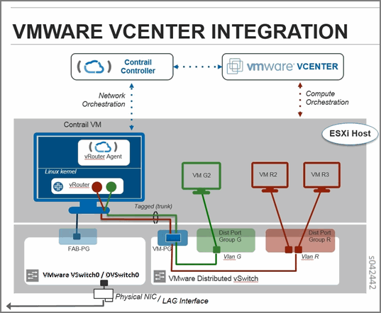
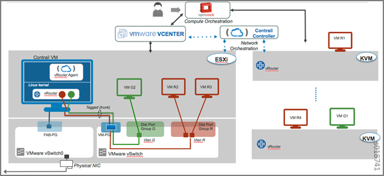

=======================================================================
Installing and Provisioning VMware vCenter with Containerized Contrail
=======================================================================

   -  `Overview: Integrating Contrail 4.0.1 and Greater with vCenter Server`_ 

   -  `Different Modes of vCenter Integration with Contrail`_ 

   -  `vCenter-Only Mode`_ 

   -  `vCenter-as-Compute Mode`_ 

   -  `Preparing the Installation Environment`_ 

   -  `Installation for vCenter-Only Mode`_ 

   -  `Installing the vCenter-Only Components`_ 

   -  `Installation of vCenter-as-Compute Mode`_ 

   -  `Installing the vCenter-as-Compute Components`_ 

   -  `Verification`_ 

   -  `Adding Hosts or Nodes`_ 

   -  `Adding an ESXi Host to an Existing vCenter Cluster`_ 

   -  `Adding a vCenter Cluster to vCenter-as-Compute`_ 

Overview: Integrating Contrail 4.0.1 and Greater with vCenter Server
=====================================================================

This topic describes how to install and provision Contrail Release 4.0.1 and later.

The Contrail VMware vCenter solution has the following main components:

#. Control and management that runs the following components as needed per Contrail system:

  #. A VMware vCenter Server independent installation that is not managed by Juniper Networks Contrail. The Contrail software provisions vCenter with Contrail components and creates entities required to run Contrail.

  #. The Contrail controller, including the configuration nodes, control nodes, analytics, database, and Web UI, which are installed, provisioned, and managed by Contrail software.

  #. A VMware vCenter plugin provided with Contrail. Starting with Contrail Release 4.0.1 release, the ``contrail-vcenter-plugin`` runs in Docker container and provisioning of additional ``contrail-vcenter-plugin`` and ``contrail-vcenter-compute`` server roles are added

#. VMware ESXi virtualization platforms forming the compute cluster, with Contrail data plane (vRouter) components running inside an Ubuntu-based virtual machine. The virtual machine, named *ContrailVM* , forms the compute personality while performing Contrail installs. The ContrailVM is set up and provisioned by Contrail. There is one ContrailVM running on each ESXi host.

Different Modes of vCenter Integration with Contrail
====================================================

The vCenter integrated Contrail solution has the following modes:

   - vCenter-only

   - vCenter-as-compute

vCenter-Only Mode
=================

In the vCenter-only mode, vCenter is the main orchestrator, and Contrail is integrated with vCenter for the virtual networking.

`Figure 20`_ shows the Contrail vCenter-only solution.

.. _Figure 20: 

*Figure 20* : Contrail vCenter-Only Solution

vCenter-as-Compute Mode
=======================

In the vCenter-as-compute mode, OpenStack is the main orchestrator, and the vCenter cluster, along with the managed ESXi hosts, act as a Nova compute node to the OpenStack orchestrator.

`Figure 21`_ shows the Contrail vCenter-as-compute solution.

.. _Figure 21: 

*Figure 21* : Contrail vCenter-as-Compute Solution

Preparing the Installation Environment
======================================

Use the standard containerized Contrail installation procedure using Server Manager to install Contrail components in cluster nodes.

Follow the steps in `Installing Containerized Contrail Clusters Using Server Manager`_ .

.. note:: Refer to the sample JSONs for Contrail vCenter in `Sample JSON Configuration Files for vCenter with Containerized Contrail 4.0.1 and Greater`_ .

Installation for vCenter-Only Mode
==================================

This section lists the basic installation procedure and the assumptions and prerequisites necessary before starting the installation of any VMware vCenter Contrail integration.

.. note:: To ensure you are using the correct versions of all software for your specific system, refer to the Supported Platforms section in the release notes for your release of Contrail .

Installation: Assumptions and Prerequisites
-------------------------------------------

The following assumptions and prerequisites are required for a successful installation of a VMware vCenter Contrail integrated system:

#. VMware vCenter Server

#. A cluster of ESXi hosts with VMware

#. The following software installation packages:

  #. The ``contrail-vcenter-docker_x.x.x.x-x_trusty.tgz`` for Ubuntu 14.04
      The ``contrail-vcenter-docker_4.0.1.0-40_xenial.tgz`` for Ubuntu 16.04.

  #. Tar file of the OVF image of ContrailVM

#. Because a Contrail vRouter runs as a virtual machine on each ESXi host, it needs an IP address assigned from the same underlay network as the host, all of which must be specified appropriately in the server JSON configuration. Refer to the section `Underlay Network Configuration for Containerized ContrailVM`_ for ContrailVM IP fabric connectivity.

Installing the vCenter-Only Components
======================================

Follow the steps in this section to install the Contrail for vCenter-only components. See sample image, server, and cluster JSON configuration files for Contrail vCenter in `Sample JSON Configuration Files for vCenter with Containerized Contrail 4.0.1 and Greater`_ for specific examples.

ContrailVM IP fabric connectivity can be configured in various ways. See `Underlay Network Configuration for Containerized ContrailVM`_ for more information. The ContrailVM is created as part of Ansible-provisioning triggered from Server Manager. The IP address or MAC address for the ContrailVM is specified in the server JSON. Configure the DHCP server, allocating IP addresses to the cluster nodes, with static mapping of the MAC to IP address in DHCP server. The server_manager or smlite version of the Server Manager can be used for provisioning the Contrail cluster with a vcenter-as-orchestrator node. Ensure that the image is added to the Server Manager, and the servers and cluster configurations are added to the Server Manager. See `Installing Containerized Contrail Using Server Manager Lite (SM-Lite)`_ .

#. Ensure that ``openstack_sku`` is configured as “vcenter” in the image JSON. See `Sample JSON Configuration Files for vCenter with Containerized Contrail 4.0.1 and Greater`_ .

#. Ensure that ``orchestrator`` is set to “vcenter” in the cluster JSON. See `Sample JSON Configuration Files for vCenter with Containerized Contrail 4.0.1 and Greater`_ .

#. Add the image to Server Manager:

    ``server-manager add image –f <path_to_image_json>`` 

#. Add the cluster configuration to the Server Manager:

    ``server-manager add cluster –f <path_to_cluster_json>`` 

#. Add the server configuration to the Server Manager:

    ``server-manager add server –f <path_to_server_json>`` 

#. Use one of the following commands to provision Contrail clusters.

   - To provision a Contrail cluster using  server-manager:

       ``server-manager provision –cluster_id <cluster_id> <contrail_image>`` 

   - To provision a Contrail cluster using SMLite:

       ``Cd /opt/contrail/contrail_server_manager`` 

       ``./provision_containers.sh –j <json file path having image/cluster/server params>`` 

      When using SMLite installation, the single JSON file must include image, cluster, and server configurations. See `Installing Containerized Contrail Using Server Manager Lite (SM-Lite)`_ .

Installation of vCenter-as-Compute Mode
=======================================

This section lists the basic installation procedure and the assumptions and prerequisites necessary before starting the installation of any VMware vCenter-as-compute Contrail integration.

.. note:: To ensure you are using the correct versions of all software for your specific system, see the Supported Platforms section in the Release Notes for your release of Contrail .

Installation: Assumptions and Prerequisites
-------------------------------------------

The following assumptions and prerequisites are required for a successful installation of a VMware vCenter containerized Contrail integrated system:

#. VMware vCenter Server 6.0 or 6.5

#. A cluster of ESXi hosts with VMware

#. The following software installation packages:

  #. The ``contrail-cloud-docker_x.x.x.x-x-mitaka_trusty.tgz`` for Ubuntu14.04

  #. The ``contrail-cloud-docker_x.x.x.x-x-newton_xenial.tgz`` for Ubuntu 16.04

  #. Tar file of the OVF image of ContrailVM

#. Because a Contrail vRouter runs as a virtual machine on each ESXi host, it needs an IP address assigned from the same underlay network as the host, all of which must be specified appropriately in the ``server JSON`` file. Refer to `Underlay Network Configuration for Containerized ContrailVM`_ for ContrailVM IP fabric connectivity.

For the vCenter-as-compute mode, an additional role of ``‘contrail-vcenter-compute’`` is required, specified as ``[‘contrail-vcenter_compute’]`` in the server JSON configuration in Server Manager. Nodes configured as ``contrail-vcenter_compute`` act as the ``nova-compute`` nodes in this mode.

Installing the vCenter-as-Compute Components
============================================

Ensure that the  contrail-vcenter-computerole is defined in the server JSON. The installation or provisioning of the  vcenter-as-computecluster is the same as specified in the  vcenter-as-orchestratorusing Server Manager. Refer to the sample JSON files in `Sample JSON Configuration Files for vCenter with Containerized Contrail 4.0.1 and Greater`_ .

Verification
============

When the provisioning step completes, run the ``contrail-status`` command on all containers to view a health check of the Contrail configuration and control components.

Adding Hosts or Nodes
======================

You can add some vCenter features to existing installations, including:

   - Adding an ESXi host

   - Adding a vCenter cluster

Adding an ESXi Host to an Existing vCenter Cluster
==================================================

You can provision and add an ESXi host to an existing vCenter cluster.

To add an ESXi host, add the server JSON configuration for the new  contrail-compute serverrole in the Server Manager and run the following  server-manager provisioncommand for the cluster:

``server-manager provision –cluster_id <cluster_id> <image_id>`` 

.. note:: The  server-manager provisioncommand also works for  server-manager smliteversion.

Adding a vCenter Cluster to vCenter-as-Compute
===============================================

Use this procedure to add a vCenter cluster to a vCenter-as-compute system to an existing cluster. Ensure that you have provisioned and added all the ESXI hosts, as described in the procedure *Adding an ESXI Host to an Existing vCenter Cluster* procedure.

To set up and add a vCenter compute node, add the server JSON configuration for the new server with the  contrail-vcenter-computerole in Server Manager and run the following  server-manager provisioncommand for the cluster:
   
::

 server-manager provision –cluster_id <cluster_id> <image_id>

.. note:: The  server-manager provisioncommand also works for the  server-manager smliteversion.

**Related Documentation**

-  `Underlay Network Configuration for Containerized ContrailVM`_ 

-  `Sample JSON Configuration Files for vCenter with Containerized Contrail 4.0.1 and Greater`_ 

-  `Using the Contrail and VMWare vCenter User Interfaces to Manage the Network`_ 

.. _Installing Containerized Contrail Clusters Using Server Manager: topic-119335.html

.. _Sample JSON Configuration Files for vCenter with Containerized Contrail 4.0.1 and Greater: topic-122504.html

.. _Underlay Network Configuration for Containerized ContrailVM: topic-122503.html

.. _Sample JSON Configuration Files for vCenter with Containerized Contrail 4.0.1 and Greater: topic-122504.html

.. _Underlay Network Configuration for Containerized ContrailVM: topic-122503.html

.. _Installing Containerized Contrail Using Server Manager Lite (SM-Lite): topic-119818.html

.. _Sample JSON Configuration Files for vCenter with Containerized Contrail 4.0.1 and Greater: topic-122504.html

.. _Sample JSON Configuration Files for vCenter with Containerized Contrail 4.0.1 and Greater: topic-122504.html

.. _Installing Containerized Contrail Using Server Manager Lite (SM-Lite): topic-119818.html

.. _Underlay Network Configuration for Containerized ContrailVM: topic-122503.html

.. _Sample JSON Configuration Files for vCenter with Containerized Contrail 4.0.1 and Greater: topic-122504.html

.. _Underlay Network Configuration for Containerized ContrailVM: topic-122503.html

.. _Sample JSON Configuration Files for vCenter with Containerized Contrail 4.0.1 and Greater: topic-122504.html

.. _Using the Contrail and VMWare vCenter User Interfaces to Manage the Network: topic-99640.html
