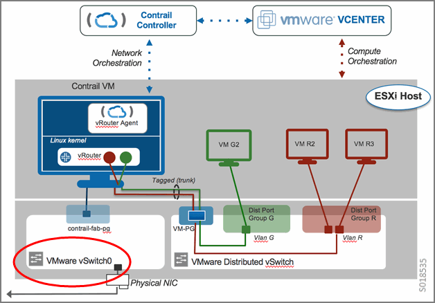
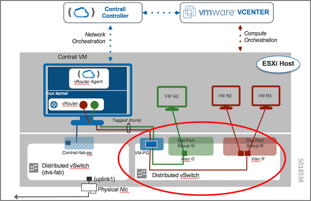
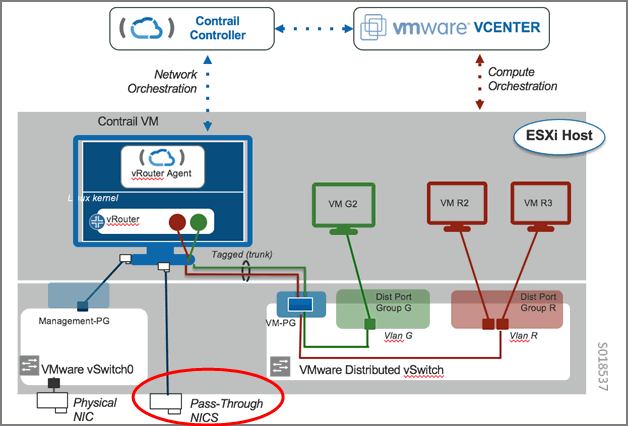
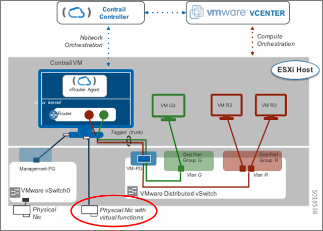

===========================================================
Underlay Network Configuration for Containerized ContrailVM
===========================================================

Starting with Contrail Release 4.0.1 and greater, vCenter can be used with containerized Contrail.

When using vCenter-as-compute with containerized Contrail, the ContrailVM can be configured in several different ways for the underlay ( ``ip-fabric`` ) connectivity:

   -  `Standard Switch Setup`_ 


   -  `Distributed Switch Setup`_ 


   -  `PCI Pass-Through Setup`_ 


   -  `SR-IOV Setup`_ 


Standard Switch Setup
=====================

In the standard switch setup, the ContrailVM is provided an interface through the standard switch port group that is used for management and control data, see `Figure 22`_ .

.. _Figure 22: 

*Figure 22* : Standard Switch Setup



To set up the ContrailVM in this mode, the standard switch and port group must be configured in the server JSON configuration.

If switch name is not configured, the default values of ``vSwitch0`` are used for the standard switch.

The ContrailVM supports multiple NICs for management and control_data interfaces. The management interface must have the DHCP flag as ``true`` and the ``control_data`` interface can have DHCP set as ``false`` . When DHCP is set to false, the interface script is updated with the IP address as specified in the server JSON. Additional configuration such as static routes and bond interface can be configured in the server JSON in Server Manager.

The following is an example of server configuration in Server Manager with standard switch.
   
::

      "contrail_vm": {
      “mgmt_switch”: “vSwitch0”,
      “mgmt_pg": “mgmt.-pg”
      "control_data_switch": "vSwitch1", 
      "control_data_pg": "control-pg", 
      "vmdk": "/root/vmdk_new/vmdk.tar"
  },


Distributed Switch Setup
========================

A distributed switch functions as a single virtual switch across associated hosts.

In the distributed switch setup, the ContrailVM is provided an interface through the distributed switch port group that is used for management and control data, see `Figure 23`_ .

The ContrailVM can be configured to use the management and control_data NICs from DVS. The DVS configuration for control_data and mgmt is provided in the cluster JSON configuration in Server Manager. When the DVS configuration is specified, the standard switch configuration is ignored.

.. _Figure 23: 

*Figure 23* : Distributed Switch Setup



To set up the ContrailVM in this mode, configure the distributed switch, port group, number of ports in the port group, and the uplink in the ``vcenter_servers`` section in the cluster JSON configuration.


.. note:: The uplink can be a link aggregation group (LAG). If you use LAG, then DVS and LAG need to be preconfigured.


The following is an example distributed switch configuration in cluster JSON.
   
::

        "vcenter_servers": [
        {
            "server1": {
                "datacenters": {
                    "i27_datacenter11": {
                        "dv_switch_control_data": {
                            "dv_port_group_control_data": {
                                "dv_portgroup_name": "pg_name", 
                                "number_of_ports": "3", 
                                "uplink": "vmnic1"
                            }, 
                            "dv_switch_name": "dvs_name"
                        }, 
                        "dv_switch_mgmt": {
                            "dv_port_group_mgmt": {
                                "dv_portgroup_name": "", 
                                "number_of_ports": "", 
                                "uplink": ""
                            }, 
                            "dv_switch_name": ""
                        }
                    }
                }
            }
        }
     ]


PCI Pass-Through Setup
======================

PCI pass-through is a virtualization technique in which a physical Peripheral Component Interconnect (PCI) device is directly connected to a virtual machine, bypassing the hypervisor. Drivers in the VM can directly access the PCI device, resulting in a high rate of data transfer.

In the pass-through setup, the ContrailVM is provided management and control data interfaces. Pass-through interfaces are used for control data. `Figure 24`_ shows a PCI pass-through setup with a single ``control_data`` interface.

.. _Figure 24: 

*Figure 24* : PCI Pass-Through with Single Control Data Interface



When setting up the ContrailVM with pass-through interfaces, upon provisioning ESXi hosts in the installation process, the PCI pass-through interfaces are exposed as Ethernet interfaces in the ContrailVM, and are identified in the ``control_data`` device field.

The following is an example PCI pass-through configuration with a single ``control_data`` interface:
  
::

    
       'contrail_vm': {
             “”“”“”             “pci_devices'”: {
                         “nics”: [“04:00.0"],
               },
              "vmdk": "/root/vmdk_new/vmdk.tar"

  }


 `Figure 25`_ shows a PCI pass-through setup with a bond_control data interface, which has multiple pass-through NICs.

   .. _Figure 25: 

  *Figure 25* : PCI Pass-Through Setup with Bond Control Interface

   .. figure:: s018743.png

Update the ContrailVM section in server JSON configuration with pci_devices as shown in the following example. Refer to the Server Manager documentation for bond interface-configuration in server JSON configuration.
   
::

        "contrail_vm": {
            “pci_devices”: {
                “nics”: [“04:00.0”, “04:00.1”]
            }
            "vmdk": "/root/vmdk_new/vmdk.tar"
        }, 


SR-IOV Setup
============

A single root I/O virtualization (SR-IOV) interface allows a network adapter device to separate access to its resources among various hardware functions.

In the SR-IOV setup, the ContrailVM is provided management and control data interfaces. SR-IOV interfaces are used for control data. See `Figure 26`_ .

.. _Figure 26: 

*Figure 26* : SR-IOV Setup



In VMware, the ``port-group`` is mandatory for SR-IOV interfaces because the ability to configure the networks is based on the active policies for the port holding the virtual machines. For more information, refer to VMware’s `SR-IOV Component Architecture and Interaction`_  .

The ``port-group`` is created as part of provisioning; however, before the provisioning, the distributed virtual switch (DVS) for the ``port-group`` should be created by the user.

To set up the ContrailVM with SR-IOV interfaces, all JSON ```` file configurations used for the standard switch setup are also used for the pass-through setup, providing the management connectivity to the ContrailVM.

To provide the ``control_data`` interfaces, configure the SR-IOV-enabled physical interfaces in the ``contrail_vm`` section, and configure the ``control_data`` in the global section of JSON file.

Configure the port group ( ``dv_port_group_sr_iov`` ) and the DVS ( ``dv_switch_sr_iov`` ) in the cluster JSON configuration in Server Manager.

Upon provisioning ESXi hosts in the installation process, the SR-IOV interfaces are exposed as Ethernet interfaces in the ContrailVM.

`Figure 27`_ shows a SR-IOV setup with a single ``control_data`` interface.

.. _Figure 27: 

*Figure 27* : SR-IOV With Single Control Data Interface

.. figure:: s018744.png

The following is an example SR-IOV configuration for the cluster and server configuration.

The cluster configuration:
   
::

    
        "vcenter_servers": [
            {
                "server1": {
                    "datacenters": {
                        "i27_datacenter11": {
                            "dv_switch_sr_iov": {
                                "dv_port_group_sriov": {
                                    "dv_portgroup_name": "", 
                                    "number_of_ports": "", 
                                    "uplink": ""
                                }, 
                                "dv_switch_name": ""
                            }
                        }
                    }
                }
            }
         ]


The server configuration:
   
::

        "contrail_vm": {
        “sr_iov_nics”: {
            “nics”: [“vmnic0”]
        }
        "vmdk": "/root/vmdk_new/vmdk.tar"
    }, 

 `Figure 28`_ shows an SR-IOV configuration with a bond ``control_data`` interface, which has multiple SR-IOV NICs.

   .. _Figure 28: 

  *Figure 28* : SR-IOV With Bond Control Data Interface

   .. figure:: s018746.png

For Bond interface-configuration specify multiple NICs in  sr_iov_nics, and add required configuration for multi-interface and bond configuration in server JSON configuration as specified in Server Manager documentation.

The cluster configuration:
   
::

    
        "vcenter_servers": [
            {
                "server1": {
                    "datacenters": {
                        "i27_datacenter11": {
                            "dv_switch_sr_iov": {
                                "dv_port_group_sriov": {
                                    "dv_portgroup_name": "", 
                                    "number_of_ports": "", 
                                    "uplink": ""
                                }, 
                                "dv_switch_name": ""
                            }
                        }
                    }
                }
            }
         ]


The server configuration:
   
::

        "contrail_vm": {
        “sr_iov_nics”: {
            “nics”: [“vmnic0”, “vmnic1”]
        }
        "vmdk": "/root/vmdk_new/vmdk.tar"
    }, 


**Related Documentation**

-  `Installing and Provisioning VMware vCenter with Containerized Contrail`_ 

-  `Sample JSON Configuration Files for vCenter with Containerized Contrail 4.0.1 and Greater`_ 

-  `Using the Contrail and VMWare vCenter User Interfaces to Manage the Network`_ 

.. _Installing and Provisioning VMware vCenter with Containerized Contrail: topic-122501.html

.. _Sample JSON Configuration Files for vCenter with Containerized Contrail 4.0.1 and Greater: topic-122504.html

.. _Using the Contrail and VMWare vCenter User Interfaces to Manage the Network: topic-99640.html

.. _SR-IOV Component Architecture and Interaction: https://pubs.vmware.com/vsphere-55/index.jsp?topic=%2Fcom.vmware.vsphere.networking.doc%2FGUID-DD13D453-98B9-4D26-85EA-A738293AEE00.html
