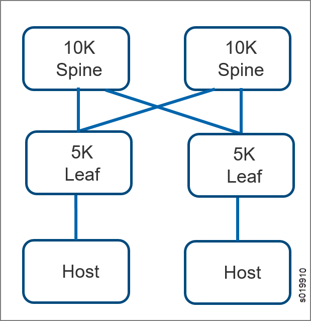
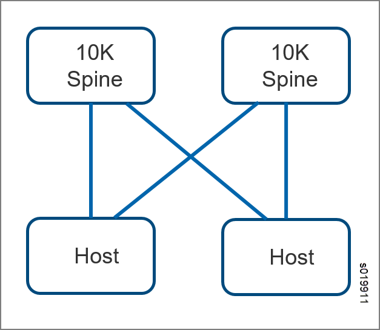

======================================================================
EVPN-VXLAN Support for Bare Metal Devices and QFX Device Configuration
======================================================================

   -  `Overview of Previous Environment`_ 

   -  `Scaling Solution`_ 

   -  `Implementation`_ 

   -  `Using the Contrail Web UI to Configure EVPN-VXLAN`_ 

Overview of Previous Environment
--------------------------------

Contrail releases previous to 4.1 enable use of EVPN-VXLAN when the network includes both virtual and bare metal devices. MX Series routers can use EVPN-VXLAN to provide both Layer 2 and Layer 3 connectivity for end stations within a Contrail virtual network (VN).

Two types of encapsulation methods are used in virtual networks:

   - MPLS-over-GRE (generic routing encapsulation) is used for Layer 3 overlay virtual network routing between Contrail and MX Series routers.

   - EVPN-VXLAN is used for Layer 2 overlay virtual network connectivity between virtual machines on Contrail, bare metal servers attached to QFX Series switches, and their respective Layer 3 gateway configured on the QFX. Subsequently, inter-VXLAN routing between virtual machines and bare metal servers, and between bare metal servers on different VXLAN VNI, is performed on QFX.

With Contrail, Layer 3 routing is preferred over Layer 2 bridging whenever possible. Layer 3 routing is used through virtual routing and forwarding (VRF) tables between Contrail vRouters and physical MX/QFX Series routers.

When there are multiple VxLAN networks connected to a spine switch, and the hosts in the networks need to talk to each other, it is necessary to export route targets (RTs) of every VN to every other VN. This results in scalability issues, because if you have 'm' networks with 'n' routes each, then the VRF of every VN will have 'm*n' routes, and the system as a whole needs to store 'm ^ 2 * n' routes. This can quickly exhaust the system resources.

Scaling Solution
----------------

Contrail 4.1 supports a solution to the scaling limitations.

Software Requirements
---------------------

These are the software requirements for the EVPN-VXLAN scaling solution.

   - QFX 5100/5110—Release Junos 17.2 and later versions.

   - QFX 10K—Release Junos 17.2 and later versions.

   - Contrail—Release 4.1 and later.

Configuration Topologies
------------------------

`Figure 126`_ and `Figure 127`_ show the configuration topologies valid for this solution.

.. _Figure 126: 

*Figure 126* : 10K Acting as Spine (Layer 3 Gateway), 5K acting as Leaf (Layer 2 Gateway), hosts are connected to leafs

.. _Figure 127: 

*Figure 127* : 10K Acting as Leaf (Layer 3 Gateway), hosts are directly connected to 10K

BGP Configuration for 10K and 5K
--------------------------------

BGP configuration for the QFX 10K and 5K is very similar to BGP configuration for the MX Router, except that dynamic tunnels are not supported by the QFX10K and 5K in release 17.2.

The following protocol configurations are supported:

   - BGP Peering (internal & external)

   - Hold timer, Auth, iBGP Export policy

   - Address Families

   - AS Configuration

   - router-id and dataplane ip configuration

   - loopback interface configuration

   - Supported Family types: evpn, router target only.

EVPN Configuration
------------------

Configuring EVPN with VXLAN encapsulation handles Layer 2 connectivity at the scale required.

   - Configure extended-vni-list all to list the VXLAN Network Identifiers (VNIs) that are part of the EVPN/VXLAN MP-BGP domain

   - Configure ingress-replication to facilitate the provider tunnel to use unicast tunnels between routers to create a multicast distribution tree.

   - For Layer 3 Spine only, configure default-gateway ("no-gateway-community")

   - For Layer 3 Leaf only, configure default-gateway ("do-not-advertise")

Sample EVPN Configuration
-------------------------
::

    set protocols evpn vni-options vni 1 vrf-target target:10003:1
    set protocols evpn vni-options vni 2 vrf-target target:10003:2
    set protocols evpn encapsulation vxlan
    set protocols evpn extended-vni-list all
    set protocols evpn default-gateway no-gateway-community (For L3)

Configuration of Interfaces with Corresponding VLAN Members and Associated VN
-----------------------------------------------------------------------------
::

    vlans {
   data {
     vlan-id none;
     l3-interface irb.82;   # For L3
   }
   v1 {
      vlan-id none;
      vxlan {
           vni 1;
      }
   }
   v6 {
      vlan-id none;
      vxlan {
         vni 2;
      }
  }
 }

# Note: ingress-node-replication is not needed

Switch Options for Layer 2 and Layer 3
--------------------------------------

   - Configure the policy-statements under policy-options to set a specific route preference using communities

   - Configure the source interface for a VXLAN tunnel

   - Configure an import and export policy, include the vrf-import statement

   - Configure route-distinguisher to distinguish one set of routes (one VRF) from another

Sample Configuration:
---------------------
::

        policy-options {
        policy-statement IMP {
        term 1 {
            from community com6;
            then accept;
        }
        term 2 {
            from community com5;
            then accept;
        }
        then reject;
     }
     community com5 members target:10003:1;
     community com6 members target:10003:2;
   }

  switch-options {
       vtep-source-interface lo0.0;
       route-distinguisher 64520:1;
       vrf-import IMP;
       vrf-export IMP;
  }

Interfaces Configuration
------------------------

For Layer 3, configure IRB interfaces (one for each bridge domain) and place them in the customer routing instance.

For 10K Acting as L3 Spine gateway:

   - Configure "proxy-macip-advertisement" on 10K IRB interfaces if 10K is acting as Spine. This enables the switch that functions as a Layer 3 gateway in an Ethernet VPN-Virtual Extensible LAN (EVPN-VXLAN) with integrated routing and bridging (IRB) interfaces that advertise the MAC and IP routes (MAC+IP type 2 routes) for hosts in the topology.

   - Configure ip, virtual-gateway-ip for each irb

   - If hosts are connected to switch, and switch inturn is connected to Layer 3 Spine via Layer 2 Leaf, then on the Spine we will need to configure MAC address for each irb (virtual-gatewa-ip mapped to mac)

For 10K Acting as Layer 3 Leaf gateway:

   - for each IRB, allocate IP and static MAC

On 10K, lo0 interface should be configured with an inet family unit and add this interface in the customer-facing routing instance.

Configure lo0.0 as vtep-source-interface on both 10K and 5K. This is the same as an MX device configuration.

Routing Instances Configuration
-------------------------------

#. Configure VRF-type routing instances for each client network.

#. Allocate IRB interfaces for each VLAN associated to this network and place in the routing instance.

#. Allocate an lo0 interface for each client network, and place it in the routing instance.

#. Allocate IP for each lo0 interface, this IP can be allocated from the implicit VN’s subnet.

#. Allocate an IP for each IRB, and add a static route next hop pointing to the IRB interface.

.. note:: IRB interfaces are needed only for client networks, and only if there is a logical router associated to the network.

          If the VXLAN routing flag is not enabled for the project, do not program VNs on 10K.

Configure Logical Router
------------------------

The concept of a logical router is present in Contrail as part of the SNAT solution, where a logical router is created for the private VNs to talk to the public cloud. In this solution, the logical router entity is used to facilitate VxLAN routing.

A new parameter ( ``enable_vxlan_routing`` ) is introduced to enable Inter-VxLAN routing at the project level. When enabled for a project, an internal system VN (VN-Int) is created for every logical router in the project. The VNI for this internal VN can be configured as part of the logical router configuration. It will be auto-generated if it is not specified.

Now all the routes in the VNs that are connected to the logical router will be exported to the RT-Int of VN-Int. The VN-Int RI will have cumulative routes for all the networks connected to the logical router. The advantage of this approach is that the routes need not be repopulated for every VN multiple times, it only needs to be populated once for the VN-Int. This helps in scalability.

The VN-Int (RT-Int) can be configured in the QFX switch so that these routes can be leaked to the QFX IRB interface, see `Figure 128`_ .

.. _Figure 128: 

*Figure 128* : Using Logical Router to Enhance Scalability

.. figure:: s019912.png

Implementation
--------------

The QFX is modeled as a physical router in the Contrail database.

There are separate plugins for QFX 5K and 10K. The logical router can be extended to a physical router. Logical Router can be extended to Physical Router. The route targets and interfaces are configured based on this association on the QFX. An explicit role of spine or leaf is added for the physical router.

The user designs the physical topology and configures the solution using either the Contrail database by means of VNC APIs or by using the Contrail Web UI.

   - QFX physical routers with proper credentials need to be configured.

   - BGP peers need to be configured.

   - Virtual networks and logical routers need to be extended to physical routers.

   - Configure interfaces, vlans, and ipams.

Using the Contrail Web UI to Configure EVPN-VXLAN
-------------------------------------------------

When using the Contrail web user interface to configure EVPN-VXLAN make sure the following are done:

   - Extend the logical router to the physical router.

   - Configure the QFX product name.

   - Configure physical router role: spine or leaf.

   - Configure VNI for the logical router if auto configuration is disabled in the global system configuration.

