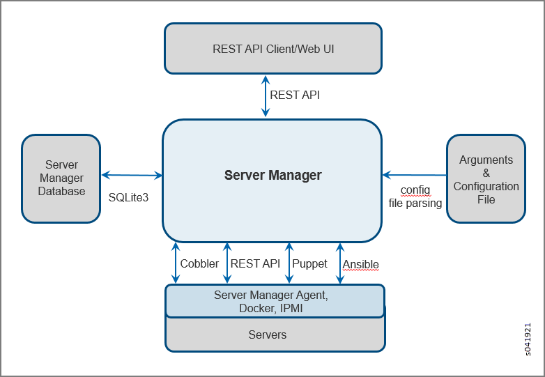

=============================================
Using Server Manager to Automate Provisioning
=============================================

   -  `Overview of Server Manager`_ 

   -  `Server Manager Requirements and Assumptions`_ 

   -  `Server Manager Component Interactions`_ 

   -  `Configuring Server Manager`_ 

   -  `Configuring the Cobbler DHCP Template`_ 

   -  `User-Defined Tags for Server Manager`_ 

   -  `Server Manager Client Configuration File`_ 

   -  `Restart Services`_ 

   -  `Accessing Server Manager`_ 

   -  `Communicating with the Server Manager Client`_ 

   -  `Server Manager Commands for Configuring Servers`_ 

   -  `Server Manager REST API Calls`_ 

   -  `Example: Reimaging and Provisioning a Server`_ 

Overview of Server Manager
==========================

The Contrail Server Manager is used to provision, configure, and reimage a Contrail virtual network system of servers, clusters, and nodes.

This section describes the functions and usage guidelines for the Contrail Server Manager.

The Server Manager provides a simple, centralized way for users to manage and configure components of a virtual network system running across multiple physical and virtual servers in a cloud infrastructure.

You can use Server Manager to configure, provision, and reimage servers with the correct software version and packages for the nodes that are running on each server in multiple virtual network system clusters.

The Server Manager:

   - Provides REST APIs to handle customer requests.

   - Manages its own database to store information about the servers.

   - Interacts with other open source products such as Cobbler, Puppet, and Ansible to configure servers based on user requests.

Server Manager Requirements and Assumptions
===========================================

The following are requirements and assumptions for the Server Manager:

   - The Server Manager runs on a Linux server (bare metal or virtual machine) and assumes availability of several software products with which it interacts to provide the functionality of managing servers.

   - The Server Manager has network connectivity to the servers it is trying to manage.

   - The Server Manager has access to a remote power management tool to power cycle the servers that it manages.

   - The Server Manager uses Cobbler software for Linux provisioning to configure and download software to physical servers. Cobbler resides on the same server that is running the Server Manager daemon.

     - Server Manager assumes that DNS and DHCP servers embedded with Cobbler provide IP addresses and names to the servers being managed, although it is possible to use external DNS and DHCP servers.

   - The Server Manager uses Puppet software, an open source configuration management tool, to accomplish the configuration management of target servers, including the installation and configuration of different software packages and the launching of various services.

   - Starting with Contrail Release 4.0, Server Manager uses Ansible software, an open source configuration management tool primarily used to automate the configuration and provisioning of Contrail components inside containers.

   - The Server Manager also uses Docker to load and move these Contrail containers to the target servers. The Server Manager maintains a local registry on the Server Manager machine and users also have an option to use an external registry from which they can copy their Contrail Docker images directly onto the target servers.

   - SQLite3 database management software is used to maintain and manage server configurations and it runs on the same machine where the Server Manager daemon is running.

   - Because the server-manager process listens on port 9001, and the server-manager webui listens on ports 9080 and 9143, the firewall must be enabled for those ports.

   - Server Manager needs a minimum of 4GB of RAM, 2 CPU cores, and 80GB of disks (to support multiple Contrail installations).

   - Server Manager assumes that SSH is enabled on target nodes.

Server Manager Component Interactions
=====================================

The Server Manager runs as a daemon and provides REST APIs for interaction with the client. The Server Manager accepts user input in the form of REST API requests, performs the requested function on the resources, and responds with a REST API response.

Configuration parameters required by the Server Manager are provided in the Server Manager configuration file. However, the parameters can be overridden by Server Manager command line parameters.

`Figure 34`_ illustrates several high-level components with which the Server Manager interacts.

.. _Figure 34: 

*Figure 34* : Server Manager Component Interactions

Internally, the Server Manager uses a SQLite3 database to hold server configuration information. The Server Manager coordinates the database configuration information and user requests to manage the servers defined in the database.

While managing the servers, the Server Manager also communicates with other software components. It uses Cobbler for reimaging target servers, Docker to host Contrail containers, and Ansible and Puppet for provisioning, thereby ensuring necessary software packages are installed and configured, required services are running, and so on.

A Server Manager agent runs on each of the servers and communicates with the Server Manager, providing the information needed to monitor the operation of the servers. The Server Manager agent also uses REST APIs to communicate with the Server Manager, and it can use other software tools to fetch other information, such as Intelligent Platform Interface (IPMI). Monitoring functionality is enabled by default with Server Manager installation but can be skipped if the user wishes.

Configuring Server Manager
==========================

When the installation of all Server Manager components and dependent packages is finished, configure the Server Manager with parameters that identify your environment and make it available for clients to serve REST API requests.

Upon installation, a sample Server Manager configuration file is created at:

 ``/opt/contrail/server_manager/sm-config.ini`` 

Modify the ``sm-config.ini`` configuration file to include parameter values specific to your environment.

The environment-specific configuration section of the ``sm-config.ini`` file is named ``SERVER-MANAGER`` .

The following example shows the format and parameters of the ``SERVER-MANAGER`` section. Typically, only the ``listen_ip_addr, cobbler_username`` , and ``cobbler_passwd`` values need to be modified.
   
::

 [SERVER-MANAGER]

 listen_ip_addr = <SM-IP-address>

 listen_port    = <port-number>

 cobbler_ip_address = <cobbler-ip-address>

 cobbler_port   = <cobbler-port-number>

 cobbler_username = <cobbler-username>

 cobbler_password = <cobbler-password>

 ipmi_username = <IPMI username>

 ipmi_password = <IPMI password>

 ipmi_type = <IPMI type>

`Table 3`_ provides details for each of the parameters in the ``SERVER-MANAGER`` section.

.. _Table 3: 

*Table 3* : Server Manager Parameters

 +---------------------------------------+-----------------------------------+
 | Parameter                             | Configuration                     |
 +=======================================+===================================+
 | ``listen_ip_addr``                    | Specify the IP address of the     |
 |                                       | server on which the Server        |
 |                                       | Manager is listening for REST API |
 |                                       | requests.                         |
 +---------------------------------------+-----------------------------------+
 | ``listen_port``                       | The port number on which the      |
 |                                       | Server Manager is listening for   |
 |                                       | REST API requests. The default is |
 |                                       | 9001.                             |
 +---------------------------------------+-----------------------------------+
 | ``cobbler_ip_address``                | The IP address used to access     |
 |                                       | Cobbler. This address MUST be the |
 |                                       | same address as the               |
 |                                       | ``listen_ip_address``. The Server |
 |                                       | Manager assumes that the Cobbler  |
 |                                       | service is running on the same    |
 |                                       | server as the Server Manager      |
 |                                       | service.                          |
 +---------------------------------------+-----------------------------------+
 | ``cobbler_port``                      | The port on which Cobbler listens |
 |                                       | for user requests. Leave this     |
 |                                       | field blank.                      |
 +---------------------------------------+-----------------------------------+
 | ``cobbler_username``                  | Specify the user name to access   |
 |                                       | the Cobbler service. Specify      |
 |                                       | ``testing`` unless your Cobbler   |
 |                                       | settings have been modified to    |
 |                                       | use a different user name.        |
 +---------------------------------------+-----------------------------------+
 | ``cobbler_password``                  | Specify the password to access    |
 |                                       | the Cobbler service. Specify      |
 |                                       | ``testing`` unless your Cobbler   |
 |                                       | settings have been modified to    |
 |                                       | use a different password.         |
 +---------------------------------------+-----------------------------------+
 | ``ipmi_username``                     | The IPMI username for power       |
 |                                       | management.                       |
 +---------------------------------------+-----------------------------------+
 | ``ipmi_password``                     | The IPMI password for power       |
 |                                       | management.                       |
 +---------------------------------------+-----------------------------------+
 | ``ipmi_type``                         | The IPMI type (ipmilan, lanplus,  |
 |                                       | or other Cobbler-supported        |
 |                                       | types).                           |
 +---------------------------------------+-----------------------------------+

Starting with Contrail Release 4.0, there is an  ANSIBLE-SERVERsection for parameters for running the Server Manager Ansible daemon, which is used to set up a Docker registry. This registry is used by Ansible to provision Contrail Release 4.0 containers onto targets. These values can be modified to reflect any remote or non-Server Manager Docker registry that the user wants to use to host the Contrail Release 4.0 Docker containers. The following example shows the format and parameters of the  ANSIBLE-SERVERsection:
   
::

 [ANSIBLE-SERVER]

 docker_insecure_registries = <IP address:Port>

 docker_registry = <IP address:Port>

 ansible_srvr_ip = <IP address>

 ansible_srvr_port = <Port>

 ansible_log_path  = /var/log/contrail-server-manager/debug.log

`Table 4`_ provides details for each of the parameters in the ``ANSIBLE-SERVER`` section.

.. _Table 4: 

*Table 4* : Ansible Server Parameters

  +-----------------------------------+-----------------------------------+
  | Parameter                         | Configuration                     |
  +===================================+===================================+
  | ``docker_insecure_registries``    | Specify the IP address and port   |
  |                                   | of the server on which the        |
  |                                   | insecure Docker registry used by  |
  |                                   | the Server Manager resides        |
  +-----------------------------------+-----------------------------------+
  | ``docker_registry``               | Specify the IP address and port   |
  |                                   | of the server on which the Docker |
  |                                   | registry used by the Server       |
  |                                   | Manager resides                   |
  +-----------------------------------+-----------------------------------+
  | ``ansible_srvr_ip``               | Specify the IP address of the     |
  |                                   | Server Manager machine on which   |
  |                                   | the Ansible daemon will run       |
  +-----------------------------------+-----------------------------------+
  | ``ansible_srvr_port``             | Specify the port on the Server    |
  |                                   | Manager machine on which the      |
  |                                   | Ansible daemon will run           |
  +-----------------------------------+-----------------------------------+
  | ``ansible_log_path``              | Specify the log path where the    |
  |                                   | Ansible daemon stores its log     |
  |                                   | messages                          |
  +-----------------------------------+-----------------------------------+

Configuring the Cobbler DHCP Template
=====================================

In addition to configuring the ``sm_config.ini`` file, you must manually change the settings in the ``/etc/cobbler/dhcp.template`` file to use the correct subnet address, mask, and DNS domain name for your environment. Optionally, you can also restrict the use of the current instance of Server Manager and Cobbler to a subset of servers in the network.

The following is a link to a sample ``dhcp.template`` file, which you can modify to match the subnets in your setup.

.. note:: The IP addresses and other values in the sample are for example purposes only. Be sure to use values that are correct for your environment.

 *Sample dhcp.template* 

 https://github.com/Juniper/contrail-server-manager/blob/master/src/cobbler/dhcp.template.u.sample 

User-Defined Tags for Server Manager
====================================

Server Manager enables you to define tags that can be used to group servers for performing a particular operation, such as show information, reimage, provision, and so on. Server Manager supports up to seven different tags that can be configured and used for grouping servers.

The names of user-defined tags are kept in the ``tags.ini file`` , at ``/etc/contrail_smgr/tags.ini.`` 

It is possible to modify tag names, and add or remove tags dynamically using the Server Manager REST API interface. However, if a tag is already being used to group servers, the tag must be removed from the servers before tag modification is allowed.

The following is a sample ``tags.ini`` file that is copied on installation. In the sample file, five tags are defined – ``datacenter, floor, hall, rack`` , and ``user_tag`` . Use the tags to group servers together.

::

  [TAGS]
  tag1 = datacenter
  tag2 = floor
  tag3 = hall
  tag4 = rack
  tag5 = user_tag

Server Manager Client Configuration File
========================================

The Server Manager client application installation copies the ``/etc/contrail/sm-client-config.ini`` sample configuration file. The sample file contains parameter values such as the IP address to reach the Server Manager and the port used by Server Manager. You must modify the values in the ``sm-client-config.ini`` file to match your environment.

The ``CLUSTER`` and ``SERVER`` subsections have fields that represent the password for a host or a service. If a value for the password field is not explicitly provided, the Server Manager selects a default password.

Starting with Contrail Release 3.0.2, if you don’t explicitly specify a password, a password is automatically generated by the system. This makes the clusters provisioned by Server Manager more secure. There are no default passwords. The system administrator can specify the passwords to configure, or you can use the passwords that are automatically generated by Server Manager.

The following fields get an autogenerated password whenever an explicit password is not provided.

   - Ceilometer Mongodb password

   - Ceilometer keystone auth password

   - Cinder keystone auth password

   - Glance keystone auth password

   - Heat encryption key

   - Heat keystone auth password

   - Keystone admin password

   - Keystone admin token

   - MYSQL root password

   - MYSQL service password

   - Neutron keystone auth password

   - Nova keystone auth password

   - Swift keystone auth password

Restart Services
================

When all user changes have been made to the configuration files, restart the Server Manager so that it runs with the modifications:

 ``service contrail-server-manager​ restart`` 

Accessing Server Manager
========================

When the Server Manager configuration has been customized to your environment, and the required daemon services are running, clients can request and use services of the Server Manager by using REST APIs. Any standard REST API client can be used to construct and send REST API requests and process Server Manager responses.

The following steps are typically required to fully implement a new cluster of servers being managed by the Server Manager.

#. Add a boot image (ISO) to server-manager, along with the kickstart and preseed files compatible with your datacenter server. Each Server Manager release has a default kickstart file. If your system administrator doesn’t provide the kickstart files, Server Manager default files will be used.

#. Add the Contrail image you are using to Server Manager.

#. Add the cluster(s) to Server Manager. You can add common provisioning parameters for servers to the cluster, and the parameters get passed to the server when provisioning starts.

#. Add the servers that will be managed by Server Manager. Remember to add the ``cluster_id`` to link with the cluster.

The following are the minimum parameters needed for reimaging or provisioning:

   - ID

   - cluster

   - domain

   - interface details

   - roles assigned to each server

   - password

#. Specify the name and location of boot images, packages, and repositories used to bring up the servers with needed software of the supported versions.

#. Provision or configure the servers by installing necessary packages, creating configuration files, and bringing up the correct services so that each server can perform the functions or role(s) configured for that server.

   A Contrail system of servers has several components or roles that work together to provide the functionality of the virtual network system, including: control, config, analytics, compute, web-ui, OpenStack, and database. Each of the roles has different requirements for the software and services needed. The provisioning REST API enables the client to configure the roles on servers using the Server Manager.

#. Set up API calls for monitoring servers.

   Once the servers in the Contrail system are correctly reimaged and provisioned to run configured roles, the server monitoring REST API calls allow clients to monitor performance of the servers as they provide one or more role functions.

Communicating with the Server Manager Client
============================================

Server Manager provides a REST API interface for clients to talk to the Server Manager software. Any client that can send and receive REST API requests and responses can be used to communicate with Server Manager, for example, Curl or Postman. Additionally, the Server Manager software provides a client with a simplified CLI interface, in a separate package. The Server Manager client can be installed and run on the Server Manager machine itself or on another server with an IP connection to the Server Manager machine.

Prior to using the Server Manager client CLI commands, you need to modify the ``sm-client-config.ini`` file to specify the IP address and the port for the Server Manager.

Each of the commands described in this section takes a set of parameters you specify, constructs a REST API request to the Server Manager, and provides the server’s response.

The following describes each Server Manager client CLI command in detail.

Server Manager Commands for Configuring Servers
===============================================

This section describes commands that are used to configure servers and server parameters in the Server Manager database. These commands allow you to add, modify, delete, or view servers, clusters, images, and tags.

   -  `Server Manager Commands Common Options`_ 

   -  `Add New Servers or Update Existing Servers`_ 

   -  `Delete Servers`_ 

   -  `Display Server Configuration`_ 

   -  `Server Manager Commands for Managing Clusters`_ 

   -  `Server Manager Commands for Managing Tags`_ 

   -  `Server Manager Commands for Managing Images`_ 

   -  `Server Manager Operational Commands for Managing Servers`_ 

   -  `Reimaging Server(s)`_ 

   -  `Provisioning and Configuring Roles on Servers`_ 

   -  `Restarting Server(s)`_ 

   -  `Show Status of Server(s)`_ 

   -  `Show Status of Provision`_ 

Server Manager Commands Common Options
--------------------------------------

The common options in `Table 5`_ are available with every Server Manager command.

.. _Table 5: 

*Table 5* : Common Command Options

  +-----------------------------------+-----------------------------------+
  | Option                            | Description                       |
  +===================================+===================================+
  | ``-h, --help``                    | Show the options available for    |
  |                                   | the current command and exit.     |
  +-----------------------------------+-----------------------------------+
  | ``--config_file CONFIG_FILE, -c   | The name of the Server Manager    |
  | CONFIG_FILE``                     | client configuration file. The    |
  |                                   | default file is                   |
  |                                   |``/etc/contrail/sm-client-config.in|
  |                                   | i``.                              |
  +-----------------------------------+-----------------------------------+
  | ``--smgr_ip`` SMGR_IP             | The IP address of the Server      |
  |                                   | Manager process if different from |
  |                                   | that specified in the config      |
  |                                   | file.                             |
  +-----------------------------------+-----------------------------------+
  | ``--smgr_port`` SMGR_PORT         | The port that the Server Manager  |
  |                                   | process is listening on if        |
  |                                   | different from that in the config |
  |                                   | file.                             |
  +-----------------------------------+-----------------------------------+

Add New Servers or Update Existing Servers
------------------------------------------

Use the ``server-manager add`` command to create a new server or update a server in the Server Manager database.

::

 server-manager [-h] [--smgr_ip SMGR_IP] [--smgr_port SMGR_PORT]
 [--config_file CONFIG_FILE] add server [-f FILE_NAME]

`Table 6`_ lists the optional arguments.

.. _Table 6: 

*Table 6* : Server Manager Add Server Command Options

  +-----------------------------------+-----------------------------------+
  | Option                            | Description                       |
  +===================================+===================================+
  | ``--file_name FILE_NAME, -f       | The JSON file that contains the   |
  | FILE_NAME``                       | server parameter values.          |
  +-----------------------------------+-----------------------------------+

The JSON file contains a number of server entries, in the format shown in the following example:

 https://github.com/Juniper/contrail-server-manager/blob/R3.1/src/client/new-server.json 

Most of the parameters in the JSON sample file are self-explanatory. ``Cluster_id`` defines the cluster to which the server belongs. The sample ``roles`` array in the example lists all valid role values. ``Tag`` defines the mapping of tag names and values for grouping and classifying the server.

The ``server-manager add`` command will add a new entry if the server with the given ID or mac_address does not exist in the Server Manager database. If an entry already exists, the add command modifies the fields in the existing entry with any new parameters specified.

.. note:: It is not possible to re-add an existing MAC address under a new server, even if the ID and IP address of that new server are unique.

Delete Servers
--------------

Use the ``server-manager delete`` command to delete one or more servers from the Server Manager database.

::

   server-manager [-h] [--smgr_ip SMGR_IP] [--smgr_port SMGR_PORT][--config_file CONFIG_FILE] delete server (--server_id SERVER_ID | --mac MAC | --ip IP | --cluster_id CLUSTER_ID | --tag <tag_name=tag_value>.. )

`Table 7`_ lists the optional arguments.

.. _Table 7: 

*Table 7* : Server Manager Delete Server Command Options

  +-----------------------------------+-----------------------------------+
  | Option                            | Description                       |
  +===================================+===================================+
  | ``--server_id SERVER_ID``         | The server ID for the server or   |
  |                                   | servers to be deleted.            |
  +-----------------------------------+-----------------------------------+
  | ``--mac MAC``                     | The MAC address for the server or |
  |                                   | servers to be deleted.            |
  +-----------------------------------+-----------------------------------+
  | ``--ip IP``                       | The IP address for the server or  |
  |                                   | servers to be deleted.            |
  +-----------------------------------+-----------------------------------+
  | ``--cluster_id CLUSTER_ID``       | The cluster ID for the server or  |
  |                                   | servers to be deleted.            |
  +-----------------------------------+-----------------------------------+
  | ``--tag TagName=TagValue``        | The TagName that is to be matched |
  |                                   | with the Tagvalue. Up to seven    |
  |                                   | TagName and Tagvalue pairs        |
  |                                   | separated by commas can be        |
  |                                   | provided.                         |
  +-----------------------------------+-----------------------------------+

The criteria for identifying servers to be deleted can be specified by providing the ``server_id`` or the server: ``mac address, ip, cluster_id`` , or the ``TagName = TagValue`` .

Provide one of the server matching criteria to display a list of servers available to be deleted.

Display Server Configuration
----------------------------

Use the ``server-manager display`` command to display the configuration of servers from the Server Manager database​.

::

   server-manager display [--smgr_ip SMGR_IP] [--smgr_port SMGR_PORT][--config_file CONFIG_FILE]
                      server (--server_id SERVER_ID | --mac MAC | --ip IP | --cluster_id CLUSTER_ID | --tag <tag_name=tag_value>.. ) [--detail]

`Table 8`_ lists the optional arguments.

.. _Table 8: 

*Table 8* : Server Manager Display Server Command Options

  +-----------------------------------+-----------------------------------+
  | Option                            | Description                       |
  +===================================+===================================+
  | ``--server_id SERVER_ID``         | The server ID for the server or   |
  |                                   | servers to be deleted.            |
  +-----------------------------------+-----------------------------------+
  | ``--mac MAC``                     | The MAC address for the server or |
  |                                   | servers to be displayed.          |
  +-----------------------------------+-----------------------------------+
  | ``--ip IP``                       | The IP address for the server or  |
  |                                   | servers to be displayed.          |
  +-----------------------------------+-----------------------------------+
  | ``--cluster_id CLUSTER_ID``       | The cluster ID for the server or  |
  |                                   | servers to be displayed.          |
  +-----------------------------------+-----------------------------------+
  | ``--tag TagName=TagValue``        | The TagName that is to be matched |
  |                                   | with the Tagvalue. Up to seven    |
  |                                   | TagName and Tagvalue pairs        |
  |                                   | separated by commas can be        |
  |                                   | provided.                         |
  +-----------------------------------+-----------------------------------+
  | ``--detail, -d``                  | Flag to indicate if details are   |
  |                                   | requested.                        |
  +-----------------------------------+-----------------------------------+

The criteria for identifying servers to be displayed can be specified by providing the ``server_id`` or one of the following server parameters: ``mac address, ip, cluster_id,`` or ``TagName=TagValue`` .

Provide one or more of the server matching criteria to display a list of servers.

Server Manager Commands for Managing Clusters
---------------------------------------------

A cluster is used to store parameter values that are common to all servers belonging to that cluster. The commands in this section facilitate managing clusters in the Server Manager database, enabling you to add, modify, delete, and view clusters.

.. note:: Whenever a server is created with a specific ``cluster_id`` , Server Manager checks to see if a cluster with that ID has already been created. If there is no matching ``cluster_id`` already in the database, an error is returned.

   -  `Create a New Cluster or Update an Existing Cluster`_ 

   -  `Delete a Cluster`_ 

   -  `Display Cluster Configuration`_ 

Create a New Cluster or Update an Existing Cluster
--------------------------------------------------

Use the ``server-manager add`` command to create a new cluster or update an existing cluster in the Server Manager database.

::

   server-manager add cluster [--file_name FILE_NAME]

`Table 9`_ lists the optional arguments.

.. _Table 9: 

*Table 9* : Server Manager Add Cluster Command Options

  +-----------------------------------+-----------------------------------+
  | Option                            | Description                       |
  +===================================+===================================+
  | ``--file_name FILE_NAME, -f       | The JSON file that contains the   |
  | FILE_NAME``                       | cluster parameter values.         |
  +-----------------------------------+-----------------------------------+

The JSON file contains a number of cluster entries, in the format shown in the following example:

 https://github.com/Juniper/contrail-server-manager/blob/master/src/client/new-cluster-contrail-4.x.json 

Server membership to a cluster is determined by specifying the ID corresponding to the cluster when defining the server. All of the cluster parameters are available to the server when provisioning roles on the server.

Delete a Cluster
----------------

Use the ``server-manager delete`` command to delete a cluster from the Server Manager database that are no longer needed. Use this command after all servers in the cluster have been deleted.

.. note:: A cluster can only be deleted if no servers are attached to it. If any servers are attached, deletion will fail.

::

   server-manager delete cluster [--cluster_id CLUSTER_ID] 

`Table 10`_ lists the optional arguments.

.. _Table 10: 

*Table 10* : Server Manager Delete Cluster Command Options

  +-----------------------------------+-----------------------------------+
  | Option                            | Description                       |
  +===================================+===================================+
  | ``--cluster_id CLUSTER_ID``       | The cluster ID for the server or  |
  |                                   | servers to be displayed.          |
  +-----------------------------------+-----------------------------------+

Display Cluster Configuration
-----------------------------

Use the ``server-manager display`` command to list the configuration of a cluster.

::

   server-manager display cluster [--cluster_id CLUSTER_ID] [--detail]

`Table 11`_ lists the optional arguments.

.. _Table 11: 

*Table 11* : Server Manager Display Cluster Command Options

  +-----------------------------+---------------------------------------------+
  | Option                      | Description                                 |
  +=============================+=============================================+
  | ``--detail, -d``            | Flag to indicate if details are requested.  |
  +-----------------------------+---------------------------------------------+
  | ``--cluster_id CLUSTER_ID`` | The cluster ID for the cluster or clusters. |
  +-----------------------------+---------------------------------------------+

You can optionally specify a cluster ID to get server information about a particular cluster. If the optional parameter is not specified, server information about all clusters in the system is returned.

Server Manager Commands for Managing Tags
-----------------------------------------

Tags are used for grouping servers together so that an operation such as show, reimage, provision, status, and so on can be easily performed on servers that have matching tags. The Server Manager provides a flexible way for you to define your own tags, and then use those tags to assign values to servers. Servers with matching tag values can be easily grouped together. The Server Manager can store a maximum of seven tag values. At initialization, the Server Manager reads the tag names from the configuration file. The tag names can be retrieved or modified using CLI commands. When modifying tag names, the Server Manager ensures that the tag name being modified is not used by any of the server entries.

   -  `Create a New Tag or Update an Existing Tag`_ 

   -  `Display Tag Configuration`_ 

Create a New Tag or Update an Existing Tag
------------------------------------------

Use the ``server-manager add`` command to create a new tag or update an existing tag in the Server Manager database.

::

   server-manager add  tag [--file_name FILE_NAME] [--tags TAG_LIST]

`Table 12`_ lists the optional arguments.
.. _Table 12: 

*Table 12* : Server Manager Add New Tag

  +-----------------------------------+-----------------------------------+
  | Option                            | Description                       |
  +===================================+===================================+
  | ``--file_name FILE_NAME, -f       | The JSON file that contains the   |
  | FILE_NAME``                       | tag names.                        |
  +-----------------------------------+-----------------------------------+
  | ``--tags TAG_LIST``               | Comma separated list of tag       |
  |                                   | number and tag. For example:      |
  |                                   | tag0=abc,tag1=``xyz``             |
  +-----------------------------------+-----------------------------------+

The sample JSON file contains a number of tag entries, in the format shown in the following example:

::

   {

    "tag1" : "data-center",

    "tag2" : "floor",

    "tag3" : "",

    "tag4" : "pod",

    "tag5" : "rack",

 }

In the example, you specify a JSON file to add or modify the tags, tag1 through tag5. For tag3, the “” value specifies that if the tag is defined prior to the CLI command, it is removed on execution of the command. The tag name for tag1 is set to data-center. This is allowed if, and only if, none of the server entries are using tag1.

Display Tag Configuration
-------------------------

Use the ``server-manager display`` command to list the configuration of a tag.

::

   server-manager display tag

The following is sample output for the ``display tag`` command.

::

   {

    "tag1": "datacenter",

    "tag2": "floor",

    "tag3": "hall",

    "tag4": "rack",

    "tag5": "user_tag"

 }

Server Manager Commands for Managing Images
-------------------------------------------

In addition to servers and clusters, the Server Manager also manages information about images and packages that can be used to reimage and configure servers. Images and packages are both stored in the database as images. When new images are added to the database, or existing images are deleted, the Server Manager interfaces with Cobbler to make corresponding modifications in the Cobbler distribution profile for the specified image.

`Table 13`_ lists the image types supported.

.. _Table 13: 

*Table 13* : Server Manager Image Types

  +-----------------------------------+-----------------------------------+
  | Image Type                        | Description                       |
  +===================================+===================================+
  | ``centos``                        | Manages the CentOS ISO base.      |
  +-----------------------------------+-----------------------------------+
  | ``contrail-centos-package``       | Maintains a repository of the     |
  |                                   | package to be installed on the    |
  |                                   | CentOS system image.              |
  +-----------------------------------+-----------------------------------+
  | ``ubuntu``                        | Manages the base Ubuntu ISO.      |
  +-----------------------------------+-----------------------------------+
  | ``contrail-ubuntu-package``       | Maintains a repository of         |
  |                                   | packages that contain Contrail    |
  |                                   | and dependent packages to be      |
  |                                   | installed on an Ubuntu base       |
  |                                   | system.                           |
  +-----------------------------------+-----------------------------------+
  | ``ESXi5.1/ESXi5.5``               | Manages VMware ESXi 5.1 or 5.5    |
  |                                   | ISO.                              |
  +-----------------------------------+-----------------------------------+

   -  `Creating New Images or Updating Existing Images`_ 

   -  `Add an Image`_ 

   -  `Upload an Image`_ 

   -  `Delete an Image`_ 

   -  `Display Image Configuration`_ 

Creating New Images or Updating Existing Images
------------------------------------------------

The Server Manager maintains four types of images – CentOS ISO, Ubuntu ISO,Contrail CentOS package, and Contrail Ubuntu package.

Use the ``server-manager add`` command or the ``server-manager upload`` command to add new images to the Server Manager database.

   - Use ``add`` when the new image is present locally on the Server Manager machine. The path provided is the image path on the Server Manager machine.

   - Use ``upload_image`` when the new image is present on the machine where the client program is being invoked. The path provided is the image path on the client machine.

Add an Image
------------

::

   server-manager add  image [--file_name FILE_NAME]

`Table 14`_ lists the optional arguments.
.. _Table 14: 

*Table 14* : Server Manager Add Image

  +-----------------------------------+-----------------------------------+
  | Option                            | Description                       |
  +===================================+===================================+
  | ``--file_name FILE_NAME, -f       | The name of the JSON file that    |
  | FILE_NAME``                       | contains the image parameter      |
  |                                   | values.                           |
  +-----------------------------------+-----------------------------------+

The JSON file contains an array of possible entries, in the following sample format. The sample shows three images: one CentOS ISO containing Contrail packages, one Ubuntu base ISO, and one Contrail Ubuntu package. When the images are added, corresponding distribution, profile, and repository entries are created in Cobbler by the Server Manager.

  .. note:: Release numbers are represented in the sample with <x.xx>. Be sure to use the correct release numbers for your image versions.

::

     {

      "image": [

          {  

              "id": "ubuntu-<x.xx.x>",

              "type": "ubuntu",

              "version": "ubuntu-<x.xx.x>",

              "path": "/iso/ubuntu-<x.xx.x>-server-amd64.iso"

          },

          {  

              "id": "centos-<x.xx>",

              "type": "centos",

              "version": "centos-<x.xx>",

              "path": "/iso/CentOS-<x.xx>-x86_64-minimal.iso"

          },

          {  

              "id": "contrail-ubuntu-<x.xx>",

              "type": "contrail-ubuntu-package",

              "version": "contrail-ubuntu-<x.xx>",

              "path": "/iso/contrail-cloud-docker_<x.xx-xx>_all.deb"

          }

      ]

   }

Upload an Image
---------------

The server-manager ``upload_image`` command is similar to the ``server-manager add`` command, except that the path provided for the image being added is the local path on the client machine. This command is useful if the client is being run remotely, not on the Server Manager machine, and the image being added is not physically present on the Server Manager machine.

::

   server-manager upload_image image_id image_version image_type file_name

`Table 15`_ lists the optional arguments.

.. _Table 15: 

*Table 15* : Server Manager Upload Image

  +-----------------------------------+-----------------------------------+
  | Option                            | Description                       |
  +===================================+===================================+
  | ``image_id``                      | Name of the new image.            |
  +-----------------------------------+-----------------------------------+
  | ``image_version``                 | Version number of the new image.  |
  +-----------------------------------+-----------------------------------+
  | ``image_type``                    | Type of image: ``fedora, centos,  |
  |                                   | ubuntu, contrail- ubuntu-package, |
  |                                   | contrail-centos-package``         |
  +-----------------------------------+-----------------------------------+
  | ``file_name``                     | Complete path for the file.       |
  +-----------------------------------+-----------------------------------+

Delete an Image
---------------

Use the ``server-manager delete`` command to delete an image from the Server Manager database. When an image is deleted from the Server Manager database, the corresponding distribution, profile, or repository for the image is also deleted from the Cobbler database.

::

   server-manager delete  image --image_id <image_id>

`Table 16`_ lists the optional arguments.

.. _Table 16: 

*Table 16* : Server Manager Delete Image

  +--------------+-------------------------------------------+
  | Option       | Description                               |
  +==============+===========================================+
  | ``image_id`` | The image ID for the image to be deleted. |
  +--------------+-------------------------------------------+

Display Image Configuration
---------------------------

Use the ``server-manager display`` command to list the configuration of images from the Server Manager database. If the detail flag is specified, detailed information about the image is returned. If the optional ``image_id`` is not specified, information about all the images is returned.

::

   server-manager display  image [--image_id IMAGE_ID] [--detail]

`Table 17`_ lists the optional arguments.

.. _Table 17: 

*Table 17* : Server Manager Display Image Configuration

  +------------------+--------------------------------------------+
  | Option           | Description                                |
  +==================+============================================+
  | ``image_id``     | The image ID for the image or images.      |
  +------------------+--------------------------------------------+
  | ``--detail, -d`` | Flag to indicate if details are requested. |
  +------------------+--------------------------------------------+

Server Manager Operational Commands for Managing Servers
--------------------------------------------------------

The Server Manager commands in the following sections are operational commands for performing a specific operation on a server or a group of servers. These commands assume that the base configuration of entities required to execute the operational commands is already completed using configuration CLI commands.

Reimaging Server(s)
-------------------

Use the ``server-manager reimage`` command to reimage a server or servers with a provided base ISO and package. Servers are specified by providing match conditions to select them from the database.
Before issuing the ``reimage`` command, the images must be added to the Server Manager, which also adds the images to Cobbler. The set of servers to be reimaged can be specified by providing match criteria for servers already added to the Server Manager database, using ``server_id`` .
You must identify the base image ID to be used to reimage.
The command prompts for a confirmation before making the REST API call to the Server Manager to start reimaging the servers. This confirmation message can be bypassed by specifying the optional ``--no_confirm`` or ``–F`` parameter on the command line.

::

   server-manager reimage 
           [--package_image_id PACKAGE_IMAGE_ID]

           [--no_reboot]

           (--server_id SERVER_ID | --cluster_id CLUSTER_ID |--tag <tag_name=tag_value>)

           [--no_confirm]            base_image_id

  Options include the following:

`Table 18`_ lists the optional arguments.

.. _Table 18: 

*Table 18* : Server Manager Reimage

  +-----------------------------------+-----------------------------------+
  | Option                            | Description                       |
  +===================================+===================================+
  | ``base_image_id``                 | The image ID of the base image to |
  |                                   | be used.                          |
  +-----------------------------------+-----------------------------------+
  | ``--package_image_id``            | The optional Contrail package to  |
  | ``PACKAGE_IMAGE_ID, -p``          | be used to reimage the server or  |
  | ``PACKAGE_IMAGE_ID``              | servers.                          |
  +-----------------------------------+-----------------------------------+
  | ``--no_reboot, -n``               | Optional parameter to indicate    |
  |                                   | that the server should not be     |
  |                                   | rebooted following the reimage    |
  |                                   | setup.                            |
  +-----------------------------------+-----------------------------------+
  | ``--server_id SERVER_ID``         | The server ID for the server or   |
  |                                   | servers to be reimaged.           |
  +-----------------------------------+-----------------------------------+
  | ``--cluster_id CLUSTER_ID``       | The cluster ID for the server or  |
  |                                   | servers to be reimaged.           |
  +-----------------------------------+-----------------------------------+
  | ``--tag TagName=TagValue``        | TagName which is to be matched    |
  |                                   | with Tagvalue                     |
  +-----------------------------------+-----------------------------------+
  | ``--no_confirm, -F``              | Flag to bypass confirmation       |
  |                                   | message, default = do NOT bypass. |
  +-----------------------------------+-----------------------------------+

Provisioning and Configuring Roles on Servers
---------------------------------------------

Use the ``server-manager provision`` command to provision identified server(s) with configured roles for the virtual network system. The servers can be selected from the database configuration (using standard server match criteria), identified in a JSON file, or provided interactively.
From the configuration of servers in the database, the Server Manager determines which roles to configure on which servers and uses this information along with other parameters from the database to achieve the task of configuring the servers with specific roles.
When the ``server-manager provision`` command is used, the Server Manager pushes the specified server configurations to the servers.

::

   server-manager provision 
         (--server_id SERVER_ID | --cluster_id CLUSTER_ID | --tag <tag_name=tag_value> )
          [--no_confirm]
          package_image_id

 Options include the following:
 
`Table 19`_ lists the optional arguments.

.. _Table 19: 

*Table 19* : Server Manager Provision

  +-----------------------------------+-----------------------------------+
  | Option                            | Description                       |
  +===================================+===================================+
  | ``package_image_id``              | The Contrail package image ID to  |
  |                                   | be used for provisioning.         |
  +-----------------------------------+-----------------------------------+
  | ``--server_id SERVER_ID``         | The server ID for the server or   |
  |                                   | servers to be provisioned.        |
  +-----------------------------------+-----------------------------------+
  | ``--cluster_id CLUSTER_ID``       | The cluster ID for the server or  |
  |                                   | servers to be provisioned.        |
  +-----------------------------------+-----------------------------------+
  | ``--tag TagName=TagValue``        | TagName to be matched with        |
  |                                   | Tagvalue.                         |
  +-----------------------------------+-----------------------------------+
  | ``--provision_params_file``       | Optional JSON file containing the |
  | ``PROVISION_PARAMS_FILE, -f``     | parameters for provisioning the   |
  | ``PROVISION_PARAMS_FILE``         | server(s).                        |
  +-----------------------------------+-----------------------------------+
  | ``--no_confirm, -F``              | Flag to bypass confirmation       |
  |                                   | message, default = do NOT bypass. |
  +-----------------------------------+-----------------------------------+

.. note:: Adding and deleting roles is not supported in Contrail Release 4.0.

Restarting Server(s)
--------------------

Use the ``server-manager restart`` command to reboot identified server(s). Servers can be specified from the database by providing standard match conditions. The ``restart`` command provides a way to reboot or power-cycle the servers, using the Server Manager REST API interface. If reimaging is intended, use the ``restart`` command with the ``net-boot`` flag enabled. When netbooted, the Puppet agent is also installed and configured on the servers. If there are Puppet manifest files created for the server prior to rebooting, the agent pulls those from the Server Manager and executes the configured Puppet manifests. The ``restart`` command uses an IPMI mechanism to power cycle the servers, if available and configured. Otherwise, the ``restart`` command uses SSH to the server and the existing reboot command mechanism is used.

::

   server-manager restart 
             (--server_id SERVER_ID | --cluster_id CLUSTER_ID | --tag <tag_name=tag_value>)

             [--net_boot]             [--no_confirm]

`Table 20`_ lists the optional arguments.

.. _Table 20: 

*Table 20* : Server Manager Restart

  +-----------------------------------+-----------------------------------+
  | Option                            | Description                       |
  +===================================+===================================+
  | ``--server_id SERVER_ID``         | The server ID for the server or   |
  |                                   | servers to be restarted.          |
  +-----------------------------------+-----------------------------------+
  | ``--cluster_id CLUSTER_ID``       | The cluster ID for the server or  |
  |                                   | servers to be restarted.          |
  +-----------------------------------+-----------------------------------+
  | ``--tag TagName=TagValue``        | TagName to be matched with        |
  |                                   | Tagvalue.                         |
  +-----------------------------------+-----------------------------------+
  | ``--net_boot, -n``                | Optional parameter to indicate if |
  |                                   | the server should be netbooted.   |
  +-----------------------------------+-----------------------------------+
  | ``--no_confirm, -F``              | Flag to bypass confirmation       |
  |                                   | message, default = do NOT bypass. |
  +-----------------------------------+-----------------------------------+

Show Status of Server(s)
------------------------

Use the ``server-manager status`` command to view the reimaging or provisioning status of server(s).

::

   server-manager status server  (--server_id SERVER_ID | --cluster_id CLUSTER_ID | --tag <tag_name=tag_value>)

`Table 21`_ lists the optional arguments.

.. _Table 21: 

*Table 21* : Server Manager Status Server

  +-----------------------------------+-----------------------------------+
  | Option                            | Description                       |
  +===================================+===================================+
  | ``--server_id SERVER_ID``         | The server ID for the server      |
  |                                   | whose status is to be fetched.    |
  +-----------------------------------+-----------------------------------+
  | ``--cluster_id CLUSTER_ID``       | The cluster ID for the server or  |
  |                                   | servers to be restarted.          |
  +-----------------------------------+-----------------------------------+
  | ``--tag TagName=TagValue``        | TagName to be matched with        |
  |                                   | Tagvalue.                         |
  +-----------------------------------+-----------------------------------+

The status command provides a way to fetch the current status of a server.

Status outputs include the following:

   -  ``restart_issued`` 

    ``reimage_started`` 

    ``provision_issued`` 

    ``provision_completed`` 

    ``openstack_started`` 

    ``openstack_completed``  

Show Status of Provision
------------------------

Use the ``server-manager status provision`` to view the detailed provisioning status of servers or cluster. The ``status`` command provides a way to fetch the current status of a provision command.

::

   server-manager status provision  (--server_id SERVER_ID | --cluster_id CLUSTER_ID | --tag <tag_name=tag_value>)

`Table 22`_ lists the optional arguments.

.. _Table 22: 

*Table 22* : Server Manager Status Provision

  +-----------------------------------+-----------------------------------+
  | Option                            | Description                       |
  +===================================+===================================+
  | ``--server_id SERVER_ID``         | The server ID for the server      |
  |                                   | whose status is to be fetched.    |
  +-----------------------------------+-----------------------------------+
  | ``--cluster_id CLUSTER_ID``       | The cluster ID for the server or  |
  |                                   | servers to be restarted.          |
  +-----------------------------------+-----------------------------------+
  | ``--tag TagName=TagValue``        | TagName to be matched with        |
  |                                   | Tagvalue.                         |
  +-----------------------------------+-----------------------------------+

Server Manager REST API Calls
=============================

This section describes all of the REST API calls to the Server Manager. Each description includes an example configuration.

   -  `REST APIs for Server Manager Configuration Database Entries`_ 

   -  `API: Add a Server`_ 

   -  `API: Delete Servers`_ 

   -  `API: Retrieve Server Configuration`_ 

   -  `API: Add an Image`_ 

   -  `API: Upload an Image`_ 

   -  `API: Get Image Information`_ 

   -  `API: Delete an Image`_ 

   -  `API: Add or Modify a Cluster`_ 

   -  `API: Delete a Cluster`_ 

   -  `API: Get Cluster Configuration`_ 

   -  `API: Get All Server Manager Configurations`_ 

   -  `API: Reimage Servers`_ 

   -  `API: Provision Servers`_ 

   -  `API: Restart Servers`_ 

REST APIs for Server Manager Configuration Database Entries
-----------------------------------------------------------

The REST API calls in this section help in configuring different elements in the Server Manager database.

.. note:: The IP addresses and other values in the following are shown for example purposes only. Be sure to use values that are correct for your environment.

API: Add a Server
-----------------

To add a new server to the service manager configuration database:

URL: ``http:// *<SM-IP-Address>* : *<SM-Port>* /server`` 

Method: ``PUT``  

Payload: JSON payload containing an array of servers to be added. For each server in the array, all the parameters are specified as JSON fields. The mask, gateway, password, and domain fields are optional, and if not specified, the values of these fields are taken from the cluster to which the server belongs.

The following is a sample JSON file for adding a server in Contrail Release 4.0.

 https://github.com/Juniper/contrail-server-manager/blob/master/src/client/new-server-contrail-4.x.json 

API: Delete Servers
-------------------

Use one of the following formats to delete a server.

URL: ``http:// *<SM-IP-Address>* : *<SM-Port>* /server?server_id=SERVER_ID`` 

           ``http:// *<SM-IP-Address>* : *<SM-Port>* /server?cluster_id=CLUSTER_ID`` 

           ``http:// *<SM-IP-Address>* : *<SM-Port>* /server?mac=MAC``  

           ``http:// *<SM-IP-Address>* : *<SM-Port>* /server?ip=IP``  

           ``http://< *<SM-IP-Address>* : *<SM-Port>* /server[?tag=<tag_name>=<tag_value>,.]``   

Method : DELETE

Payload : None

API: Retrieve Server Configuration
----------------------------------

Use one of the following methods to retrieve a server configuration. The detail argument is optional, and specified as part of the URL if details of the server entry are requested.

URL: ``http:// *<SM-IP-Address>* : *<SM-Port>* /server[?server_id=SERVER_ID&detail]``  

              ``http:// *<SM-IP-Address>* : *<SM-Port>* /server[?cluster_id=CLUSTER_ID&detail]`` 

              ``http:// *<SM-IP-Address>* : *<SM-Port>* /server[?tag=<tag_name>=<tag_value>,.]`` 

              ``http:// *<SM-IP-Address>* : *<SM-Port>* /server[?mac=MAC&detail]`` 

              ``http:// *<SM-IP-Address>* : *<SM-Port>* /server[?ip=IP&detail]`` 

             ``http:// *<SM-IP-Address>* : *<SM-Port>* /server[?tag=<tag_name>=<tag_value>,.]`` 

Method : GET

Payload : None

API: Add an Image
-----------------

Use the following to add a new image to the Server Manager configuration database from the Server Manager machine.

An image is either an ISO for a CentOS or Ubuntu distribution or an Ubuntu Contrail package repository. When adding an image, the image file is assumed to be available on the Server Manager machine.

URL : ``http:// *<SM-IP-Address>* : *<SM-Port>* /image`` 

Method: ``PUT``  

Payload: Specifies all the parameters that define the image being added.

See sample payload in the following:

 https://github.com/Juniper/contrail-server-manager/blob/master/src/client/new-package.json 

API: Upload an Image
--------------------

Use the following to upload a new image from a client to the Server Manager configuration database.
An image is an ISO for a CentOS or Ubuntu distribution or an Ubuntu Contrail package repository. Add image assumes the file is available on the Server Manager, whereas upload image transfers the image file from the client machine to the Server Manager machine.
URL : ``http:// *<SM-IP-Address>* : *<SM-Port>* /image/upload`` 
Method: ``PUT``  
Payload: Specifies all the parameters that define the image being added.

::

   {      
    "image": [
        {
            " id": "Image-id",
            "type": "image_type",  <ubuntu or centos or esxi5.1 or esxi5.5 or contrail-ubuntu-package or contrail-centos-package>
            "version": "image_version",
            "path":"path-to-image-on-client-machine"
        }
    ]  
 }        

API: Get Image Information
--------------------------

Use the following to get image information.

URL : ``http:// *<SM-IP-Address>* : *<SM-Port>* /image[?image_id=IMAGE_ID&detail]`` 

Method: ``GET``  

Payload: Specifies criteria for the image being sought. If no match criteria is specified, information about all the images is provided. The details field specifies if details of the image entry in the database are requested.

API: Delete an Image
--------------------

Use the following to delete an image.

URL: ``http:// *<SM-IP-Address>* : *<SM-Port>* /image?image_id=IMAGE_ID`` 

Method: ``DELETE``  

Payload: Specifies criteria for the image being deleted.

API: Add or Modify a Cluster
----------------------------

Use the following to add a cluster to the Server Manager configuration database. A cluster maintains parameters for a set of servers that work together in different roles to provide complete functions for a Contrail cluster.

URL: ``http:// *<SM-IP-Address>* : *<SM-Port>* /cluster`` 

Method: ``PUT``  

Payload: Contains the definition of the cluster, including all the global parameters needed by all the servers in the cluster. The subnet_mask, gateway, password, and domain fields define parameters that apply to all servers in the VNS. These parameter values can be individually overridden for a server by specifying different values in the server entry.

A sample JSON for Contrail Release 4.0 is at the following:

 https://github.com/Juniper/contrail-server-manager/blob/master/src/client/new-cluster-contrail-4.x.json 

API: Delete a Cluster
---------------------

Use this API to delete a cluster from the Server Manager database.

URL: ``http:// *<SM-IP-Address>* : *<SM-Port>* /cluster?cluster_id=CLUSTER_ID`` 

Method: ``DELETE``  

Payload: None

API: Get Cluster Configuration
------------------------------

Use this API to get a cluster configuration.

URL: ``http:// *<SM-IP-Address>* : *<SM-Port>* /cluster[?cluster_id=CLUSTER_ID&detail]`` 

Method: ``GET`` 

Payload: None

The optional detail argument is specified as part of the URL if details of the VNS entry are requested.

API: Get All Server Manager Configurations
------------------------------------------

Use this API to get all configurations of Server Manager objects, including servers, clusters, images, and tags.

URL: ``http:// *<SM-IP-Address>* : *<SM-Port>* /all[?detail]`` 

Method: ``GET`` 

Payload: None

The optional detail argument is specified as part of the URL if details of the Server Manager configuration are requested.

API: Reimage Servers
--------------------

Use one of the following API formats to reimage one or more servers.

URL: ``http:// *<SM-IP-Address>* : *<SM-Port>* /server/reimage?server_id=SERVER_ID``  ``http:// *<SM-IP-Address>* : *<SM-Port>* /server/reimage?cluster_id=CLUSTER_ID``  ``http:// *<SM-IP-Address>* : *<SM-Port>* /server/reimage?mac=MAC``  ``http:// *<SM-IP-Address>* : *<SM-Port>* /server/reimage?ip=IP``  ``http:// *<SM-IP-Address>* : *<SM-Port>* /server/reimage [?tag=<tag_name>=<tag_value>,.]`` 

Method: ``POST``  

Payload: None

API: Provision Servers
----------------------

Use this API to provision or configure one or more servers for roles configured on them.
URL: ``http:// *<SM-IP-Address>* : *<SM-Port>* /server/provision`` 
Method: ``POST``  
Payload: Specifies the criteria to be used to identify servers which are being provisioned. The servers can be identified by server_id, mac, cluster_id or tags. See the following example.

::

   {
    server_id : <server_id> OR
    mac : <server_mac_address> OR
    cluster_id : <cluster_id> OR
    tag : {“data-center” : “dc1”}    }
 }
 

API: Restart Servers
--------------------

This REST API is used to power cycle the servers and reboot either with net-booting enabled or disabled.

If the servers are to be reimaged and reprovisioned, the ``net-boot`` flag should be set.

If servers are only being reprovisioned, the ``net-boot`` flag ​is not needed, however, the Puppet agent must be running on the target systems with the correct puppet configuration to communicate to the puppet master running on the Server Manager.

URL: ``http:// *<SM-IP-Address>* : *<SM-Port>* /server/restart?server_id=SERVER_ID``  ``http:// *<SM-IP-Address>* : *<SM-Port>* /server/restart?[netboot&]cluster_id=CLUSTER_ID``  ``http:// *<SM-IP-Address>* : *<SM-Port>* /server/restart? [netboot&]mac=MAC``  ``http:// *<SM-IP-Address>* : *<SM-Port>* /server/restart? [netboot&]ip=IP``  ``http:// *<SM-IP-Address>* : *<SM-Port>* /server/restart ? [netboot&]tag=<tag_name>=<tag_value>`` 

Method: ``POST``  

Payload: Specifies the criteria to be used to identify servers which are being restarted. The servers can be identified by their ``server_id`` , ``mac, cluster_id`` , or ``tag`` . The netboot parameter specifies if the servers being power-cycled are to be booted from Cobbler or locally.

Example: Reimaging and Provisioning a Server
============================================

This example shows the steps used in Server Manager software to configure, reimage, and provision a server running all roles of the Contrail system in a single-node configuration.

.. note:: Component names and IP addresses in the following are used for example only. To use this example in your own environment, be sure to use addresses and names specific to your environment.

The Server Manager client configuration file used for the following CLI commands, is ``/opt/contrail/server_manager/client/sm-client-config.ini`` . It contains the values for the server IP address and port number as follows:

 ``[SERVER-MANAGER]`` 

 ``listen_ip_addr = 192.168.1.10 (Server Manager IP address)`` 

 ``listen_port = 9001`` 

 *Overview* 

The steps to be followed include:

#. Configure cluster.

#. Configure servers.

#. Configure images.

#. Reimage servers (either using servers configured above or using explicitly specified reimage parameters with the request).

#. Provision servers (either using servers configured above or using explicitly specified provision parameters with the request).

 *Procedure* 

#. Configure a cluster.

    ``server-manager add cluster -f cluster.json`` 

#. Configure the server.

    ``server-manager add server –f server.json`` 

#. Configure images.

   In the example, the image files for ``ubuntu-xx.xx.x`` and ``contrail-ubuntu-164`` are located at the corresponding image path specified on the Server Manager.

    ``server-manager add -c smgr_client_config.ini image –f image.json`` 

#. Reimage servers.

   This step can be performed after the configuration from the previous steps is in the Server Manager database.

    ``server-manager reimage –server_id demo-server ubuntu-<x.xx.x>`` 

#. Provision servers.

    ``server-manager provision –server_id demo-server contrail-ubuntu-164`` 

.. note:: The samples for all JSONs used in the procedure above are available as links in the documentation for the API calls for those respective commands.

**Related Documentation**

-  `Installing Server Manager`_ 

-  `Using the Server Manager Web User Interface`_ 

-  `Installing and Using Server Manager Lite`_ 

.. _Installing Server Manager: topic-120557.html

.. _Using the Server Manager Web User Interface: topic-96137.html

.. _Installing and Using Server Manager Lite: topic-120572.html

.. _https://github.com/Juniper/contrail-server-manager/blob/master/src/cobbler/dhcp.template.u.sample: 

.. _https://github.com/Juniper/contrail-server-manager/blob/R3.1/src/client/new-server.json: 

.. _https://github.com/Juniper/contrail-server-manager/blob/master/src/client/new-cluster-contrail-4.x.json: 

.. _https://github.com/Juniper/contrail-server-manager/blob/master/src/client/new-server-contrail-4.x.json: 

.. _https://github.com/Juniper/contrail-server-manager/blob/master/src/client/new-package.json: 

.. _https://github.com/Juniper/contrail-server-manager/blob/master/src/client/new-cluster-contrail-4.x.json: 
