===========================================
Using the Server Manager Web User Interface
===========================================

When the Server Manager is installed on your Contrail system, you can also install a Server Manager Web user interface that you can use to access the features of Server Manager.

   -  `Log In to Server Manager`_ 

   -  `Create a Cluster for Server Manager`_ 

   -  `Edit a Cluster through Edit JSON`_ 

   -  `Working with Servers in the Server Manager User Interface`_ 

   -  `Add a Server`_ 

   -  `Edit Tags for Servers`_ 

   -  `Using the Edit Config Option for Multiple Servers`_ 

   -  `Edit a Server through Server Manager, Edit JSON`_ 

   -  `Filter Servers by Tag`_ 

   -  `Viewing Server Details`_ 

   -  `Configuring Images and Packages`_ 

   -  `Add New Image or Package`_ 

   -  `Selecting Server Manager Actions for Clusters`_ 

   -  `Reimage a Cluster`_ 

   -  `Provision a Cluster`_ 

Log In to Server Manager
========================

The Server Manager user interface can be accessed using:

 ``http://<server-manager-user-interface-ip>:9080`` 

Where ``<server-manager-user-interface-ip>`` is the IP address of the server on which the Server Manager web user interface is installed.

From the Contrail user interface, select **Setting > Server Manager** to access the Server Manager home page. From this page you can manage Server Manager settings for clusters, servers, images, and packages.

Create a Cluster for Server Manager
===================================

Select **Add Cluster** to identify a cluster to be managed by the Server Manager. Select **Setting > Server Manager > Clusters** , to access the **Clusters** page, see `Figure 35`_ .

.. _Figure 35: 

*Figure 35* : Server Manager > Clusters

.. figure:: s042018.gif

To create a new cluster, click the plus icon in the upper right of the **Clusters** page. The **Add Cluster** window is displayed. In the **Add Cluster** window, you can add a new cluster ID and the domain e-mail address of the cluster. See `Figure 36`_ .

.. _Figure 36: 

*Figure 36* : Add Cluster

.. figure:: s042019.gif

When you are finished adding information about the new cluster in the **Add Clusters** window, click **Save & Next** . Now you can add servers to the cluster, see `Figure 37`_ .

.. _Figure 37: 

*Figure 37* : Add Servers to Cluster

.. figure:: s042020.gif

Click the check box of each server to be added to the cluster.

When you are finished, click **Next** . The selected servers are added to the cluster, see `Figure 38`_ .

.. _Figure 38: 

*Figure 38* : Add Servers to Cluster, Next

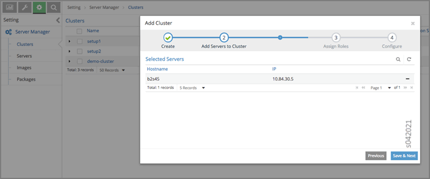

When you are finished adding servers, click **Save & Next** . Now you can assign Contrail roles to servers that you select in the cluster. Roles available are Config, OpenStack, Control, Compute, and Collector. Select each role assignment for the selected server. You can also unselect any assigned role. The assigned roles correspond to the role functions in operation on the server, see `Figure 39`_ .

.. _Figure 39: 

*Figure 39* : Assign Roles

.. figure:: s042022.gif

When you are finished selecting roles for the selected server in the **Roles** window, click **Apply** to save your choices.

Click **Save & Next** to view your selections. Check marks are displayed in the columns of the **Add Cluster** window, see `Figure 40`_ .

.. _Figure 40: 

*Figure 40* : Roles Assigned

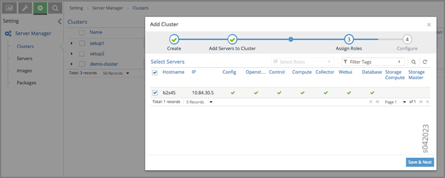

The next step after roles are assigned is to enter the cluster configuration information for OpenStack. After viewing the assigned roles, click **Save & Next** . The **Add Cluster** window is displayed. Click an icon that opens a set of fields where you can enter OpenStack or Contrail configuration information for the cluster. In the following image, the **Openstack** icon is selected. You can enter **Keystone** configuration information, such as IP, Admin tenant, user, and password, service tenant, and region name. You can also enable LBaaS and Ceilometer, see `Figure 41`_ .

.. _Figure 41: 

*Figure 41* : OpenStack Configuration

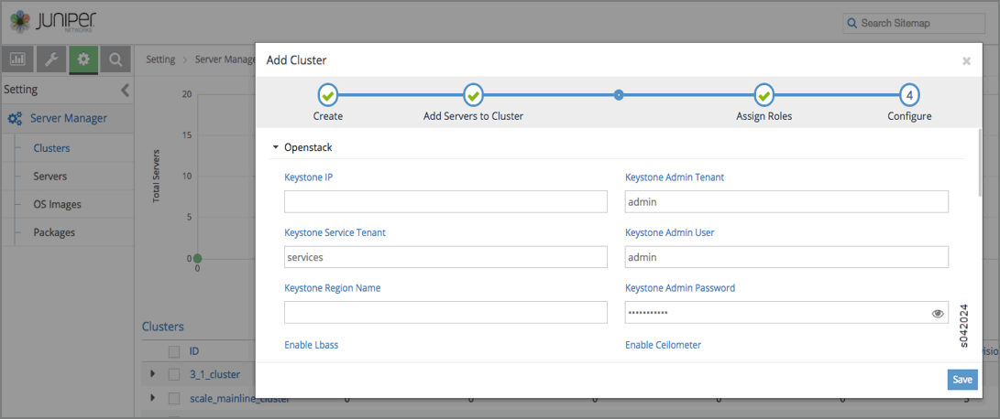

In the following image, the Contrail controller icon is selected. You can enter configuration information for Contrail, such as **External BGP, Router ASN, Huge Pages, Core Mask, Encapsulation Priority, Healthcheck Interval, Zookeeper IP Port, Enable SRIOV,** and so on, see `Figure 42`_ .

.. _Figure 42: 

*Figure 42* : Configure Contrail

.. figure:: s042025.gif

In the following image, the High Availability (HA) icon is selected. You can configure high availability parameters such as ``HA Proxy Enable`` , ``Internal`` and ``External VIP`` , and so on, see `Figure 43`_ .

.. _Figure 43: 

*Figure 43* : Configure High Availability

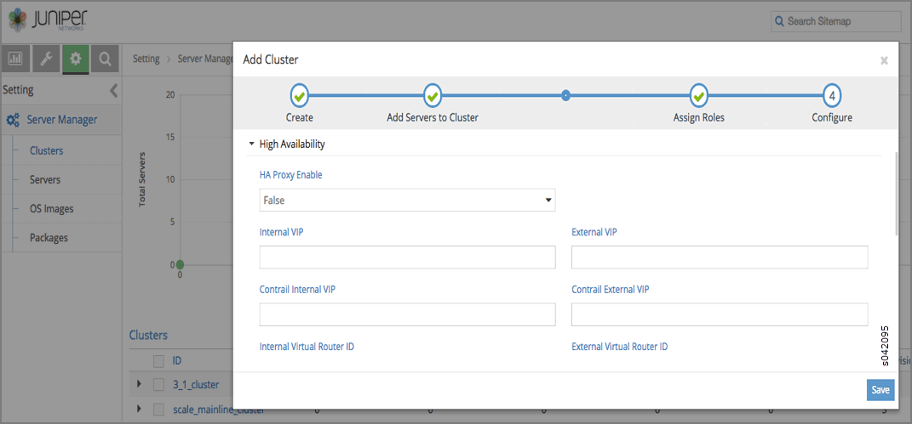

In the following image, the **Analytics** icon is selected. Here you can configure parameters for Contrail Analytics, including **Syslog Port** , various scan frequencies, and various TTL settings, see `Figure 44`_ .

.. _Figure 44: 

*Figure 44* : Configure Analytics

.. figure:: s042096.gif

In following image, the **Database** icon is selected. You can configure parameters for the Contrail database, including **IP Port, Directory, Minimum Disk GB,** and so on, see `Figure 45`_ .

.. _Figure 45: 

*Figure 45* : Configure Database

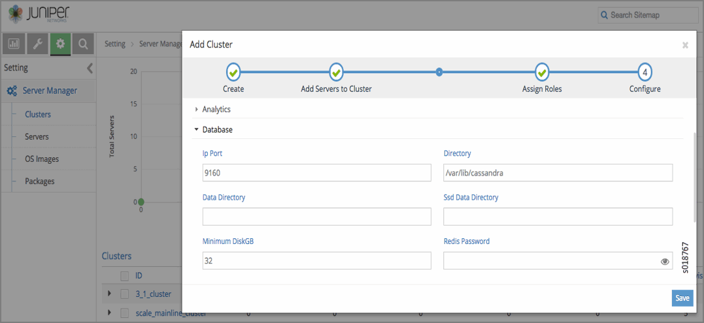

In following image, the **VMware** icon is selected. You can configure parameters for Contrail VMware , including **VMware IP, VMware vSwitch, Username, Password** , and so on, see `Figure 46`_ .

.. _Figure 46: 

*Figure 46* : Configure VMware

.. figure:: s018768.gif

In following image, the **Virtual Gateway** icon is selected. You can configure parameters for the Contrail Virtual Gateway, including **VGW Public Interface, VGW Public VN Name, VGW Interface, Routes** , and so on, see `Figure 47`_ .

.. _Figure 47: 

*Figure 47* : Configure Virtual Gateway

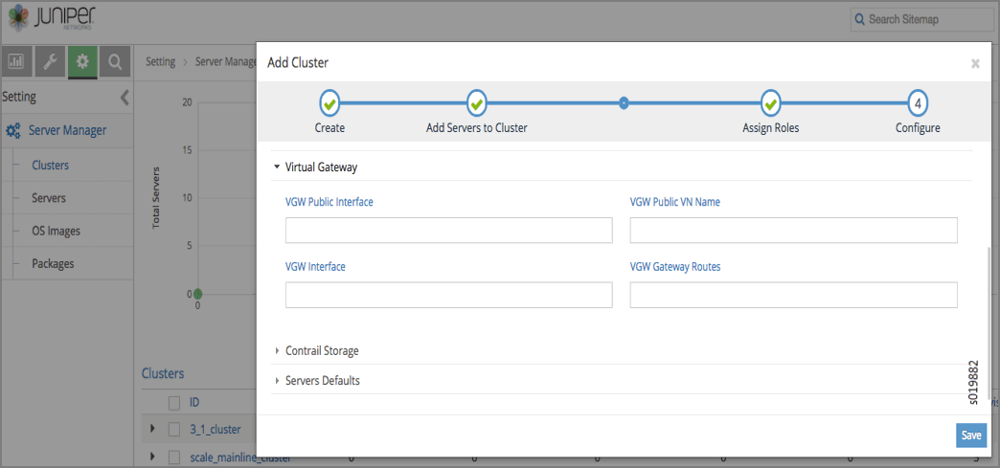

In following image, the **Contrail Storage** icon is selected. You can configure parameters for Contrail Storage, including **Storage Monitor Secret, OSD Bootstrap Key, Admin Key** , and so on, see `Figure 48`_ .

.. _Figure 48: 

*Figure 48* : Configure Contrail Storage

.. figure:: s042098.gif

When you are finished entering all of the cluster configuration information, click **Save** to submit the configurations. You can view all configured clusters on the **Clusters** window by selecting **Setting > Server Manager > Clusters** , see `Figure 49`_ .

.. _Figure 49: 

*Figure 49* : View Configured Clusters

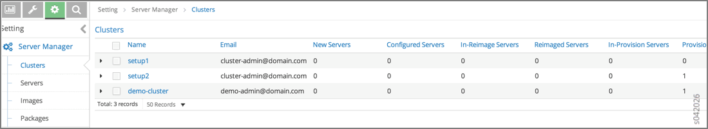

To perform an action on one of the configured clusters, click the gear wheel icon at the right to select from a menu of actions available for that cluster, including **Add Servers, Remove Servers, Assign Roles, Edit Config, Reimage, Provision** , and **Delete** , see `Figure 50`_ .

.. _Figure 50: 

*Figure 50* : Select Cluster Action

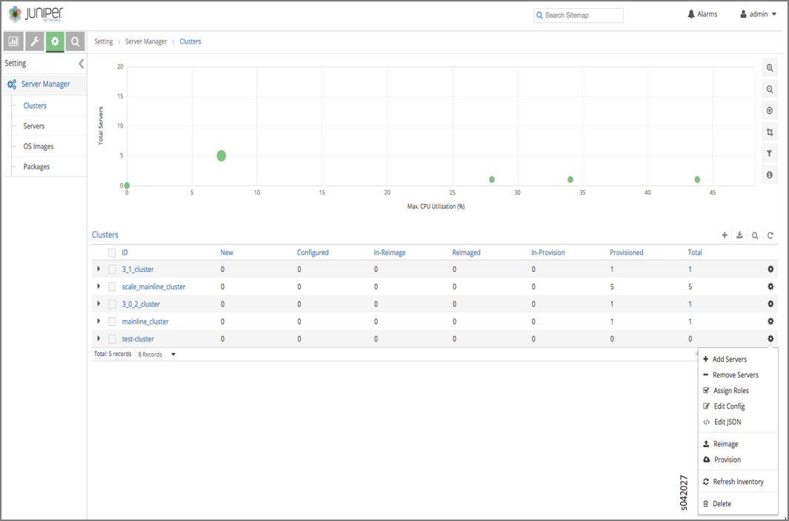

You can also click the expansion icon on the left side of the cluster name to display the details of that cluster in an area below the name line, see `Figure 51`_ .

.. _Figure 51: 

*Figure 51* : Display Cluster Details

.. figure:: s042028.gif

Click the upper right icon to switch to the JSON view to see the contents of the JSON file for the cluster, see `Figure 52`_ .

.. _Figure 52: 

*Figure 52* : View Cluster JSON

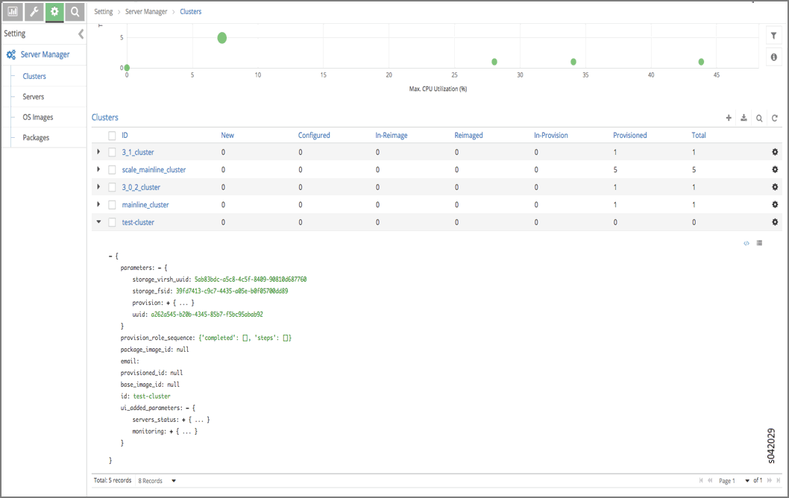

The cluster name is a link, click the cluster name to display the cluster **Details** page, see `Figure 53`_ .

.. _Figure 53: 

*Figure 53* : Link to View Cluster Details

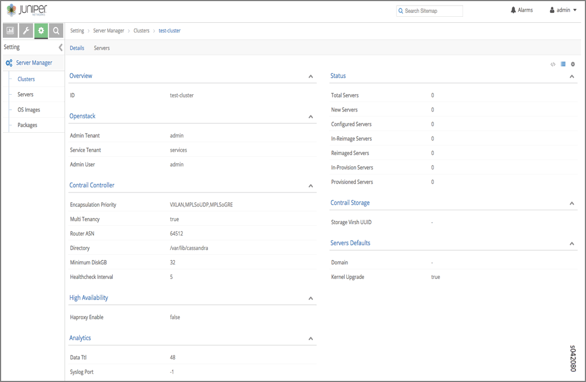

Click the **Servers** tab to display the servers under that cluster, see `Figure 54`_ .

.. _Figure 54: 

*Figure 54* : Display Servers for Cluster

.. figure:: s019883.gif

Edit a Cluster through Edit JSON
=================================

Select **Edit JSON** to edit a cluster by editing the JSON file. Make changes to the JSON code and click **Save** to save the edited configuration for the cluster, see `Figure 55`_ .

.. _Figure 55: 

*Figure 55* : Edit Cluster JSON

.. figure:: s019884.gif

Working with Servers in the Server Manager User Interface
=========================================================

Select **Setting > Server Manager** and click the **Servers** link in the left sidebar at to view a list of all servers, see `Figure 56`_ .

.. _Figure 56: 

*Figure 56* : View Servers

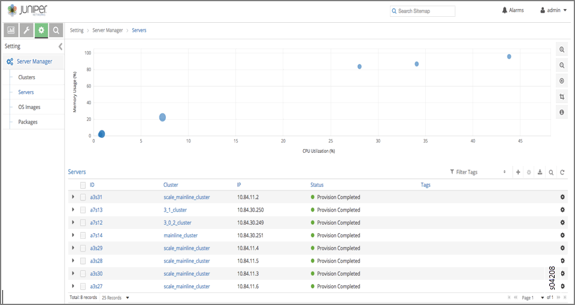

Add a Server
============

To add a new server, select **Setting > Server Manager > Servers** and click the plus (+) icon at the upper right side in the header line. The **Add Server** window is displayed, see `Figure 57`_ , in which the **System Management** tab is expanded. Here you enter the details of ``ID, Password, Domain, Partition,`` and so on for the server.

.. _Figure 57: 

*Figure 57* : Add Server, System Management

.. figure:: s042082.gif

​In the following image, the **Physical Interfaces** icon is selected. You can add new interfaces or edit existing interfaces. To enable editing for any field, hover the cursor on any selected field to open it, see `Figure 58`_ .

.. _Figure 58: 

*Figure 58* : Add Server, Physical Interfaces

.. figure:: s042097.gif

In the following image, the **Contrail Storage** icon is selected. You can configure parameters for Contrail Storage, including selecting a package and adding storage disks locations, see `Figure 59`_ .

.. _Figure 59: 

*Figure 59* : Add Server, Contrail Storage

.. figure:: s042099.gif

When you are finished entering new server details in the **Add Server** window, click **Save** to add the new server configuration to the list of servers.

You can change details of the new server by clicking the gear wheel icon to the right side to get a list of actions available, including **Edit Config, Edit JSON, Edit Tags, Reimage, Provision, Refresh Inventory,** and **Delete** , see `Figure 60`_ .

.. _Figure 60: 

*Figure 60* : Select Server Actions

.. figure:: s042083.gif

Edit Tags for Servers
=====================

Select **Edit Tags** from the gear wheel icon menu. The **Edit Tags** window is displayed. Enter any user-defined tags to be associated with the selected server, then click **Save** to add the tags to the server configuration, see `Figure 61`_ .

.. _Figure 61: 

*Figure 61* : Edit Tags

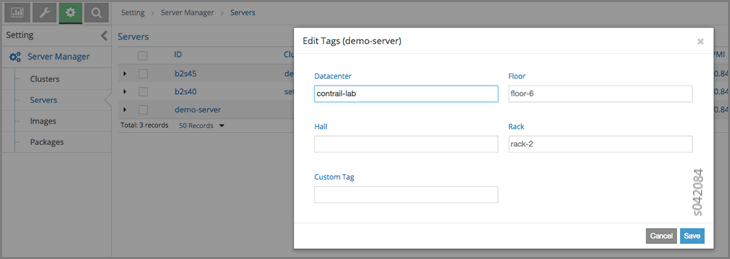

Using the Edit Config Option for Multiple Servers
=================================================

You can also edit the configuration of multiple servers at one time. From the **Servers** window at **Setting > Server Manager > Servers** , select the servers you want to edit, then click a gear wheel icon at the right to open the action menu, and select **Edit Config** .

The **Edit Config** window is displayed, as shown.

Click a pencil icon to open configuration fields that can be edited Fields include **System Management, Contrail Controller, Contrail Storage** , and so on, see `Figure 62`_ .

.. _Figure 62: 

*Figure 62* : Edit Config, Multiple Servers

.. figure:: s042085.gif

Edit a Server through Server Manager, Edit JSON
================================================

Select **Edit JSON** to edit the server through JSON file. Make changes to the server details in the JSON, then click **Save** , see `Figure 63`_ .

.. _Figure 63: 

*Figure 63* : Server Edit JSON

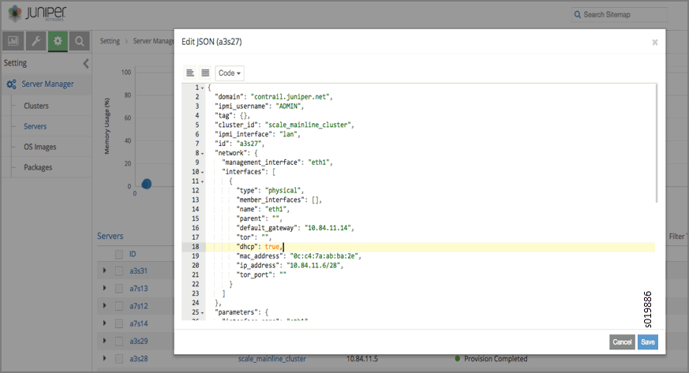

Filter Servers by Tag
=====================

You can filter servers according to the tags defined for them. In the **Servers** window, click the **Filter Tags** field in the upper right heading. A list of configured tags is displayed. Select a tag by which to filter the list of servers, see `Figure 64`_ .

.. _Figure 64: 

*Figure 64* : Filter Servers by Tag

.. figure:: s042086.gif

Viewing Server Details
======================

Each server name on the **Servers** page is a link to the details page for that server. Click any server name to open the details for that server, including **System Management** information, **Status, Contrail Controller, Contrail Storage, Roles, Tags** , and **Provisioning** , see `Figure 65`_ .

.. _Figure 65: 

*Figure 65* : View Server Details, System Management

.. figure:: s019887.gif

At the **Servers** page, click the **Monitoring** tab to see detailed information regarding **CPU/Memory Information, Chassis State, Sensors, Interface Monitoring, File System** , and **Disk Usage** , see `Figure 66`_ .

.. _Figure 66: 

*Figure 66* : Server Monitoring

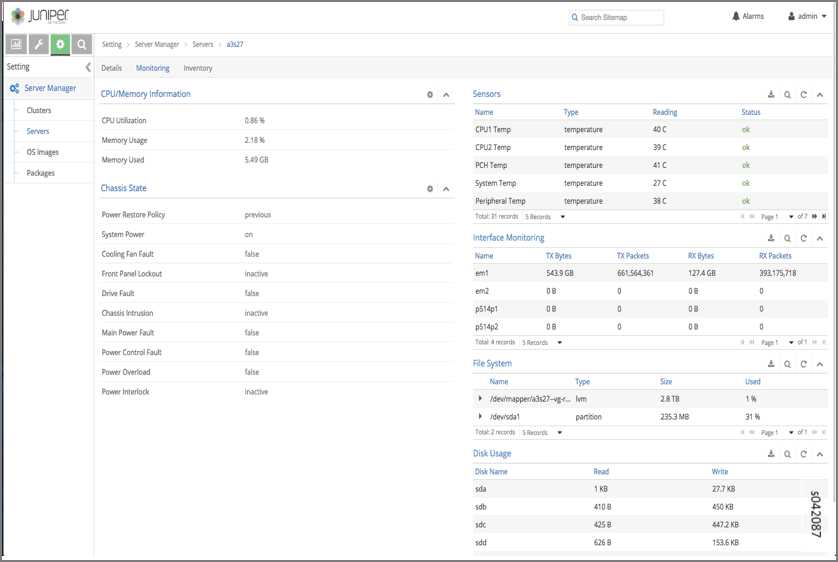

At the **Servers** page, click the **Inventory** tab to see detailed information regarding **Overview of the server, Interface Information, CPU information, Memory,** and **FRU Information** , see `Figure 67`_ .

.. _Figure 67: 

*Figure 67* : Server Inventory

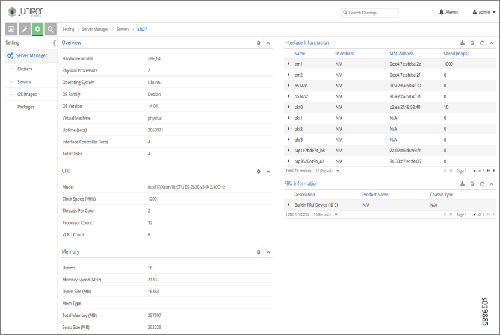

Configuring Images and Packages
===============================

Use the sidebar **Images and Packages** options to configure the software images and packages to be used by the Server Manager. Images are typically used to reimage clusters with an operating system version. Packages are used to provision clusters with a Contrail setup.

Both areas of the Server Manager user interface operate in a similar fashion. The figure shows the **Images** section. The **Packages** section has similar options.

Select **Images** . The Images page is displayed, see `Figure 68`_ .

.. _Figure 68: 

*Figure 68* : Servers OS Images

.. figure:: s042088.gif

Add New Image or Package
========================

To add a new image or package, on the respective **Images** or **Packages** page, click the plus (+) icon in the upper right header. The **Add Image** window is displayed. Enter the information for the new image (or package) and click **Save** to add the new item to the list of configured items, see `Figure 69`_ .

.. note:: The path field requires the path of the image where it is located on the server upon which the ``server-manager`` process is running.

.. _Figure 69: 

*Figure 69* : Add OS Image

.. figure:: s042089.gif

Selecting Server Manager Actions for Clusters
=============================================

After all aspects of a cluster are configured, you can select actions for the Server Manager to perform on the cluster, such as **Reimage** or **Provision** .

Reimage a Cluster
=================

Select **Setting > Servers > Clusters** . The **Clusters** window is displayed. Click the right side gear wheel icon of the cluster to be reimaged, then select **Reimage** from the action menu.

The **Reimage** dialog box is displayed, as shown. Verify that the correct image is selected in the **Default Image** field, then click **Save** to initiate the reimage action, se `Figure 70`_

.. _Figure 70: 

*Figure 70* : Reimage Cluster

.. figure:: s042090.gif

Provision a Cluster
===================

The process to provision a cluster is similar to the process to reimage a cluster. Select **Setting > Servers > Clusters** . The **Clusters** window is displayed. Click the right side gear wheel icon of the cluster to be provisioned, then select **Provision** from the action menu.

The **Provision Cluster** dialog box is displayed, as shown. Verify that the correct package for provisioning is selected in the **Default Package** field, then click **Save** to initiate the provisioning action, see `Figure 71`_ .

.. _Figure 71: 

*Figure 71* : Provision Cluster

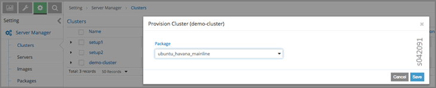

**Related Documentation**

-  `Using Server Manager to Automate Provisioning`_ 

-  `Installing Server Manager`_ 

-  `Installing and Using Server Manager Lite`_ 

.. _Using Server Manager to Automate Provisioning: topic-92560.html

.. _Installing Server Manager: topic-120557.html

.. _Installing and Using Server Manager Lite: topic-120572.html
