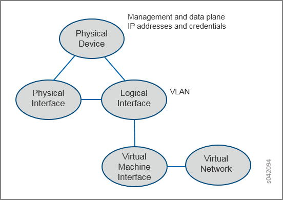
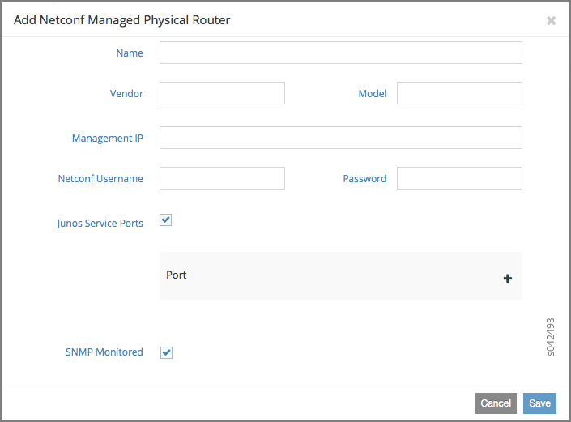
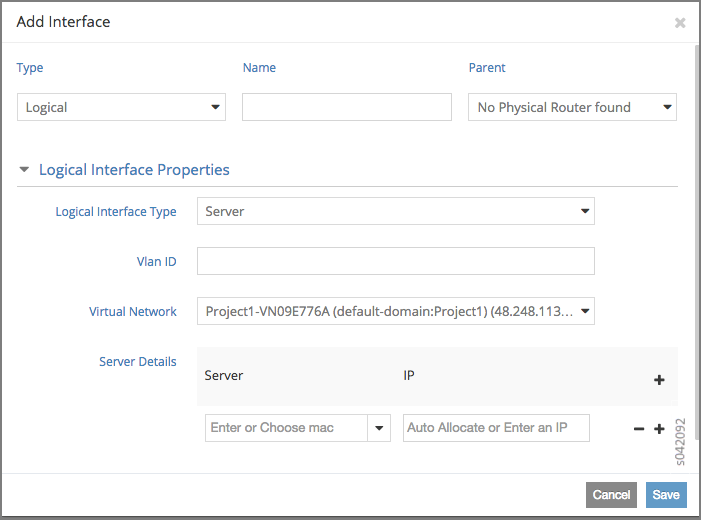
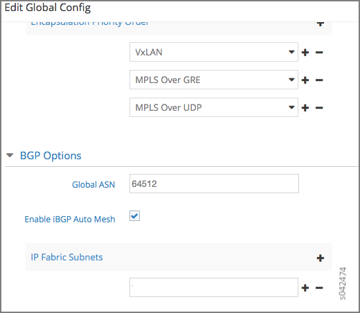
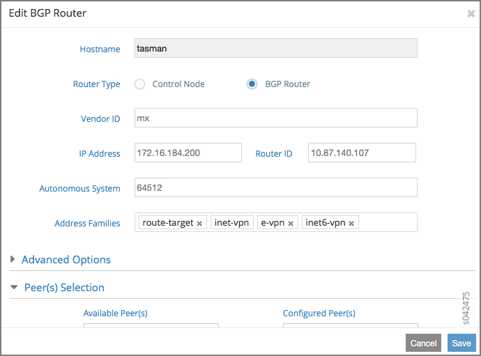
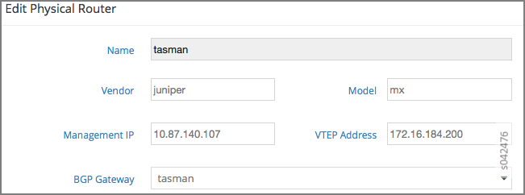
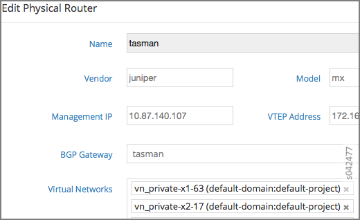
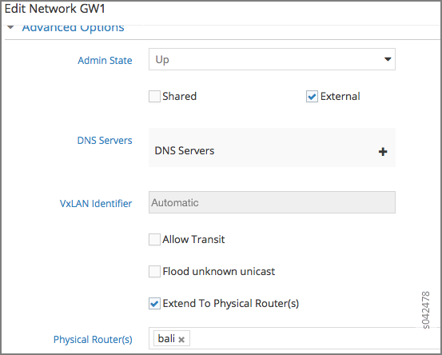
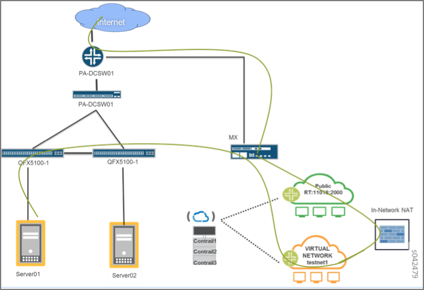

===============================================
Using Device Manager to Manage Physical Routers
===============================================

   -  `Support for Physical Routers Overview`_ 

   -  `Configuration Model`_ 

   -  `Alternate Ways to Configure a Physical Router`_ 

   -  `Device Manager Configurations`_ 

   -  `Prerequisite Configuration Required on MX Series Device`_ 

   -  `Configuration Scenarios`_ 

   -  `Device Manager Functionality`_ 

   -  `Dynamic Tunnels`_ 

   -  `Extending the Public Network`_ 

   -  `Ethernet VPN Configuration`_ 

   -  `Floating IP Addresses and Source Network Address Translation for Guest Virtual Machines and Bare Metal Servers`_ 

   -  `Samples of Generated Configurations for an MX Series Device`_ 

Support for Physical Routers Overview
-------------------------------------

A configuration node daemon named Device Manager can be used to manage physical routers in the Contrail system.

The Device Manager daemon listens to configuration events from the API server, creates any necessary configurations for all physical routers it is managing, and programs those physical routers.

You can extend a cluster to include physical Juniper Networks MX Series routers and other physical routers that support the Network Configuration (NETCONF) protocol. You can configure physical routers to be part of any of the virtual networks configured in the Contrail cluster, facilitating communication between the physical routers and the Contrail control nodes. Contrail policy configurations can be used to control this communication.

Configuration Model
-------------------

`Figure 79`_ depicts the configuration model used in the system. The Physical Router, Physical Interface, and Logical Interface all represent physical router entities.

.. _Figure 79: 

*Figure 79* : Contrail Configuration Model

Configuring a Physical Router
-----------------------------

The Contrail Web user interface can be used to configure a physical router into the Contrail system. Select **Configure > Physical Devices > Physical Routers** to create an entry for the physical router and provide the router's management IP address and user credentials.

The following shows how a Juniper Networks MX Series device can be configured from the Contrail Web user interface.

.. _Figure 80: 

*Figure 80* : Add Physical Router Window

Select **Configure > Physical Devices > Interfaces** to add the logical interfaces to be configured on the router. The name of the logical interface must match the name on the router (for example, ge-0/0/0.10).

.. _Figure 81: 

*Figure 81* : Add Interface Window

Alternate Ways to Configure a Physical Router
----------------------------------------------

You can also configure a physical router by using a Contrail REST API, see `REST APIs for Extending the Contrail Cluster to Physical Routers, and Physical and Logical Interfaces`_ .

Device Manager Configurations
-----------------------------

Device Manager can configure all of the following on a Juniper Networks MX Series device and other physical routers.

   - Create configurations for physical interfaces and logical interfaces as needed.

   - Create VRF table entries as needed by the configuration.

   - Add interfaces to VRF tables as needed.

   - Create public VRF tables corresponding to external virtual networks.

   - Create BGP protocol configuration for internal or external BGP groups as needed and adding iBGP and eBGP peers in appropriate groups.

   - Program route-target import and export rules as needed by policy configurations.

   - Create policies and firewalls as needed.

   - Configure Ethernet VPNs (EVPNs).

Prerequisite Configuration Required on MX Series Device
-------------------------------------------------------

Before using Device Manager to manage the configuration for an MX Series device, use the following Junos CLI commands to enable NETCONF on the device:

 ``set system services netconf ssh`` 

 ``set system services netconf traceoptions file nc``   

 ``set system services netconf traceoptions flag all`` 

Debugging Device Manager Configuration
--------------------------------------

If there is any failure during a Device Manager configuration, the failed configuration is stored on the MX Series device as a candidate configuration. An appropriate error message is logged in the local system log by the Device Manager.

The log level in the Device Manager configuration file should be set to INFO for logging NETCONF XML messages sent to physical routers.

Configuration Scenarios
------------------------

This section presents different configuration scenarios and shows snippets of generated MX Series configurations.

Configuring Physical Routers Using REST APIs
--------------------------------------------

For information regarding configurations using REST APIs, see `REST APIs for Extending the Contrail Cluster to Physical Routers, and Physical and Logical Interfaces`_ .

Sample Python Script Using Rest API for Configuring an MX Device
----------------------------------------------------------------

Refer to the following link for a Python-based script for configuring required MX Series device resources in the Contrail system, using the VNC Rest API provided by Contrail.

 https://github.com/Juniper/contrail-controller/blob/master/src/config/utils/provision_physical_router.py 

Device Manager Functionality
----------------------------

Device Manager auto configures physical routers when it detects associations in the Contrail database.

The following naming conventions are used for generating MX Series router configurations:

   - Device Manager generated configuration group name: ``__contrail__``  

BGP groups:

     - Internal group name: ``__contrail__`` 

     - External group name: ``__contrail_external`` 

   - VRF name: ``_contrai_{l2|l3}_[vn-id]_[vn-name]`` 

   - NAT VRF name: ``_contrai_{l2|l3}_[vn-id]_[vn-name]-nat`` 

   - Import policy: ``[vrf-name]—import, Export policy: [vrf-name]—export`` 

   - Service set: ``sv-[vrf-name]`` 

   - NAT rules, SNAT: ``sv-[vrf-name]-sn-rule, DNAT: sv-[vrf-name]-dn-rule`` 

   - SNAT term name: ``term_[private_ip], DNAT term name: term_[public_ip]`` 

Firewall filters:

     - Public VRF filter: ``redirect_to_public_vrf_filter`` 

     - Private VRF filter: ``redirect_to_[vrf_name]_vrf`` 

Logical interface unit numbers:

     - Service ports: ``2*vn_id -1, 2*vn_id`` 

     - IRB interface: ``vn_id`` 

Dynamic Tunnels
---------------

Dynamic tunnel configuration in Contrail allows you to configure GRE tunnels on the Contrail Web user interface. When Contrail detects this configuration, the Device Manager module constructs GRE tunnel configuration and pushes it to the MX Series router. A property named ``ip-fabric-subnets`` is used in the global system configuration of the Contrail schema. Each IP fabric subnet and BGP router is configured as a dynamic tunnel destination point in the MX Series router. The physical router data plane IP address is considered the source address for the dynamic tunnel. You must configure the data plane IP address for auto configuring dynamic tunnels on a physical router. The IP fabric subnets is a global configuration; all of the subnets are configured on all the physical routers in the cluster that have data plane IP configuration.

The following naming conventions are used in the API configuration:

   - Global System Config: ``ip-fabric-subnets`` 

   - Physical Router: ``data-plane-ip`` 

Web UI Configuration
--------------------

`Figure 82`_ shows the web user interface used to configure dynamic tunnels.

.. _Figure 82: 

*Figure 82* : Edit Global Config Window

In the **Edit Global Config** window, the VTEP address is used for the ``data-plane-ip`` address.
The following is an example of the MX Series router configuration generated by the Device Manager.

::

  root@host# show groups __contrail__ routing-options         

  router-id 172.16.184.200;

  route-distinguisher-id 10.87.140.107;

  autonomous-system 64512;

  dynamic-tunnels {

      __contrail__ {

          source-address 172.16.184.200;

          gre;

          destination-networks {

              172.16.180.0/24;

              172.16.180.8/32;

              172.16.185.200/32;

              172.16.184.200/32;

              172.16.180.5/32;

              172.16.180.7/32;

          }

      }

  }

BGP Groups
----------

When Device Manager detects BGP router configuration and its association with a physical router, it configures BGP groups on the physical router.
`Figure 83`_ shows the web user interface used to configure BGP groups.

.. _Figure 83: 

*Figure 83* : Edit BGP Router Window

`Figure 84`_ shows the web user interface used to configure the physical router.

.. _Figure 84: 

*Figure 84* : Edit Physical Router Window for BGP Groups

The following is an example of the MX Series router configuration generated by the Device Manager.

::

  root@host show groups __contrail__ protocols bgp    
  group __contrail__ {
      type internal;
      multihop;
      local-address 172.16.184.200;
      hold-time 90;
      keep all;
      family inet-vpn {
          unicast;
      }
      family inet6-vpn {
          unicast;
      }
      family evpn {
          signaling;
      }
      family route-target;
      neighbor 172.16.180.8;
      neighbor 172.16.185.200;
      neighbor 172.16.180.5;
      neighbor 172.16.180.7;
  }

  group __contrail_external__ {
      type external;
      multihop;
      local-address 172.16.184.200;
      hold-time 90;
      keep all;
      family inet-vpn {
          unicast;
      }
      family inet6-vpn {
          unicast;
      }
      family evpn {
          signaling;                      
      }                                   
      family route-target;                
  }              

Extending the Private Network
-----------------------------

Device Manager allows you to extend a private network and ports to a physical router. When Device Manager detects a VNC configuration, it pushes Layer 2 (EVPN) and Layer 3 VRF, import and export rules and interface configuration to the physical router.
`Figure 85`_ shows the web user interface for configuring the physical router for extending the private network.

.. _Figure 85: 

*Figure 85* : Edit Physical Router Window for Extending Private Networks

The following is an example of the MX Series router configuration generated by the Device Manager.

::

  /* L2 VRF */

  root@host# show groups __contrail__ routing-instances _contrail_l2_147_vn_private-x1-63           
  vtep-source-interface lo0.0;
  instance-type virtual-switch;
  vrf-import _contrail_l2_147_vn_private-x1-63-import;
  vrf-export _contrail_l2_147_vn_private-x1-63-export;
  protocols {
      evpn {
          encapsulation vxlan;
          extended-vni-list all;
      }
  }
  bridge-domains {
      bd-147 {
          vlan-id none;
          routing-interface irb.147;
          vxlan {
              vni 147;
          }
      }
  }

  /* L3 VRF */
  root@host# show groups __contrail__ routing-instances _contrail_l3_147_vn_private-x1-63    
  instance-type vrf;
  interface irb.147;
  vrf-import _contrail_l3_147_vn_private-x1-63-import;
  vrf-export _contrail_l3_147_vn_private-x1-63-export;
  vrf-table-label;
  routing-options {
      static {
          route 1.0.63.0/24 discard;
      }
      auto-export {
          family inet {
              unicast;
          }
      }
  }

  /* L2 Import policy */

  root@host# ...cy-options policy-statement _contrail_l2_147_vn_private-x1-63-import
  term t1 {
      from community target_64512_8000066;
      then accept;
  }
  then reject;

   

  /* L2 Export Policy */
  root@host# ...ail__ policy-options policy-statement _contrail_l2_147_vn_private-x1-63-export    
  term t1 {
      then {
          community add target_64512_8000066;
          accept;
      }
  }

  /* L3 Import Policy */

  root@host# ...ail__ policy-options policy-statement _contrail_l3_147_vn_private-x1-63-import    
  term t1 {
      from community target_64512_8000066;
      then accept;
  }
  then reject;

  /*L3 Export Policy */
  root@host# ...ail__ policy-options policy-statement _contrail_l3_147_vn_private-x1-63-export    
  term t1 {
      then {
          community add target_64512_8000066;
          accept;
      }
  }

Extending the Public Network
----------------------------

When a public network is extended to a physical router, a static route is configured on the MX Series router. The configuration copies the next hop from the ``public.inet.0`` routing table to the ``inet.0`` default routing table, and copies a forwarding table filter from the ``inet.0`` routing table to the ``public.inet.0`` routing table. The filter is applied to all packets being looked up in the ``inet.0`` routing table and matches destinations that are in the subnet(s) for the public virtual network. The policy action is to perform the lookup in the ``public.inet.0`` routing table.
`Figure 86`_ shows the web user interface for extending the public network.

.. _Figure 86: 

*Figure 86* : Edit Network Gateway Window

The following is an example of the MX Series router configuration generated by the Device Manager.

::

  /* forwarding options */

  root@host show groups __contrail__ forwarding-options
  family inet {
      filter {
          input redirect_to_public_vrf_filter;
      }
  }

  /* firewall filter configuration */

  root@host# show groups __contrail__ firewall family inet filter redirect_to_public_vrf_filter

  term term-_contrail_l3_184_vn_public-x1- {

      from {

          destination-address {

              20.1.0.0/16;

          }

      }

      then {

          routing-instance _contrail_l3_184_vn_public-x1-;

      }

  }

  term default-term {

      then accept;

  }

  /* L3 VRF static route 0.0.0.0/0 configuration */

  root@host# ...instances _contrail_l3_184_vn_public-x1- routing-options static route 0.0.0.0/0   
  next-table inet.0;

Ethernet VPN Configuration
--------------------------

For every private network, a Layer 2 Ethernet VPN (EVPN) instance is configured on the MX Series router. If any Layer 2 interfaces are associated with the virtual network, logical interfaces are also created under the bridge domain.
The following is an example of the MX Series router configuration generated by the Device Manager.

::

  root@host# show groups __contrail__ routing-instances _contrail_l2_147_vn_private-x1-63           
  vtep-source-interface lo0.0;
  instance-type virtual-switch;
  vrf-import _contrail_l2_147_vn_private-x1-63-import;
  vrf-export _contrail_l2_147_vn_private-x1-63-export;
  protocols {
      evpn {
          encapsulation vxlan;
          extended-vni-list all;
      }
  }
  bridge-domains {
      bd-147 {
          vlan-id none;

          interface ge-1/0/5.0;
          routing-interface irb.147;
          vxlan {
              vni 147;
          }
      }
  }

Floating IP Addresses and Source Network Address Translation for Guest Virtual Machines and Bare Metal Servers
--------------------------------------------------------------------------------------------------------------

This section describes a bare metal server deployment scenario in which servers are connected to a TOR QFX device inside a private network and an MX Series router is the gateway for the public network connection.
The MX Series router provides the NAT capability that allows traffic from a public network to enter a private network and also allows traffic from the private network to the public network. To do this, you need to configure NAT rules on the MX Series router. The Device Manager is responsible for programming these NAT rules on MX Series routers when it detects that a bare metal server is connected to a public network.
You must configure virtual network computing for the TOR device, the MX Series router, the private network, and the public network, including the address pool. When a logical interface on the TOR device is associated with the virtual machine interface and a floating IP address is assigned to the same virtual machine interface (VMI), Contrail detects this and the Device Manager configures the necessary floating IP NAT rules on each of the MX Series routers associated with the private network.
`Figure 87`_ illustrates that the Device Manager configures two special logical interfaces called *service-ports* on the MX Series router for NAT translation from the private network to the public network.

.. _Figure 87: 

*Figure 87* : Logical Topology for Floating IP and SNAT

The Contrail schema allows a user to specify a service port name using the virtual network computing API. The service port must be a physical link on the MX Series router and the administrative and operational state must be up. The Device Manager creates two logical interfaces on this service port, one for each private virtual network, and applies NAT rules.
The private network routing instance on the MX Series router has a default static route (0.0.0.0/0) next hop pointing to the inside service interface. A public network routing instance on the MX Series router has a route for the private IP prefix next hop pointing to the outside service interface. The public IP address to private IP address and the reverse NAT rules are configured on the MX Series router.
A special routing instance for each private network to one or more public networks association is created on the MX Series router. This VRF has two interfaces on one side allowing traffic to and from the public network and another interface allowing traffic to and from the private network. Firewall filters on the MX Series router are configured so that, if the public network has floating IP addresses associated with a guest VM managed by the Contrail vRouter, the vRouter performs the floating IP address functionality. Otherwise, the MX Series router performs the NAT functions to send and receive the traffic to and from the bare metal server VM.
As illustrated in `Figure 87`_ , you must create the necessary physical device, interface, and virtual network configuration that is pushed to the to the MX Series router.
Contrail configuration can be done using the Web UI or VNC API. The required configuration is:

   - Create the private virtual network.

   - Create one or more TOR physical routers (No Junos OS configuration needs to be pushed to this device by Contrail. Therefore set the ``vnc managed`` attribute to ``False`` ).

   - Extend the private virtual network to the TOR device.

   - Create physical and logical interfaces on the TOR device.

   - Create the VMI on the private network for the bare metal server and associate the VMI with the logical interface. Doing that indicates that the bare metal server is connected to the TOR device through the logical interface. An instance IP address must be assigned to this VMI. The VMI uses a private IP address for the bare metal server.

   - Create the gateway router. This is a physical router that is managed by the Device Manager.

   - Configure the ``service-port`` physical interface information for the physical MX Series router. Device Manager configures two logical service interfaces on the MX Series router for each private network associated with the device, and automatically configures NAT rules on these interfaces for the private-to-public IP address translation and SNAT rules for the opposite direction. The logical port ID is calculated from the virtual network ID allocated by Contrail VNC. Two logical ports are required for each private network

   - Associate the floating IP address, including creating the public network, the floating IP address pool, and a floating IP address in Contrail, and associate this IP address with the VMI bare metal server.

   - The private network and public network must be extended to the physical router.

When the required configuration is present in Contrail, the Device Manager pushes the generated Junos OS configuration to the MX Series device. An example configuration is shown in the following.

::

  /* NAT VRF configuration */

  root@host# show groups __contrail__ routing-instances _contrail_l3_147_vn_private-x1-63-nat

  instance-type vrf;

  interface si-2/0/0.293;

  vrf-import _contrail_l3_147_vn_private-x1-63-nat-import;

  vrf-export _contrail_l3_147_vn_private-x1-63-nat-export;

  vrf-table-label;

  routing-options {

      static {

          route 0.0.0.0/0 next-hop si-2/0/0.293;

      }

      auto-export {

          family inet {

              unicast;

          }

      }

  }

  /* NAT VRF import policy */

  root@host# ...y-statement _contrail_l3_147_vn_private-x1-63-nat-import       

  term t1 {

      from community target_64512_8000066;

      then accept;

  }

  then reject;

  /* NAT VRF Export policy */

  root@host# ..._ policy-options policy-statement _contrail_l3_147_vn_private-x1-63-nat-export   

  term t1 {

      then reject;

  }

  /* The following additional config is generated for public l3 vrf */

  root@host# show groups __contrail__ routing-instances _contrail_l3_184_vn_public-x1-

  interface si-2/0/0.294;              

  routing-options {                      

      static {                           

          route 20.1.252.8/32 next-hop si-2/0/0.294;

          route 20.1.252.9/32 next-hop si-2/0/0.294;

      }

  }

  /* Services set configuration */

  root@host# show groups __contrail__                

  services {

      service-set sv-_contrail_l3_147_vn_ {

          nat-rules sv-_contrail_l3_147_vn_-sn-rule;

          nat-rules sv-_contrail_l3_147_vn_-dn-rule;

          next-hop-service {

              inside-service-interface si-2/0/0.293;

              outside-service-interface si-2/0/0.294;

          }

      }

  }

  /* Source Nat Rules*/

  root@host# show groups __contrail__ services nat rule sv-_contrail_l3_147_vn_-sn-rule   

  match-direction input;

  term term_1_0_63_248 {

      from {

          source-address {

              1.0.63.248/32;

          }

      }

      then {

          translated {

              source-prefix 20.1.252.8/32;

              translation-type {

                  basic-nat44;

              }

          }

      }

  }

  term term_1_0_63_249 {

      from {

          source-address {

              1.0.63.249/32;

          }

      }

      then {

          translated {

              source-prefix 20.1.252.9/32;

              translation-type {

                  basic-nat44;

              }

          }

      }

  }

  /* Destination NAT rules */

  root@host# show groups __contrail__ services nat rule sv-_contrail_l3_147_vn_-dn-rule   

  match-direction output;

  term term_20_1_252_8 {

      from {

          destination-address {

              20.1.252.8/32;

          }

      }

      then {

          translated {

              destination-prefix 1.0.63.248/32;

              translation-type {

                  dnat-44;

              }

          }

      }

  }

  term term_20_1_252_9 {

      from {

          destination-address {

              20.1.252.9/32;

          }

      }

      then {

          translated {

              destination-prefix 1.0.63.249/32;

              translation-type {

                  dnat-44;

              }

          }

      }

  }

   

  /* Public VRf Filter */

  root@host# show groups __contrail__ firewall family inet filter redirect_to_public_vrf_filter

  term term-_contrail_l3_184_vn_public-x1- {

      from {

          destination-address {

              20.1.0.0/16;

          }

      }

      then {

          routing-instance _contrail_l3_184_vn_public-x1-;

      }

  }

  term default-term {

      then accept;

  }

  /* NAT Vrf filter */

  root@host# ...all family inet filter redirect_to__contrail_l3_147_vn_private-x1-63-nat_vrf  

  term term-_contrail_l3_147_vn_private-x1-63-nat {

      from {

          source-address {

              1.0.63.248/32;

              1.0.63.249/32;

          }

      }

      then {

          routing-instance _contrail_l3_147_vn_private-x1-63-nat;

      }

  }

  term default-term {

      then accept;

  }

  /* IRB interface for NAT VRF */

  root@host# show groups __contrail__ interfaces            

  irb {

      gratuitous-arp-reply;

      unit 147 {

          family inet {

              filter {

                  input redirect_to__contrail_l3_147_vn_private-x1-63-nat_vrf;

              }

              address 1.0.63.254/24;

          }

      }

  /* Service Interfaces config */

  root@host# show groups __contrail__ interfaces si-2/0/0        

  unit 293 {

      family inet;

      service-domain inside;

  }

  unit 294 {

      family inet;

      service-domain outside;

  }

Samples of Generated Configurations for an MX Series Device
-----------------------------------------------------------

This section provides several scenarios and samples of MX Series device configurations generated using Python script.

Scenario 1: Physical Router With No External Networks
-----------------------------------------------------

The following describes the use case of basic ``vn, vmi, li, pr, pi`` configuration with no external virtual networks. When the Python script shown in the following is executed with the parameters of this use case, the configuration is applied on the MX Series physical router.

Script executed on the Contrail controller:

::

  # python provision_physical_router.py --api_server_ip 127.0.0.1 --api_server_port 8082 --admin_user user1 --admin_password password1 --admin_tenant_name default-domain --op add_basic

  Generated configuration for MX Series device:
     ::

      root@host# show groups __contrail__    
  routing-options {
      route-distinguisher-id 10.84.63.133;
      autonomous-system 64512;
  }
  protocols {
      bgp {
          group __contrail__ {
              type internal;
              multihop;
              local-address 10.84.63.133;
              keep all;
              family inet-vpn {
                  unicast;
              }
              family inet6-vpn {
                  unicast;
              }
              family evpn {
                  signaling;
              }
              family route-target;
          }
          group __contrail_external__ {
              type external;
              multihop;
              local-address 10.84.63.133;
              keep all;
              family inet-vpn {
                  unicast;
              }
              family inet6-vpn {
                  unicast;
              }
              family evpn {
                  signaling;
              }
              family route-target;
          }
      }
  }
  policy-options {
      policy-statement __contrail__default-domain_default-project_vn1-export {
          term t1 {
              then {
                  community add target_64200_8000008;
                  accept;
              }
          }
      }
      policy-statement __contrail__default-domain_default-project_vn1-import {
          term t1 {
              from community target_64200_8000008;
              then accept;                
          }                               
          then reject;                    
      }                                   
      community target_64200_8000008 members target:64200:8000008;
  }                                       
  routing-instances {                     
      __contrail__default-domain_default-project_vn1 {
          instance-type vrf;              
          interface ge-1/0/5.0;           
          vrf-import __contrail__default-domain_default-project_vn1-import;
          vrf-export __contrail__default-domain_default-project_vn1-export;
          vrf-table-label;                
          routing-options {               
              static {                    
                  route 10.0.0.0/24 discard;
              }                           
              auto-export {               
                  family inet {           
                      unicast;            
                  }                       
              }                           
          }                               
      }                                   
  }                                      

Scenario 2: Physical Router With External Network, Public VRF
-------------------------------------------------------------

This section describes the use case of ``vn, vmi, li, pr, pi`` configuration with an external virtual network, public VRF. When the Python script shown is executed with the parameters of this use case, the configuration is applied on the MX Series physical router.

This example assumes that the configuration already described in Scenario 1 has been executed.

 *Script executed on the Contrail controller:* 

::

 # python provision_physical_router.py --api_server_ip 127.0.0.1 --api_server_port 8082 --admin_user user1 --admin_password password1 --admin_tenant_name default-domain --op add_basic --public_vrf_test True

 *Generated configuration for MX Series device:* 

The following additional configuration is pushed to the MX Series device, in addition to the configuration generated in Scenario 1.

::

      forwarding-options {
      family inet {
          filter {
              input redirect_to___contrail__default-domain_default-project_vn1_vrf;
          }
      }
  }
  firewall {                           
      filter redirect_to___contrail__default-domain_default-project_vn1_vrf {
          term t1 {                    
              from {                    
                  destination-address {
                      10.0.0.0/24;     
                  }                    
              }                        
              then {                   
                  routing-instance __contrail__default-domain_default-project_vn1;
              }                        
          }                            
          term t2 {                    
              then accept;             
          }                            
      }                                
  }
  routing-instances {                  
      __contrail__default-domain_default-project_vn1 {
          routing-options {            
              static {                 
                  route 0.0.0.0/0 next-table inet.0;
              }                        
          }                            
      }                                
  }

Scenario 3: Physical Router With External Network, Public VRF, and EVPN
-----------------------------------------------------------------------

The scenario in this section describes the use case of ``vn, vmi, li, pr, pi`` physical router configuration with external virtual networks (public VRF) and EVPN configuration. When the Python script (as in the previous examples) is executed with the parameters of this scenario, the following configuration is applied on the MX Series physical router.

This example assumes that the configuration already described in Scenario 1 has been executed.

 *Script executed on the Contrail controller:* 

::

      # python provision_physical_router.py --api_server_ip 127.0.0.1 --api_server_port 8082 --admin_user user1 --admin_password password1 --admin_tenant_name default-domain --op add_basic --public_vrf_test True –vxlan 2002

   *Generated configuration for MX Series device:* 

  The following additional configuration is pushed to the MX Series device, in addition to the configuration generated in Scenario 1.
     ::

      protocols {
      mpls {
          interface all;
      }
  }                                      
  firewall {                            
      filter redirect_to___contrail__default-domain_default-project_vn1_vrf {
          term t1 {                     
              from {                    
                  destination-address { 
                      10.0.0.0/24;      
                  }                     
              }                         
              then {                    
                  routing-instance __contrail__default-domain_default-project_vn1;
              }                         
          }                             
          term t2 {                     
              then accept;              
          }                              
      }                                 
  }                              
  routing-instances {                   
      __contrail__default-domain_default-project_vn1 {
          vtep-source-interface lo0.0;  
          instance-type virtual-switch; 
          vrf-target target:64200:8000008;
          protocols {                   
              evpn {                    
                  encapsulation vxlan;  
                  extended-vni-all;     
              }                         
          }                             
          bridge-domains {              
              bd-2002 {                  
                  vlan-id 2002;         
                  interface ge-1/0/5.0; 
                  routing-interface irb.2002;
                  vxlan {               
                      vni 2002;         
                      ingress-node-replication;
                  }                     
              }                         
          }                             
      }                                 
  }

Scenario 4: Physical Router With External Network, Public VRF, and Floating IP Addresses for a Bare Metal Server
----------------------------------------------------------------------------------------------------------------

The scenario in this section describes the user case of ``vn, vmi, li, pr, pi`` physical router configuration with external virtual networks (public VRF) and floating IP addresses for bare metal server configuration.

 *Script executed on the Contrail controller:* 
::

    #python provision_physical_router.py --api_server_ip <ip address> --api_server_port 8082 --admin_user admin --admin_password <password> --admin_tenant_name default-domain --op {fip_test|delete_fip_test}

**Related Documentation**

-  `REST APIs for Extending the Contrail Cluster to Physical Routers, and Physical and Logical Interfaces`_ 

.. _REST APIs for Extending the Contrail Cluster to Physical Routers, and Physical and Logical Interfaces: topic-97453.html

.. _REST APIs for Extending the Contrail Cluster to Physical Routers, and Physical and Logical Interfaces: topic-97453.html

.. _REST APIs for Extending the Contrail Cluster to Physical Routers, and Physical and Logical Interfaces: topic-97453.html

.. _https://github.com/Juniper/contrail-controller/blob/master/src/config/utils/provision_physical_router.py: 
