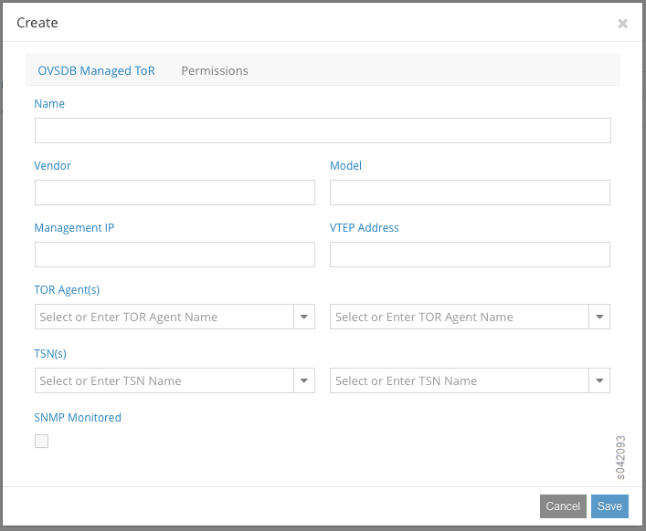

.. This work is licensed under the Creative Commons Attribution 4.0 International License.
   To view a copy of this license, visit http://creativecommons.org/licenses/by/4.0/ or send a letter to Creative Commons, PO Box 1866, Mountain View, CA 94042, USA.

==============================================================================
Using ToR Switches and OVSDB to Extend the Contrail Cluster to Other Instances
==============================================================================

-  `Support for ToR Switch and OVSDB Overview`_ 

-  `ToR Services Node (TSN)`_ 

-  `Contrail ToR Agent`_ 

-  `Using the Web Interface to Configure ToR Switch and Interfaces`_ 

-  `Configuration Parameters for Provisioning ToR and TSN`_ 

-  `Prerequisite Configuration for QFX5100 Series Switch`_ 

-  `Changes to Agent Configuration File`_ 

-  `REST APIs`_ 

Support for ToR Switch and OVSDB Overview
-----------------------------------------

Contrail Releases 2.1 and greater support extending a cluster to include bare metal servers and other virtual instances connected to a top-of-rack (ToR) switch that supports the Open vSwitch Database Management (OVSDB) protocol. The bare metal servers and other virtual instances can belong to any of the virtual networks configured in the Contrail cluster, facilitating communication with the virtual instances running in the cluster. Contrail policy configurations can be used to control this communication.

The OVSDB protocol is used to configure the ToR switch and to import dynamically-learned addresses. VXLAN encapsulation is used in the data plane communication with the ToR switch.

ToR Services Node (TSN)
-----------------------

A ToR services node (TSN) can be provisioned as a role in the Contrail system. The TSN acts as the multicast controller for the ToR switches. The TSN also provides DHCP and DNS services to the bare metal servers or virtual instances running behind ToR switch ports.

The TSN receives all the broadcast packets from the ToR switch, and replicates them to the required compute nodes in the cluster and to other EVPN nodes. Broadcast packets from the virtual machines in the cluster are sent directly from the respective compute nodes to the ToR switch.

The TSN can also act as the DHCP server for the bare metal servers or virtual instances, leasing IP addresses to them, along with other DHCP options configured in the system. The TSN also provides a DNS service for the bare metal servers. Multiple TSN nodes can be configured in the system based on the scaling needs of the cluster.

Contrail ToR Agent
------------------

A ToR agent provisioned in the Contrail cluster acts as the OVSDB client for the ToR switch, and all of the OVSDB interactions with the ToR switch are performed by using the ToR agent. The ToR agent programs the different OVSDB tables onto the ToR switch and receives the local unicast table entries from the ToR switch.

The ToR agent receives the configuration information for the ToR switch, translates the Contrail configuration to OVSDB, and populates the relevant OVSDB table entries in the ToR switch.

Contrail recognizes the ToR after you configure ``tsn`` and ``toragent`` roles.

The typical practice is to run the ToR agent on the TSN node.

Configuration Model
-------------------

`Figure 30`_ depicts the configuration model used in the system.

.. _Figure 30: 

*Figure 30* : Configuration Model

.. figure:: s042094.gif

`Table 7`_ maps the Contrail configuration objects to the OVSDB tables.

.. _Table 7: 

*Table 7* : Contrail Objects in the OVSDB

 +-----------------------------------+-----------------------------------+
 | Contrail Object                   | OVSDB Table                       |
 +===================================+===================================+
 | Physical device                   | Physical switch                   |
 +-----------------------------------+-----------------------------------+
 | Physical interface                | Physical port                     |
 +-----------------------------------+-----------------------------------+
 | Logical interface                 | *<VLAN physical port>* binding to |
 |                                   | logical switch                    |
 +-----------------------------------+-----------------------------------+
 | Virtual networks                  | Logical switch                    |
 +-----------------------------------+-----------------------------------+
 | Layer 2 unicast route table       | Unicast remote and local table    |
 +-----------------------------------+-----------------------------------+
 |                                   | Multicast remote table            |
 +-----------------------------------+-----------------------------------+
 |                                   | Multicast local table             |
 +-----------------------------------+-----------------------------------+
 |                                   | Physical locator table            |
 +-----------------------------------+-----------------------------------+
 |                                   | Physical locator set table        |
 +-----------------------------------+-----------------------------------+

Control Plane
-------------

The ToR agent receives the EVPN route entries for the virtual networks in which the ToR switch ports are members, and adds the entries to the unicast remote table in the OVSDB.

MAC addresses learned in the ToR switch for different logical switches (entries from the local table in OVSDB) are propagated to the ToR agent. The ToR agent exports the addresses to the control node in the corresponding EVPN tables, which are further distributed to other controllers and subsequently to compute nodes and other EVPN nodes in the cluster.

The TSN node receives the replication tree for each virtual network from the control node. It adds the required ToR addresses to the received replication tree, forming its complete replication tree. The other compute nodes receive the replication tree from the control node, whose tree includes the TSN node.

Data Plane
----------

The data plane encapsulation method is VXLAN. The virtual tunnel endpoint (VTEP) for the bare metal end is on the ToR switch.

Unicast traffic from bare metal servers is VXLAN-encapsulated by the ToR switch and forwarded, if the destination MAC address is known within the virtual switch.

Unicast traffic from the virtual instances in the Contrail cluster is forwarded to the ToR switch, where VXLAN is terminated and the packet is forwarded to the bare metal server.

Broadcast traffic from bare metal servers is received by the TSN node. The TSN node uses the replication tree to flood the broadcast packets in the virtual network.

Broadcast traffic from the virtual instances in the Contrail cluster is sent to the TSN node, which replicates the packets to the ToR switches.

Using the Web Interface to Configure ToR Switch and Interfaces
--------------------------------------------------------------

The Contrail Web user interface can be used to configure a ToR switch and the interfaces on the switch. To add a switch, select **Configure > Physical Devices > Physical Routers** .

The **Physical Routers** list is displayed.

Click the + symbol to open the **Add** menu. From the **Add** menu you can select one of the following:

-  **Add OVSDB Managed ToR** 

-  **Add Netconf Managed Physical Router** 

-  **CPE Router** 

-  **Physical Router** 

To add a physical ToR, select **Add OVSDB Managed ToR** . The **Create** window is displayed, as shown in `Figure 31`_ . Enter the IP address and VTEP address of the ToR switch . Also configure the TSN and ToR agent names for the ToR.

.. _Figure 31: 

*Figure 31* : Create OVSDB Managed ToR

To add the logical interfaces to be configured on the ToR switch, select **Configure > Physical Devices > Interfaces** .

The **Physical Routers** list is displayed. Click the **+** symbol. The **Add Interface** window is displayed, as shown in `Figure 32`_ .

At **Add Interface** , enter the name of the logical interface. The name must match the name on the ToR, for example, ge-0/0/0.10. Also enter other logical interface configuration parameters, such as VLAN ID, MAC address, and IP address of the bare metal server and the virtual network to which it belongs.

.. _Figure 32: 

*Figure 32* : Add Interface

.. figure:: s042092.png

Configuration Parameters for Provisioning ToR and TSN
-----------------------------------------------------

This section presents the configuration parameters for different methods of provisioning ToR and TSN.

-  `Inventory Format ToR and TSN`_ 

-  `JSON Format ToR and TSN`_ 

-  `Testbed.py Format ToR and TSN`_ 

The following information can be provided for each ToR agent.

- IP address of the ToR

- a unique numeric identifier for the ToR

- a unique (optional) name for the ToR Agent

- the OVS protocol (TCP or SSL)

- the OVS port

- when OVS protocol is TCP, port indicates the TCP port to connect on the ToR

- when OVS protocol is pssl, port indicates the SSL port on which the ToR agent listens for connections from the TOR

- TSN IP address of the ToR

- name of the TSN node

- IP address of the data tunnel endpoint

- HTTP server port of the ToR Agent using which introspect data can be checked

- vendor name for ToR (optional)

- product name of ToR switch (optional)

- OVS keepalive timeout (optional)

Inventory Format ToR and TSN
----------------------------

Indicate the compute node to act as TSN.

::

 [contrail-computes]
 1.1.1.7 ctrl_data_ip=10.1.1.7 tsn_mode=True

::

   tor_agent = { ‘host1': [ 
                          { 'tor_ip': '10.xxx.221.35’, 
                             'tor_agent_id': '1’,
			     ‘tor_agent_name’:’node-1’,
                             'tor_ovs_protocol': 'tcp’, 
                             'tor_ovs_port': '9999’,
                             'tor_tsn_ip': '10.xxx.221.33’, 
                             'tor_tsn_name':’tsn1’,
                             'tor_name': 'contrail-tor-1’,
			     ‘tor_tunnel_ip’:’5.5.5.5’,
                             'tor_http_server_port': '9090’,
                             'tor_vendor_name': 'Juniper’,
			     ‘tor_product_name’:’QFX5100’,
                             'tor_agent_ovs_ka': ‘1000’ 
                           } ,
			   { … }
		        ],
			‘host2': [ … ]
                   }

JSON Format ToR and TSN
-----------------------

If you are provisioning using JSON, the following example is the JSON format.
For ToR in server.json.

::

   
 {
    "server": [
        {
            "id": “new-server",
            "parameters" : {
            "top_of_rack": {
               "switches" : [
                  {
                     "agent_id": "1",
                     "ip": "10.x.141.84",
                     "tunnel_ip": "10.xx.141.84",
                     "name": "TOR1",
                     "tsn_name": "TSN1",
                     "agent_name": "AGENT1",
                     "ovs_port": "6632",
                     "agent_ovs_ka": "1000",
                     "ovs_protocol": "tcp",
                     "http_server_port": "9912",
                     "vendor_name": "Juniper"
                  },
                  {
                     "agent_id": "2",
                     "ip": "10.xx.141.83",
                     "tunnel_ip": "10.xx.141.83",
                     "name": "TOR2",
                     "ovs_port": "6632",
                     "ovs_protocol": "tcp",
                     "http_server_port": "9913",
                     "vendor_name": "Juniper"
                  }
                ]
            },

For TSN in server.json.

::

   	{
	    “server" : [
	        {  
	            "id": “new-server",
	            "parameters" : {
                "provision": {
                    "contrail_4": {
                        “tsn_mode": false
                    }
                }
            }
        }]
 }

Testbed.py Format ToR and TSN
-----------------------------

Starting with Contrail 4.0, if you are provisioning using SM-Lite, you can provision with JSON or testbed.py. The following is the testbed.py format.
The ToR agent and TSN can be provisioned using the ``testbed.py`` configured with the following:
- The ``env.roledef`` section is configured with the ``tsn`` and ``toragent`` roles. The hosts for these roles should also host a compute node.

- The ``env.tor_agent`` section should be present and configured.

For ToR:

::

   #env.tor_agent = {host10:[{
	#                    'tor_ip':'10.xxx.217.39',
	#                    'tor_agent_id':'1',
	#                    'tor_agent_name':'nodexx-1',
	#                    'tor_type':'ovs',
	#                    'tor_ovs_port':'9999',
	#                    'tor_ovs_protocol':'tcp',
	#                    'tor_tsn_name':'nodec45',
	#                    'tor_name':'bng-contrail-qfx51-2',
	#                    'tor_tunnel_ip':'34.34.34.34',
	#                    'tor_vendor_name':'Juniper',
	#                    'tor_product_name':'QFX5100',
	#                    'tor_agent_http_server_port': '9010',
	#                    'tor_agent_ovs_ka': '10000',
	#                       }]
	#                }

For TSN:

::

 env.roledefs = {
 'tsn': [host1], # Optional, Only to enable TSN. Only compute can support TSN
 }

For more information, see https://github.com/Juniper/contrail-controller/wiki/Baremetal-Support .

Prerequisite Configuration for QFX5100 Series Switch
----------------------------------------------------

When using the Juniper Networks QFX5100 Series switches, ensure the following configurations are made on the switch before extending the Contrail cluster.

#. Enable OVSDB.

#. Set the connection protocol.

#. Identify the interfaces that are managed by means of OVSDB.

#. Configure the controller (in case pssl is used). If HA Proxy is used, use the address of the HA Proxy node and use the VIP when VRRP is used between multiple nodes running HA Proxy. The following is an example:
   ::

    set interfaces lo0 unit 0 family inet address

    set switch-options ovsdb-managed

    set switch-options vtep-source-interface lo0.0

    set protocols ovsdb interfaces

    set protocols ovsdb passive-connection protocol tcp port

    set protocols ovsdb controller <tor-agent-ip> inactivity-probe-duration 10000 protocol ssl port <tor-agent-port>

#. When using SSL to connect, CA-signed certificates must be copied to the ``/var/db/certs`` directory in the QFX device. The following example shows one way to get the certificates. The following comands could be run on any server.
    ::

     apt-get install openvswitch-common 
     ovs-pki init 
     ovs-pki req+sign vtep 
     scp vtep-cert.pem root@<qfx>:/var/db/certs 
     scp vtep-privkey.pem root@<qfx>:/var/db/certs 
     cacert.pem file will be available in /var/lib/openvswitch/pki/switchca, when the above are done. This is the file to be provided in the above testbed (in env.ca_cert_file).  

Debug QFX5100 Configuration
---------------------------

You can use the following commands on the QFX switch to show the OVSDB configuration.
::

 show ovsdb logical-switch

 show ovsdb interface

 show ovsdb mac

 show ovsdb controller

 show vlans

You can use the agent introspect on the ToR agent and the TSN nodes to show the configuration and operational state of these modules.

- The TSN module is like any other ``contrail-vrouter-agent`` on a compute node, with introspect access available on port 8085 by default. Use the introspect on port 8085 to view operational data such as interfaces, virtual network, and VRF information, along with their routes.

- The port on which the ToR agent introspect access is available is in the configuration file provided to the contrail-tor-agent. This provides the OVSDB data available through the client interface, apart from the other data available in a Contrail Agent.

Changes to Agent Configuration File
-----------------------------------

You can make changes to the agent features by making changes in the configuration file.

In the ``/etc/contrail/contrail-vrouter-agent.conf`` file for TSN, the ``agent _mode`` option is available in the DEBUG section to configure the agent to be in TSN mode.

``agent_mode = tsn`` 

The following are typical configuration items in a ToR agent configuration file.
::

 [DEFAULT]

 agent_name = noded2-1 # Name (formed with hostname and TOR id from below)

 agent_mode = tor # Agent mode

 http_server_port=9010 # Port on which Introspect access is available
  

 [TOR]

 tor_ip=<ip> # IP address of the TOR to manage

 tor_id=1 # Identifier for ToR Agent.

 tor_type=ovs # ToR management scheme - only “ovs” is supported

 tor_ovs_protocol=tcp # IP-Transport protocol used to connect to TOR, can be tcp or pssl

 tor_ovs_port=port # OVS server port number on the ToR

 tsn_ip=<ip> # IP address of the TSN

 tor_keepalive_interval=10000 # keepalive timer in ms 

 ssl_cert=/etc/contrail/ssl/certs/tor.1.cert.pem # path to SSL certificate on TOR Agent, needed for pssl

 ssl_privkey=/etc/contrail/ssl/private/tor.1.privkey.pem # path to SSL private key on TOR Agent, needed for pssl

 ssl_cacert=/etc/contrail/ssl/certs/cacert.pem # path to SSL CA cert on the node, needed for pssl 

REST APIs
---------

For information regarding REST APIs for physical routers and physical and logical interfaces, see `REST APIs for Extending the Contrail Cluster to Physical Routers, and Physical and Logical Interfaces`_ .

**Related Documentation**

-  `REST APIs for Extending the Contrail Cluster to Physical Routers, and Physical and Logical Interfaces`_ 

-  `Using Device Manager to Manage Physical Routers`_ 

-  `Configuring High Availability for the Contrail OVSDB ToR Agent`_ 

.. _REST APIs for Extending the Contrail Cluster to Physical Routers, and Physical and Logical Interfaces: rest-apis-routers-contrail.html

.. _REST APIs for Extending the Contrail Cluster to Physical Routers, and Physical and Logical Interfaces: rest-apis-routers-contrail.html

.. _Using Device Manager to Manage Physical Routers: using-device-manager-netconf-contrail.html

.. _Configuring High Availability for the Contrail OVSDB ToR Agent: ha-tor-agnt.html
