.. This work is licensed under the Creative Commons Attribution 4.0 International License.
   To view a copy of this license, visit http://creativecommons.org/licenses/by/4.0/ or send a letter to Creative Commons, PO Box 1866, Mountain View, CA 94042, USA.

===========================================================================
Using the Contrail and VMWare vCenter User Interfaces to Manage the Network
===========================================================================

You can install Contrail to work with the VMware vCenter Server in various vSphere environments and use the Contrail user interface and the vCenter user interface to configure and manage the integrated Contrail system.

-  `Overview: User Interfaces for Contrail Integration with VMware vCenter`_ 

-  `Feature Configuration for Contrail vCenter`_ 

-  `Creating a Virtual Machine`_ 

-  `Configuring the vCenter Network in Contrail UI`_ 

Overview: User Interfaces for Contrail Integration with VMware vCenter
----------------------------------------------------------------------

This topic shows how to use the Contrail user interface and the vCenter user interface to configure and manage features of a Contrail VMware integrated system.

The two user interfaces are available after installing the integrated Contrail system, see.

When Contrail is integrated with VMware vCenter, the following two user interfaces are used to manage and configure features of the system.

-  `Contrail Administration User Interface`_ 

-  `Contrail vCenter User Interface`_ 

Contrail Administration User Interface
--------------------------------------

The Contrail UI is an administrator’s user interface. It provides a view of all components managed by the Contrail controller.

To log in to the Contrail UI, use your Contrail server main IP address URL as follows:

``https://<Contrail IP>:8080`` 

Then log in using your registered Contrail account administrator credentials.

Contrail vCenter User Interface
--------------------------------

The Contrail vCenter user interface (vCenter UI) is a subset of the Contrail administration UI. The Contrail vCenter UI provides a view of all of the virtual components within a Contrail vCenter project.

.. note:: This is applicable only to the vCenter-only mode.

To access the login page for the Contrail vCenter UI, use your Contrail IP address URL as follows:

``https://<Contrail URL>:8080/vcenter``  

Then use the vCenter registered account log in name and password to access the Contrail vCenter UI, as in the following.

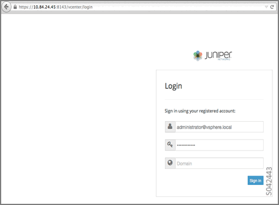

Upon successful login, the Contrail vCenter user interface is displayed, as in the following example.

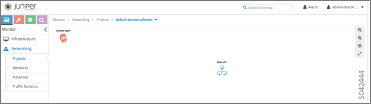

Feature Configuration for Contrail vCenter
------------------------------------------

This section shows how to use the Contrail UI and the Contrail vCenter UI to configure features for the Contrail vCenter integrated system.

Creating a Virtual Network
--------------------------

This section describes how to create a virtual network using the Contrail UI and the Contrail vCenter UI.

Create Virtual Network – Contrail UI
-------------------------------------

After logging in to the Contrail UI, select **Configure > Networking > Networks** to access the Networks window.

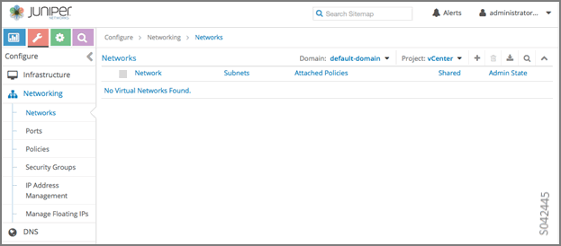

At Networks, click the plus icon ( **+** )to access the **Create Network** window.

Complete the fields in the **Create Network** window. Provide a **Primary VLAN** value and a **Secondary VLAN** value as part of a **Private VLAN** configuration. **Private VLAN** pairs are configured on a Distributed Virtual Switch. Select the values for the Primary and Secondary VLANs from one of the configured, isolated, private-vlan pairs.

The following figure shows the creation of a virtual network named Green-VN.

Click **Save** to create the virtual network.

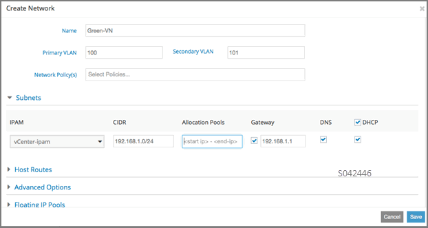

The virtual network just created (Green-VN) is displayed with its details, as in the following figure.

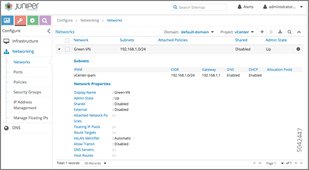

Create Virtual Networks – Contrail vCenter UI
----------------------------------------------

You can also create a virtual network in the vCenter UI, and view and manage it from either the vCenter UI or the Contrail UI.

.. note:: This is applicable only to the vCenter-only mode.

In vCenter, a virtual network is called a port group, which is part of a distributed switch.

Log in to the vCenter client UI (  https:// *<Contrail URL>* :9443/vsphere-client).

To start creating a virtual network (distributed port group), click the distributed virtual switch ( **dvswitch** ) on the left panel.

The following figure shows the *demo_dvswitch* has been selected for this example.

To create a virtual network (vCenter port group), at the bottom of the window, click **Create a new port group** .

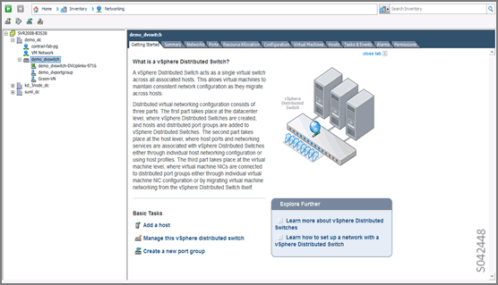

When you click **Create a new port group** , the **Create Distributed Port Group** window is displayed, as in the following figure.

Enter the name of the virtual network. Select the **VLAN type** , then select other details for the selected VLAN type.

The following figure shows the **Create Distributed Port Group** window with the example creation of a virtual network named Red-VN, with a Private VLAN and isolated private VLAN ports 102, 103.

When you are finished, click **Next** .

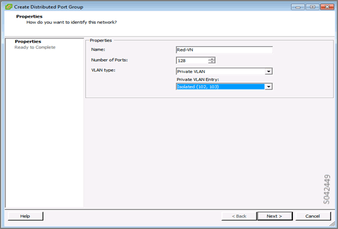

The **Ready to Complete** window is displayed, see the following figure. It shows the details entered for the virtual network (distributed port group).

If changes are needed, click **Back** . If the details are correct, click **Finish** to verify the port group details and complete its creation.

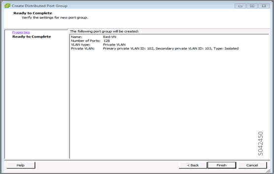

Next, create IP pools for the virtual network port group. Select the datacenter name in the left side panel, then click the **IP Pools** tab.

The following figure shows the **IP Pools** tab for the datacenter named demo_dc.

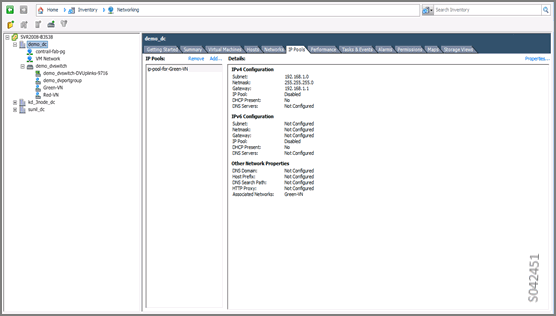

Near the top of the **IP Tools** window, click **Add** to open the **New IP Pool Properties** window, as in the following figure. The **IP Pool Properties** window has several tabs across the upper area. Ensure the **IPv4** tab is selected, and enter a name for the IP pool. Then enter the IP pool IPv4 details, including subnet, gateway, and IP address ranges. To enable IP address pools, select **Enable IP Pool** .

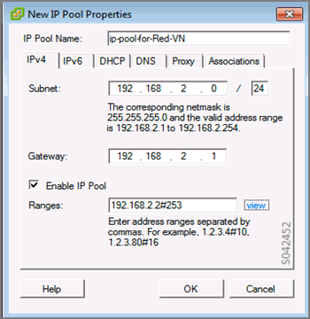

In the **New IP Pool Properties** window, click the **Associations** tab to select the networks that should use the IP address pool you are creating. This tab enables you to associate the IP pool with the port group.

The following figure of the **Associations** tab shows that the IP pool being created should be associated with the virtual network port group named Red-VN.

When you are finished, click **OK** .

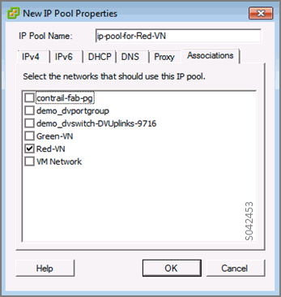

To verify that the virtual network is created and visible to Contrail, in the Contrail UI, select **Configure > Networking > Networks** to display Contrail network information.

The virtual network just created (Red-VN in this example) is displayed in the **Networks** window, see the following.

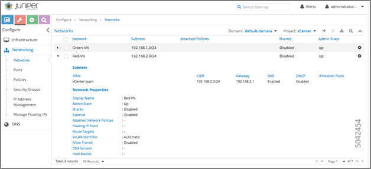

Delete Virtual Network – Contrail UI
-------------------------------------

You can delete a virtual network in either the Contrail UI or in the vCenter UI. This section shows you how to delete a virtual network in the Contrail UI.

In the Contrail UI, select **Configure > Networking > Networks** to display Contrail network information.

Select the network you want to delete, then click the trashcan icon.

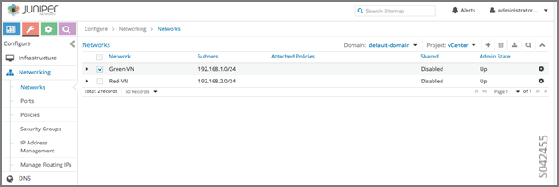

A Confirm window is displayed. Click **Confirm** to delete the selected network.

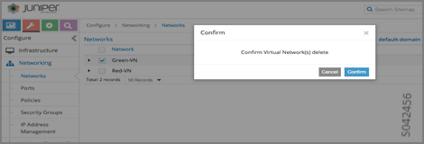

Delete Virtual Networks – vCenter UI
------------------------------------

You can also delete a virtual network from the vCenter UI. From the vCenter UI, in the left side panel, right-click the port-group (virtual-network) you want to delete. In the menu, select **Delete** to delete the selected port group. An example is shown in the following.

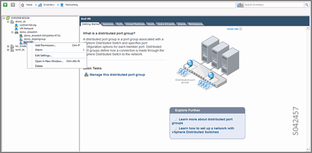

When deleting a port group (virtual network) using the vCenter UI, you must also delete the IP pool associated with the port group. Select the **IP Pools** tab, and right click the name of the IP pool associated with the port group being deleted. From the menu, select **Remove** to delete the IP pool.

The following shows the deletion of the IP pool associated with the Red-VN from the vCenter UI.

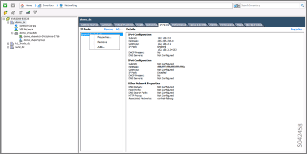

Creating a Virtual Machine
--------------------------

Use the vCenter client interface to create a virtual machine for your VMware vCenter Contrail integrated system. This section describes how to create a virtual machine using a virtual machine template from the vCenter client interface.

Create a Virtual Machine – vCenter UI
--------------------------------------

From the vCenter UI, select the virtual machine template from the left side panel. At the bottom of the right side pane, click **Deploy** to deploy a new virtual machine.

The following figure shows the **vm-template-ubuntu-12.04.2** virtual machine selected.

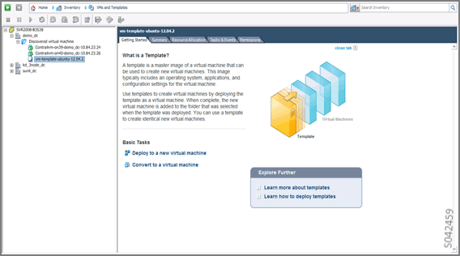

The **Deploy Template** Name and Location window is displayed, as in the following. Specify a name for the virtual machine and select the datacenter on which the virtual machine is to be spawned.

When you are finished, click **Next** .

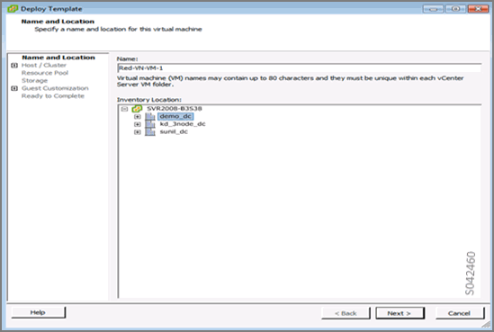

The **Host/Cluster** window is displayed, as in the following. Select the cluster on which to spawn the virtual machine.

When you are finished, click **Next** .

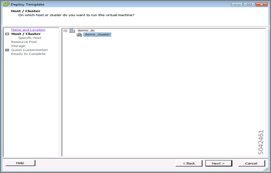

The **Specify a Specific Host** window is displayed, as in the following. Select the ESXi host on which to spawn the virtual machine.

When you are finished, click **Next** .

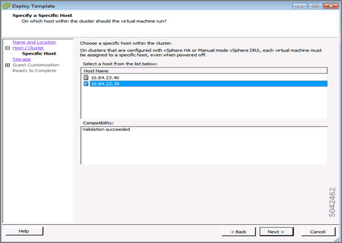

In the **Storage** window, select the destination storage location for the virtual machine.

When you are finished, click **Next** .

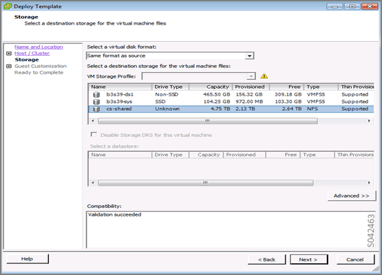

On the **Guest Customization** window, the typical selection is Do not customize. Select **Do not customize** .

When you are finished, click **Next** .

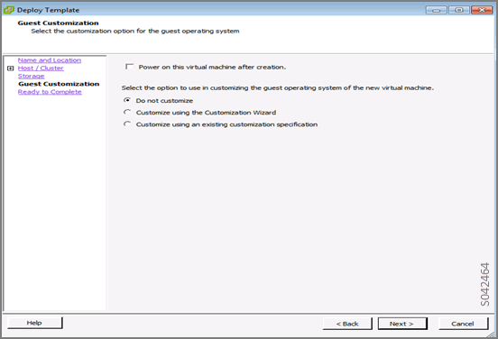

On the **Ready to Complete** window, review all of the virtual machine definitions that you have selected for the template.

If all the selections are correct, click **Finish** . This spawns the virtual machine.

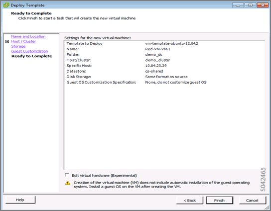

To complete the settings for the virtual machine, select the virtual machine to be edited in the left column of the main window of the vCenter UI. Then click **Edit virtual machine settings** .

The **Virtual Machine Properties** window is displayed, as in the following. From here you can update the virtual machine properties.

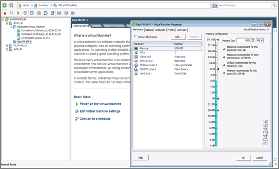

Click the **Hardware** tab in the **Virtual Machine Properties** window. Next, click **Add** to add a NIC and select the appropriate network. Select **Connect at power on** , as in the following.

When you are finished, click **OK** .

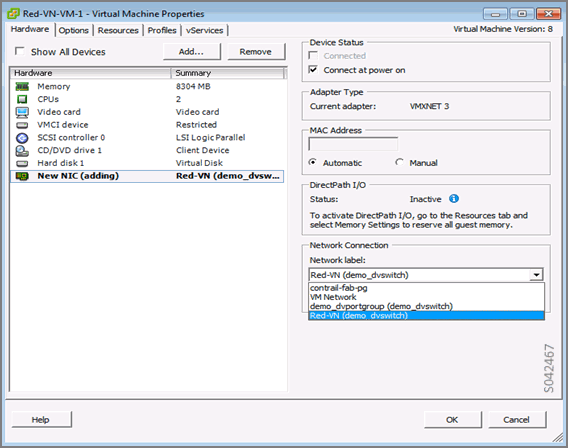

You are returned to the main vCenter UI window. Select the **Getting Started** tab. Select **Power on the virtual machine** . The virtual machine launches.

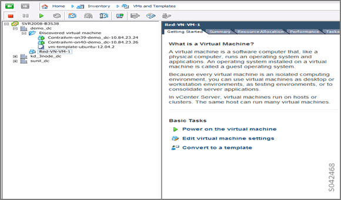

Once the virtual machine is launched, you can view it from the Contrail UI. Select **Monitor > Networking > Instances** . The virtual machines are displayed in the **Instances Summary** window, as in the following.

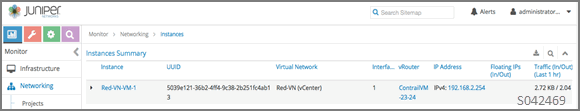

You can also see real-time running information for the virtual machine in the vCenter UI. Select the virtual machine and the **Console** tab. Real-time information is displayed, including ping statistics, as in the following.

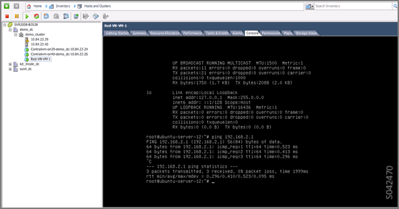

Configuring the vCenter Network in Contrail UI
----------------------------------------------

The following items can be configured for the vCenter network by using the Contrail UI.

- Network policy is configured by using the Contrail UI.

- Security policy is configured by using the Contrail UI.

- Public networks, floating IP address pools, and floating IP addresses are configured using the Contrail Administrator UI.

When you configure a virtual network using the administrator UI, the network is a Contrail-only network. No resources are consumed on vCenter to implement this type of network. You can configure a floating IP address pool on the network, allocate floating IP addresses, and associate floating IP addresses to virtual machine interfaces (ports).