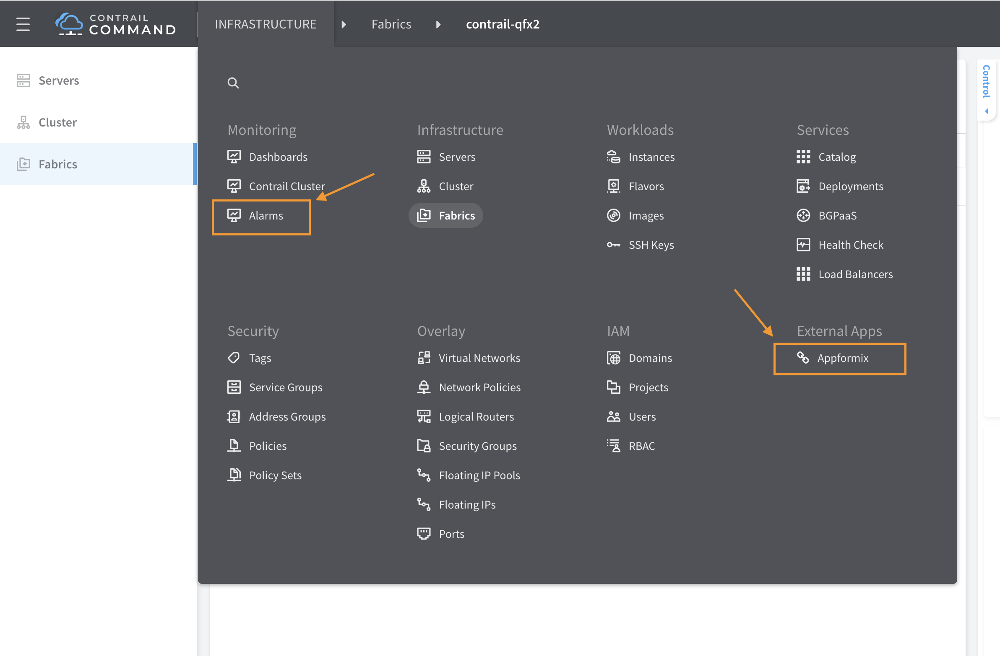
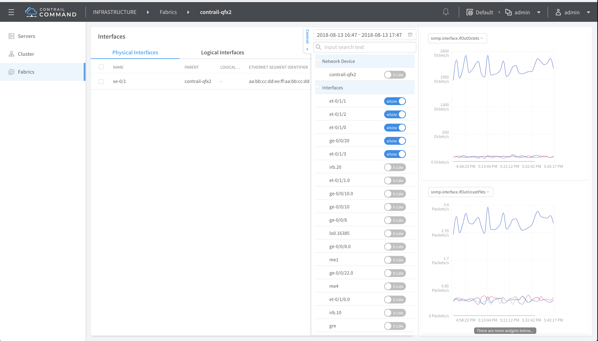

.. This work is licensed under the Creative Commons Attribution 4.0 International License.
   To view a copy of this license, visit http://creativecommons.org/licenses/by/4.0/ or send a letter to Creative Commons, PO Box 1866, Mountain View, CA 94042, USA.

========================
New and Changed Features
========================

The features listed in this section are new or changed as of Contrail Release 5.0. A brief description of each new feature is included.

-  `New and Changed Features in Contrail Release 5.0.1`_ 

-  `New and Changed Features in Contrail Release 5.0`_ 

New and Changed Features in Contrail Release 5.0.1
--------------------------------------------------

The features listed in this section are new as of Contrail Release 5.0.1.

Bare Metal Server Life Cycle Management
---------------------------------------

Starting with Contrail Release 5.0.1, you can use Bare Metal Server (BMS) Manager to manage the life cycle of bare metal servers (BMS). BMS Manager can install tenant-specific software images on BMS and attach them to the tenant network in a multi-tenant cloud. BMS Manager provides a single-click solution for the tenants to manage the bare metal servers in their network.

For more information, see `Understanding Bare Metal Server Managers`_  .

Contrail Support for Underlay Management
----------------------------------------

Contrail Release 5.0.1 supports underlay network management. The existing Contrail configuration node can provide intent driven automation capabilities on physical network elements such as ToR and EoR switches, Spines, SDN gateway, and VPN gateways in the data center. In addition, you can perform basic device management functions such as device discovery, device import, image upgrade, device underlay configuration, and topology discovery from the node.

For more information, see `Understanding Underlay Management`_  .

Support for Advertising of Local AS to BGP Peers
------------------------------------------------

Contrail Release 5.0.1 supports advertising of local autonomous system (AS) numbers to BGP peers. With the support for local AS, virtual network functions can advertise AS numbers of the received networks to Contrail, which results in the routing table getting updated and in turn enabling the sites to communicate. A new parameter  ``local-autonomous-system`` has been added in the BgpSessionAttributes field in the Contrail configuration schema to support local AS. You can configure this parameter either from the Contrail web UI or by using the VNC API.

In earlier releases, Contrail supported advertising of only Contrail AS numbers, so the virtual machines could not advertise the AS numbers of received networks. This is because most BGP implementations do not advertise routes received from a given AS back to the same AS. With the support for local AS in Contrail, this check can be avoided, thus ensuring that VNF routes get correctly propagated by BGP.

Support for Contrail Command UI
-------------------------------

Contrail Release 5.0.1, supports the Contrail Command UI. The Contrail Command is an intuitive, wizard-based user interface (UI) which provides automated work flows such as the following:

- Contrail cluster deployment (Kolla-based OpenStack cluster)

- Automating the data center IP fabric

- Orchestrating virtual machines and bare metal servers

For more information, see `Configuring Contrail Command`_  .

Usage of Contrail Command UI
----------------------------

Use the Contrail command UI for only the following deployments and feature management:

- For Contrail DataCenter automation and fabric deployment and features, use the Contrail Command UI for both Contrail Release 5.0 and 5.0.1 features.

- For OpenStack-based Contrail Deployments, use the Contrail Command UI for both Contrail Release 5.0 and 5.0.1 features.

- For non-OpenStack based Contrail deployments, such as vCenter, Kubernetes, and OpenShift, use the old UI for features supported till Contrail Release 5.0.

- For non-OpenStack based Contrail deployments, such as vCenter, Kubernetes, and OpenShift, use VNC APIs for new features supported in Contrail Release 5.0.1.

Support for Configuring QFX10000 as a DataCenter Gateway
---------------------------------------------------------

Starting with Contrail Release 5.0.1, you can use a QFX10000 switch as a DataCenter Gateway (DC-GW). DC-GW is an overlay role that is assigned to a QFX10000 switch to:

- Extend private network

- Extend public routable network

For more information, see `Configuring QFX10000 as a DataCenter Gateway`_  .

Support for Red Hat OpenShift Container Platform Version 3.9
------------------------------------------------------------

OpenShift Container Platform version 3.9 is supported on Contrail Release 5.0.1 and validated with CentOS 7.5.

For more information, see `Installing Red Hat OpenShift Container Platform with Contrail`_  .

Support for Contrail Cloud Release 13.0
---------------------------------------

Contrail Release 5.0.1 supports Contrail Cloud Release 13.0. Contrail Cloud supports the OpenStack Queens Release and supports integration with Red Hat OpenStack Release 13. This OpenStack release provides support for containerized OpenStack services and Ansible-based RHOSP deployment.

For more information on Contrail Cloud Release 13.0, see `Contrail Cloud Platform Architecture`_  and `Contrail Cloud Deployment Guide`_  .

Support for AppFormix Features
------------------------------

Starting with Contrail Release 5.0.1, the following AppFormix features are integrated into the Contrail Command UI.

- Alarms

- Charts

- Contrail Control plane service monitoring

- Monitoring of vRouter stats

Prior to Contrail Release 5.0.1, Contrail Analytics and AppFormix were supported as separate packages and feature sets.

In Contrail 5.0.1, AppFormix provisioning is not supported using the UI, so you need to enable AppFormix in the Contrail Command UI.

To enable AppFormix in the Contrail Command UI:

#. Log in to the  ``contrail_command`` Docker container.

   ::

    docker exec -it contrail_command bash

#. Update the ``feature-list.json`` file and set the ``appformix key`` to ``true`` .

   ::

    vi /usr/share/contrail/public/feature-list.json

#. Restart the  ``contrail_command`` container.

   ::

    docker restart contrail_command

#. Log in to Contrail Command UI and access the cluster endpoints.

    ``http://<command-ui-ip>:9091/#/contrail_command/infrastructure/cluster-details/overview/advanced/endpoints`` 

#. Add a new entry with prefix ``appformix`` and update the public_url pointing to your Appformix UI IP:port.

   You should now be able to access AppFormix features from within Contrail Command.

   When enabled, you can see alarms under Monitoring and external link to Appformix UI under External Apps. See `Figure 1`_ .

.. _Figure 1: 

*Figure 1* : AppFormix Features in Contrail Command UI

Additionally, network devices, instances, and host detail pages are augmented to show charts using metrics from AppFormix data. See `Figure 2`_ 

.. _Figure 2: 

*Figure 2* : Example of Network Devices in Contrail Command UI

Support for EVPN Route Type 5
-----------------------------

Contrail Release 5.0.1 supports EVPN Route Type 5 messages as defined in the IETF specification *IP Prefix Advertisement in EVPN* . EVPN Route Type 5 is an extension of EVPN Route Type 2, which carries MAC addresses along with their associated IP addresses. EVPN Route Type 5 facilitates in inter-subnet routing.

Support For Encryption of Traffic Between vRouters
--------------------------------------------------

Contrail Release 5.0.1 supports encryption of data packets sent between Contrail vRouters. Contrail uses the IPsec Encapsulating Security Payload (ESP) protocol to provide authentication, integrity, and encryption to Layer 3 VPN (L3VPN) multi-tenant traffic egressing a vRouter. IPSec ESP ensures secure forwarding of tenant data in both private and public Contrail clouds.

You can enable encryption of multi-tenant traffic by enabling the  ``crypt_interface = crypt0`` configuration option during provisioning. You can create IPsec tunnels between a set of vRouter compute nodes or across all vRouter compute nodes. In addition, you can specify a list of IP addresses that should send and receive encrypted multi-tenant traffic in the vRouter agent configuration file.

In releases prior to Contrail Release 5.0.1, L3VPN packets that egress a vRouter using GRE, VXLAN, or MPLS are not encrypted.

.. note:: This feature is supported only on On-premise data centers running Ubuntu release 16.04.

Contrail Plugin For VMware vRealize Orchestrator
------------------------------------------------

The Contrail plugin for VMware vRealize Orchestrator is available in Contrail Release 5.0.1. You can use the dedicated Contrail plugin to connect Contrail to VMware vRealize Orchestrator (vRO). vRO is used to automate the management processes in data centers. You can use the Contrail plugin to view the Contrail controller configurations in the vRO inventory. You can also use the plugin to modify configurations by using vRO workflows. You can deploy the Contrail plugin in any Java Virtual Machine (JVM) compatible language and load it on an active vRO instance. In Release 5.0.1, Contrail plugin for vRO does not support draft mode.

See `Integrating Contrail Release 5.0.1 with VMware vRealize Orchestrator`_  

Support for Mellanox Connectx-5 NIC
-----------------------------------

Starting with Contrail Release 5.0.1, Contrail vRouter in DPDK mode supports the Mellanox Connectx-5 Network Interface Card (NIC). The NIC works in a no-offload mode in which all packets through the interface are transmitted to the vrouter-dpdk application and then sent to the respective virtual machines (VMs) or the host.

To deploy a node with the Mellanox Connectx-5 NIC, set  ``"DPDK_UIO_DRIVER" : "mlnx"`` for that node under  ``vrouter`` in the ``instances.yaml`` or ``host.yml`` files. The vrouter-dpdk application cannot work if the  ``"DPDK_UIO_DRIVER"`` is not set.

Example ``instances.yml`` file in Ansible-based provisioning setups:
::

 Bms1:
 provider: bms
 ip: 192.0.2.0
 roles:
 vrouter:
 AGENT_MODE: dpdk
 CPU_CORE_MASK: 0xff
 DPDK_UIO_DRIVER: mlnx
 HUGE_PAGES: 32000

Example ``host.yml`` file in Helm-based provisioning setups:
::

 AGENT_MODE: dpdk
 CPU_CORE_MASK: 0xff
 DPDK_UIO_DRIVER: mlnx
 HUGE_PAGES: 32000

Support for Remote Compute
--------------------------

Contrail Release 5.0.1 supports remote compute, a method of managing a Contrail deployment across many small distributed data centers. Remote compute employs a subcluster that manages compute nodes at remote sites to receive configurations and exchange routes.

For more information, see `Remote Compute`_  .

Support for Red Hat OpenStack Platform Director 13
--------------------------------------------------

Contrail Release 5.0.1 supports integration with Red Hat OpenStack Platform Director 13.

`Table 1`_ lists the the OpenStack releases and the corresponding operating systems and deployer versions supported by Contrail Release 5.0.1.

.. _Table 1: 

*Table 1* : Supported Release Versions

+-----------------------+----------------------+-------------------------------+-------------------+
| Contrail Release      | Operating System     | OpenStack                     | Deployer          |
+=======================+======================+===============================+===================+
| Contrail 5.0.1        | RHEL 7.5             | Red Hat OpenStack Platform 13 | RHOSP 13 director |
+-----------------------+----------------------+-------------------------------+-------------------+

For more information, see Deploying Contrail with Red Hat OpenStack Platform Director 13

Documentation Update
--------------------

Juniper Networks provides cumulative documentation for features supported in Contrail Release 5.0 and Contrail Release 5.0.1. Features supported only in Contrail Release 5.0.1 are indicated in the respective topics in the documentation. You can also find feature support information in the release notes.

New and Changed Features in Contrail Release 5.0
------------------------------------------------

The features listed in this section are new as of Contrail Release 5.0.

Ansible Scripts to Provision Contrail
-------------------------------------

Contrail Release 5.0 introduces microservices architecture. The ``contrail-ansible-deployer`` is a set of Ansible playbooks designed to deploy Contrail 5.x with microservices architecture on a CentOS-based system.

For more information, see `Overview of contrail-ansible-deployer for Installing Contrail with Microservices Architecture`_  and `Installing Contrail with OpenStack Ocata and Kolla Ansible`_  .

Contrail Microservices
----------------------

With Contrail Release 4.0, Contrail started moving to an architecture of containers for major system components. Each container encapsulates the services needed for that container. The first phase of Contrail containers were characterized as fat containers, where multiple processes run within the container.

Starting with Contrail Release 5.0, more components are being containerized, and the fat containers are being decomposed into thin containers with microservices. The microservices are still encapsulated in their respective containers, however, only the essential functions relative to each container’s functions are present as microservices. This enables a more agile system, avoiding monolithic containers.

Nothing is changing with regard to Contrail functionality, however, employing microservices provides a number of benefits, including the ability to deploy patches without updating the entire Contrail deployment, offering better ways to manage the lifecycles of containers, and improving user experiences with Contrail provisioning and upgrading. The microservices architecture enables provisioning with minimum information provided and enables every feature to be configurable. Utilizing microservices also simplifies application complexity by implementing small and independent processes.

For more information, see `Introduction to Contrail Microservices Architecture`_  .

Containerization of DPDK vRouter
--------------------------------

Starting with Contrail Release 5.0, you can configure the Contrail DPDK vRouter to run in a Docker container. In earlier releases, DPDK vRouter runs on a compute host. The contrail-vrouter-dpdk binary file provides data plane functionality when Contrail vRouter is run in DPDK mode in a Contrail cluster.

For more information, see `Configuring Contrail DPDK vRouter to Run in a Docker Container`_  .

Distributed Source Network Address Translation (SNAT)
-----------------------------------------------------

The distributed SNAT feature allows virtual machines to communicate with the IP fabric network using the existing forwarding infrastructure for compute node connectivity. This functionality is achieved through port address translation of virtual machine traffic using the IP address of the compute node as the public address.

The following distributed SNAT use case is supported:

- Virtual networks with distributed SNAT enabled can communicate with the IP fabric network. The session must be initiated from a virtual machine. Sessions initiated from the external network are not supported.

Distributed SNAT is supported only for TCP and UDP, and you can configure discrete port ranges for both protocols.

For more information, see `Source Network Address Translation (SNAT)`_  .

EVPN vRouter MultiHoming to Multiple ToRs
-----------------------------------------

The Contrail control node can be in a situation in which it peers with a set of provider edge (PE) nodes that also contain a multihome CE device or top-of-rack (ToR) that is multihomed to the PE nodes, and the PEs are in all-active multihoming mode.

In this situation, any EVPN route originating through the multihome device is exported to Contrail with two paths—the multihome device path and the PE path. Those routes need to be load-balanced to prevent skewed traffic flow.

In previous releases, only the Contrail controller supports this scenario. In Contrail Release 5.0, this support has been added to the Contrail vRouter supporting both Layer 2 and Layer 3 traffic.

Fat Flow Enhancements
---------------------

The fat flow feature has been enhanced to support aggregation of multiple flows into a single flow by ignoring source and destination ports and/or IP addresses, or a combination of these. This extends the existing option of ignoring by either source or destination for a given protocol only.

Also added is support for fat-flow configuration at the VN level, extending the existing support at only the VMI level.

For more information, see `Understanding Flow Sampling`_  .

Implementing Kubernetes Network Policy with Contrail Firewall Policy
--------------------------------------------------------------------

Contrail Release 5.0 supports implementing Kubernetes network policy in Contrail using the Contrail firewall security policy framework. While Kubernetes network policy can be implemented using other security objects in Contrail like security groups and Contrail network policies, the support of tags by Contrail firewall policy allows decoupling of routing from security policies and provides multi dimension segmentation and policy portability, while significantly enhancing user visibility and analytics functions.

For more information, see `Implementing Kubernetes Network Policy with Contrail Firewall Policy`_  .

Kubernetes Updates
------------------

Contrail Release 5.0 includes the following Kubernetes updates.

- The IP fabric forwarding feature enables reachability to public cloud services for Kubernetes pods. The IP fabric forwarding feature enables the overlay network to be a part of the underlay network or the IP fabric network, eliminating the need for encapsulating data packets between Kubernetes pods.

- The ip-fabric-snat feature enables service or ingress reachability from external clusters in isolated namespaces.

- Multiple Ingress Controllers can co-exist in Contrail. Since Contrail ensures the reachability between pods and services, any ingress controller can reach the endpoints or pods directly or through services.

- Contrail supports custom networks in namespace level. Starting with Contrail Release 5.0, custom networks are supported for ingress resources as well.

- Contrail network policy is created between the IP fabric network and pod-network to provide reachability between node and pods. So, any process in the node can reach the pods. Kubernetes Service Node-Port is also supported.

For more information on Kubernetes updates in Contrail Release 5.0, see `Kubernetes Updates`_  .

Routing Policies Enhanced for Interface Routes
----------------------------------------------

Service interface and static routes are proliferating as leaked routes in the routing table of the SDN gateway. To reduce these leaked routes, routing policies have additional term match conditions under the protocol options to distinguish interface routes, service interface routes, and static routes from other VM routes. Also, a new action attribute, ASPATH (autonomous system path), is added that can be appended with a configurable AS list. All of the action attributes of Add/Set/Remove Community, SetLocal-Pref, and Set Med are supported with the new protocol match conditions and the new ASPATH list append action.

Users will be able to configure the new term match and action attributes as needed in the following cases:

- Setting LocalPref on service interface static routes when exporting to distinguish routes and take further action.

- Setting different LocalPref for all other reoriginated routes to distinguish routes and take further action.

Additionally, Contrail can set the LocalPref based on community onto imported routes, instead of the data center gateway, allowing direct access to VPN Internet-Shared from Contrail.

Service Instance Health Check Failure
-------------------------------------

In Contrail Release 5.0, when one or more than one service instance (SI) in a service chain fails, reorigination of routes on the ingress and egress sides of the service chain is stopped. The routes automatically converge to a backup service chain that is part of another Contrail cluster. You can detect an SI failure by keeping track of corresponding connected routes of the service chain address.

For more information, see `Service Instance Health Checks`_  .

Support for Load Balancing as a Service (LBaaS) in the Web UI
-------------------------------------------------------------

For the LBaaS feature, load balancers using HAproxy can now be created, edited, or deleted using the Contrail Web UI.

For more information, see `Configuring Load Balancing as a Service in Contrail`_  .

Support for Security Policies Draft Mode
----------------------------------------

Starting with Contrail Release 5.0, you can define new security policies and review the policies before enforcing them. You can also edit existing policies and review the changes before updating them. You can define security policies in both global and project scopes.

For more information, see `Security Policies Draft Mode Overview`_  .

Support for Virtual Network Route Tables in Contrail Introspect
---------------------------------------------------------------

Starting with Contrail Release 5.0, virtual network route table entries per compute node can be viewed in Contrail Introspect.

Support for a Flow-Hold Entries Counter in vRouter UVEs
--------------------------------------------------------

Starting with Contrail Release 5.0 , a flow-hold entries counter is transmitted in vRouter User-Visible Entities (UVEs). The counter specifies the number of flows in **hold** state in the vRouter. vRouter uses the flow-hold count to check against a defined limit and when it reaches a defined limit, packets requiring new flows are dropped and new flows are not created till the flow-hold count goes below the defined limit.

Along with the flow-hold entries counter, the vRouter UVEs also provide information associated with a vRouter, such as:

- Virtual networks present on the vRouter

- Virtual machines spawned on the server of the vRouter

- Statistics of the traffic flowing through the vRouter

Timestamp In UVE API Response
-----------------------------

Starting with Contrail Release 5.0, a timestamp is added to the ``/analytics/uve`` UVE API response message.

Timestamp In UVE Stream Response
--------------------------------

Starting with Contrail Release 5.0, a timestamp is added to the ``/analytics/uve-stream`` UVE Stream API response message.

Using Helm Charts to Provision Contrail
---------------------------------------

Starting with Contrail 5.0, Contrail Helm charts give you complete life cycle management of installation, update, and deletion of Contrail Docker-based containers in a microservices architecture.

Helm is the package manager for Kubernetes which is an open source software for managing containerized systems. The packaging format used by Helm is a chart, a collection of files that describe a related set of Kubernetes resources.

Many Contrail components have been broken out into manageable Helm charts, including the following specific features:

- Contrail service and IP address numbers are configurable by means of Helm charts.

- Ingress controllers can be implemented by means of Helm charts.

For more information, see:

-  `Installing and Managing Contrail 5.0 Microservices Architecture Using Helm Charts`_  

-  `Using Helm Charts to Provision Multinode Contrail OpenStack Ocata with High Availability`_  

-  `Using Helm Charts to Provision All-in-One Contrail with OpenStack Ocata`_  

-  `Accessing a Contrail OpenStack Helm Cluster`_  

-  `Frequently Asked Questions About Contrail and Helm Charts`_  

Contrail Plugin For VMware vRealize Orchestrator—Beta
-----------------------------------------------------

The Contrail plugin for VMware vRealize Orchestrator is available as a Beta feature in Contrail Release 5.0. You can use the dedicated Contrail plugin to connect Contrail to VMware vRealize Orchestrator (vRO). vRO is used to automate the management processes in data centers. You can use the Contrail plugin to view the Contrail controller configurations in the vRO inventory. You can also use the plugin to modify configurations by using vRO workflows. You can deploy the Contrail plugin in any Java Virtual Machine (JVM) compatible language and load it on an active vRO instance.

See `Integrating Contrail with VMware vRealize Orchestrator.`_  

RBAC Support for Contrail Analytics API—Beta
--------------------------------------------

Starting with Contrail Release 5.0, the Contrail Analytics API supports role-based access control (RBAC) as a Beta feature. Based on the user privileges, the logged-in user can access network monitoring information. Contrail Analytics API provides this information by mapping the user query and the UVE to the configuration objects on which RBAC rules are applied.

Remote Compute—Beta
-------------------

Remote compute is available as a Beta feature. The remote compute feature enables the deployment of Contrail in many small distributed data centers, up to hundreds or even thousands, for telecommunications point-of-presence (PoPs) or central offices (COs). Because each small datacenter has only a small number of computes running only a few applications, it is not cost-effective to deploy a full Contrail cluster of nodes of control, configuration, analytics, database, and the like, on dedicated servers in each distributed PoP. Additionally, manually managing hundreds or thousands of clusters is not feasible operationally.

Remote compute implements a subcluster that manages compute nodes at remote sites to receive configurations and exchange routes.

For more information, see `Remote Compute`_  .

Contrail Cloud
--------------

Contrail Cloud is *not* supported in Contrail Release 5.0.

OpenShift Enterprise
--------------------

OpenShift Enterprise is *not* supported in Contrail Release 5.0. OpenShift Origin 3.7 is supported.

.. _Deploying Contrail with Red Hat OpenStack Platform Director 13: 

.. _Understanding Bare Metal Server Managers: https://www.juniper.net/documentation/en_US/contrail5.0/topics/topic-map/bare-metal-server-manager-overview.html

.. _Understanding Underlay Management: https://www.juniper.net/documentation/en_US/contrail5.0/topics/concept/understanding-underlay-management.html

.. _Configuring Contrail Command: https://www.juniper.net/documentation/en_US/contrail5.0/topics/example/install-contrail-command.html

.. _Configuring QFX10000 as a DataCenter Gateway: https://www.juniper.net/documentation/en_US/contrail5.0/topics/task/configuration/qfx10000-as-datacenter-gateway-501.html

.. _Installing Red Hat OpenShift Container Platform with Contrail: https://www.juniper.net/documentation/en_US/contrail5.0/topics/task/installation/install-redhat-openshift-container.html

.. _Contrail Cloud Platform Architecture: https://www.juniper.net/documentation/en_US/contrail5.0/information-products/pathway-pages/contrail-cloud-platform-architecture-13.0.html

.. _Contrail Cloud Deployment Guide: https://www.juniper.net/documentation/en_US/contrail5.0/information-products/pathway-pages/contrail-cloud-deployment-guide-13.0.html

.. _Integrating Contrail Release 5.0.1 with VMware vRealize Orchestrator: https://www.juniper.net/documentation/en_US/contrail5.0/topics/concept/integrating-contrail501-with-vRO.html

.. _Remote Compute: https://www.juniper.net/documentation/en_US/contrail5.0/topics/concept/remote-compute-50.html

.. _Overview of contrail-ansible-deployer for Installing Contrail with Microservices Architecture: https://www.juniper.net/documentation/en_US/contrail5.0/topics/concept/install-contrail-overview-ansible-50.html

.. _Installing Contrail with OpenStack Ocata and Kolla Ansible: https://www.juniper.net/documentation/en_US/contrail5.0/topics/concept/install-contrail-ocata-kolla-50.html

.. _Introduction to Contrail Microservices Architecture: https://www.juniper.net/documentation/en_US/contrail5.0/topics/concept/intro-microservices.html

.. _Configuring Contrail DPDK vRouter to Run in a Docker Container: https://www.juniper.net/documentation/en_US/contrail5.0/topics/task/configuration/containerzing-contrail-dpdk-vrouter.html

.. _Source Network Address Translation (SNAT): https://www.juniper.net/documentation/en_US/contrail5.0/topics/task/configuration/snat-vnc.html

.. _Understanding Flow Sampling: https://www.juniper.net/documentation/en_US/contrail5.0/topics/concept/flow-sample-overview.html

.. _Implementing Kubernetes Network Policy with Contrail Firewall Policy: https://www.juniper.net/documentation/en_US/contrail5.0/topics/concept/k8s-network-policy.html

.. _Kubernetes Updates: https://www.juniper.net/documentation/en_US/contrail5.0/topics/concept/k8s-ip-fabric.html

.. _Service Instance Health Checks: https://www.juniper.net/documentation/en_US/contrail5.0/topics/topic-map/service-instance-health-check.html

.. _Configuring Load Balancing as a Service in Contrail: https://www.juniper.net/documentation/en_US/contrail5.0/topics/task/configuration/load-balance-as-service-vnc.html

.. _Security Policies Draft Mode Overview: https://www.juniper.net/documentation/en_US/contrail5.0/topics/concept/security-policy-draft-mode.html

.. _Installing and Managing Contrail 5.0 Microservices Architecture Using Helm Charts: https://www.juniper.net/documentation/en_US/contrail5.0/topics/concept/install-microsvcs-helm-chart-50.html

.. _Using Helm Charts to Provision Multinode Contrail OpenStack Ocata with High Availability: https://www.juniper.net/documentation/en_US/contrail5.0/topics/concept/install-microsvcs-helm-multi-50.html

.. _Using Helm Charts to Provision All-in-One Contrail with OpenStack Ocata: https://www.juniper.net/documentation/en_US/contrail5.0/topics/concept/install-microsvcs-helm-aio-50.html

.. _Accessing a Contrail OpenStack Helm Cluster: https://www.juniper.net/documentation/en_US/contrail5.0/topics/concept/access_os_helm_cluster.html

.. _Frequently Asked Questions About Contrail and Helm Charts: https://www.juniper.net/documentation/en_US/contrail5.0/topics/concept/install-microsvcs-helm-multi-faq-50.html

.. _Integrating Contrail with VMware vRealize Orchestrator.: https://www.juniper.net/documentation/en_US/contrail5.0/topics/concept/integrating-contrail5.0-with-vRO.html

.. _Remote Compute: https://www.juniper.net/documentation/en_US/contrail5.0/topics/concept/remote-compute-50.html
